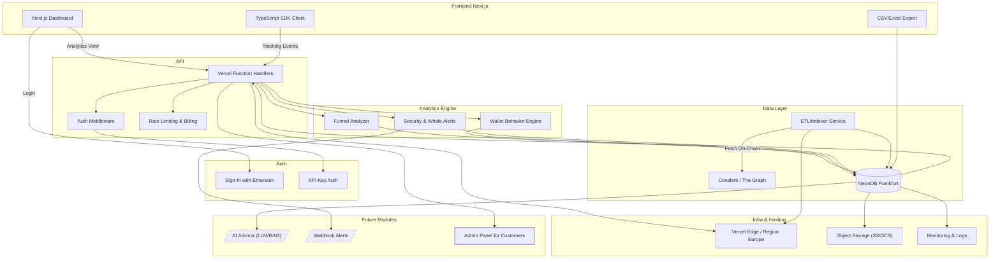

# 🧠 ChainSights – On-Chain Analytics-as-a-Service

ChainSights is a SaaS platform for analyzing on-chain data – optimized for DApps, DAOs, and NFT projects. The goal is to provide Web3 projects with actionable metrics – via dashboard or API.

---

## 🚀 Tech Stack

| Component       | Technology                        |
|----------------|------------------------------------|
| **Frontend**    | Next.js (React), TailwindCSS       |
| **Client SDK**  | TypeScript (more planned)          |
| **API**         | Vercel Microservices (Serverless)  |
| **Database**    | NeonDB (Region: Frankfurt)         |
| **Auth**        | SIWE (Sign-In with Ethereum), API-Key Auth |
| **Data Sources**| Covalent, The Graph                |
| **Visualization** | Recharts, CSV/Excel Export      |

---

## 🛠️ Architecture (Mermaid)

---

## 📦 Features (Roadmap Snapshot)

- 📊 Wallet Analytics
- 📈 DApp Funnel Tracking
- 🗳️ DAO Governance Monitoring
- 🪙 NFT Whale Tracking
- 🔔 Anomaly Detection & Alerts
- 💬 CSV/Excel Export
- 🧠 Planned Modules: LLM Advisor, Webhooks, Admin Panel

---

## 📄 License

MIT License – masem.at 2025

---

## 🛣️ Roadmap: ChainSights – On-Chain Analytics-as-a-Service

### 📦 v0.1 – MVP (4 Weeks)
**Target Group:** Web3 DApps with real users

**Core Features:**
- ✅ SIWE Login (Sign-In with Ethereum)
- ✅ Wallet Behavior Dashboard  
  - Token Transfers
  - Smart Contract Interactions
- ✅ Funnel Tracking (Connect → Approve → Transact)
- ✅ Data integration via Covalent or The Graph
- ✅ Export Functionality (CSV / Excel)
- ✅ Ethereum & Polygon Support
- ✅ API Key Authentication

**Tech Stack:**
- Frontend: Next.js + Tailwind
- Backend: Vercel Microservices (FastAPI-like)
- DB: NeonDB (Frankfurt)
- SDK: TypeScript

---

## 📚 API Route Overview – Roadmap v0.1 MVP

| Route                              | Method | Description                                             | Schema (Example / Rough)                                   |
|------------------------------------|--------|---------------------------------------------------------|------------------------------------------------------------|
| `/api/v1/auth/siwe`                | POST   | SIWE login and wallet verification                      | `{ message, signature }` → `{ token }`                    |
| `/api/v1/auth/me`                 | GET    | Current user profile (wallet address)                   | Header: `Authorization: Bearer <token>`                   |
| `/api/v1/funnel/track`            | POST   | Tracking DApp funnel events                             | `{ wallet, step, dapp_id }`                               |
| `/api/v1/wallet/:address/activity`| GET    | Wallet behavior (tokens, interactions)                  | Response: `{ txs: [...], categories: [...] }`             |
| `/api/v1/export/csv`              | POST   | Export wallet/funnel data as CSV                        | `{ type: 'wallet' | 'funnel', filters: {...} }`           |
| `/api/v1/stats/funnel/:dapp_id`   | GET    | Aggregated funnel data for a DApp                       | `{ steps: [...], totals: [...] }`                         |
| `/api/v1/sdk/config`              | GET    | Provides configuration for the embedded client SDK      | `{ endpoints, tokenScopes }`                              |
| `/api/v1/usage`                   | GET    | Shows API usage and rate limits                         | Header: `Authorization` + API Key                         |

> ✳️ These routes are conceptual and may slightly change in the MVP.

---