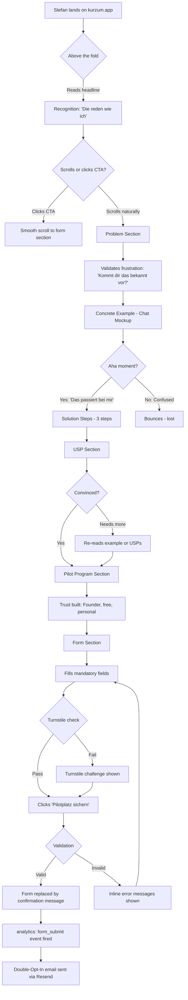
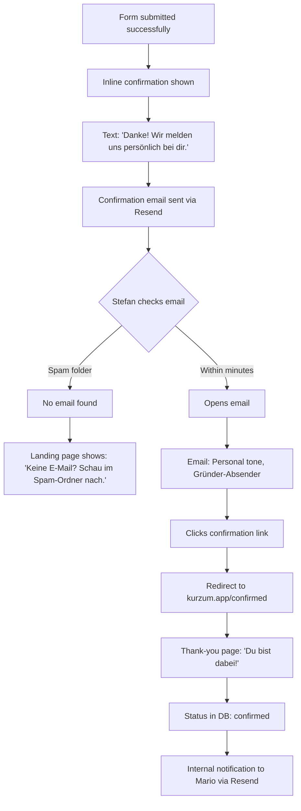
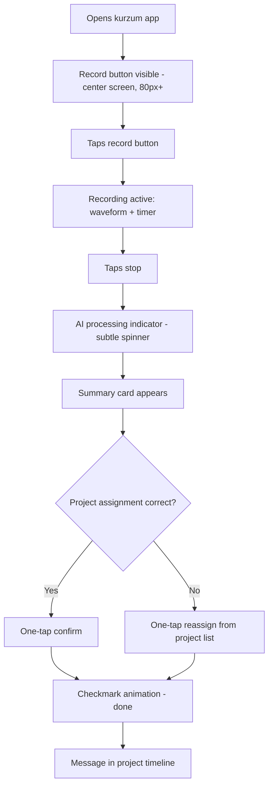
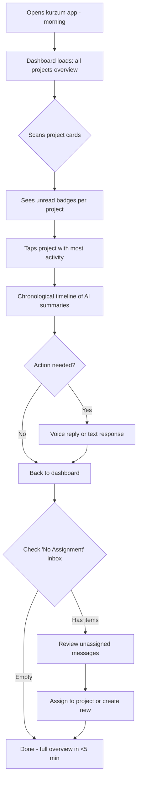
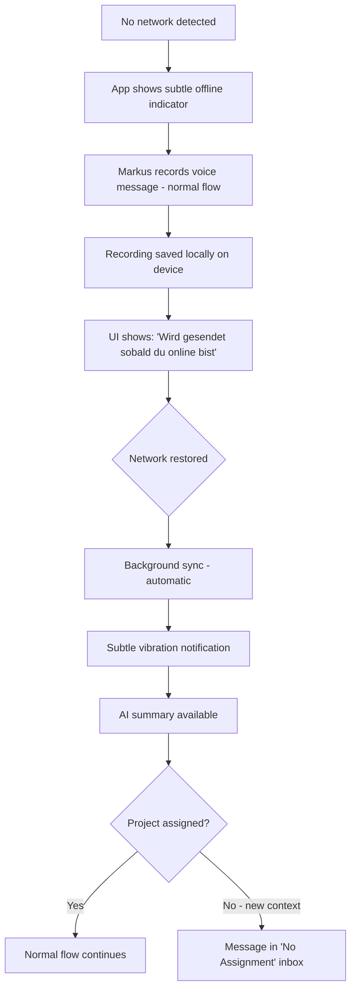

# UX Design Specification kurzum-app

**Author:** Sempre
**Date:** 2026-02-10

---

## Executive Summary

### Project Vision

kurzum.app is an AI-powered, GDPR-compliant communication app for trades companies (Handwerksbetriebe) with field workers in the DACH region. The core principle is radical simplicity: "Task done → voice message → done." AI transcribes, summarizes, and auto-assigns to projects. No typing, no forms, no evening paperwork.

**UX Scope Decision (2026-02-10):** High-level design system for the entire kurzum.app (colors, typography, component language, navigation concept). Detailed UX design only for the recruiting landing page (pilot company waitlist). This is driven by FFG funding constraints — only the landing page may be developed and shipped before grant approval.

### Target Users

**Primary — Markus (Field Worker/Monteur, 34):**
Daily user. Works with gloves, on ladders, in dusty/wet conditions. Needs voice-first interaction — typing is not an option. Wants zero after-work paperwork. Success = 30-second voice message replaces 60 minutes of evening documentation.

**Primary — Stefan (Master Craftsman/Owner, 48):**
Decision-maker AND buyer. Currently the "human database" bottleneck — all information flows through him. Wants morning overview in 5 minutes instead of 30+ WhatsApp messages. Success = can be absent 2 days without business standstill.

**Secondary — Andrea (Office Admin, 42):**
Data consumer. Needs structured, complete data for billing and accounting. Currently chases field workers for missing information. Success = billing time halved, zero follow-up calls.

**Landing Page Target — Stefan (as Decision-Maker):**
35-55, male, technically pragmatic. Manages 8-15 field workers, 15-20 concurrent projects. Knows WhatsApp is GDPR-problematic. Has little time, decides quickly, wants to see value immediately. Reached via LinkedIn Ads, Google search, guild events.

### Key Design Challenges

1. **Two worlds in one design system:** The high-level design must work for both a construction-site app (dirty hands, sunlight, 48px touch targets, offline-first) and a marketing landing page (trust, emotion, conversion). The design language must bridge both contexts coherently.

2. **Speaking to craftsmen, not techies:** Tonality must be informal (du/duzen), down-to-earth, zero tech jargon. The landing page must communicate "this solves MY problem" within 5 seconds. The app UX must feel like WhatsApp simplicity, not enterprise software.

3. **Mobile-first under extreme conditions:** Target users are on smartphones at construction sites. Design must be perfect at 375px, high contrast for direct sunlight (WCAG AA 4.5:1 minimum), large touch targets (48x48px minimum), and work reliably offline.

### Design Opportunities

1. **"Made in Austria" as trust anchor:** Regional identity is powerful in the trades sector. No Silicon Valley aesthetic — instead, grounded, trustworthy, local. This differentiates from US-cloud competitors and builds DACH trust.

2. **The concrete example as aha-moment:** The landing page can demonstrate immediate value with a real field worker scenario (voice message → AI output). Not abstract feature lists, but a tangible "this is what happens when Monteur Martin speaks into his phone" moment.

3. **Define a warm, energetic brand world:** The masemIT base colors (#093236 / #009BB1) are cool and technical. For the trades audience, warmer, bolder accents (orange/yellow — construction site, safety vest, energy) could send the right signal while maintaining professionalism.

## Core User Experience

### Defining Experience

**Gesamte App (High-Level):**
The defining interaction is: field worker speaks into phone → AI does the rest. Maximum 2 taps to record, 30 seconds of speech, zero follow-up required. Everything else in the product exists to support this single loop. If this feels effortless, the product succeeds. If it doesn't, nothing else matters.

**Recruiting Landing Page (Detail):**
The defining interaction is: Stefan (owner/decision-maker) lands on the page, recognizes his daily reality within 3 seconds, understands the value within 30 seconds, and signs up for the pilot waitlist within 2 minutes. The page sells relief, not innovation.

### Platform Strategy

**Gesamte App (High-Level):**
- PWA (Progressive Web App) — mobile-first, installable, offline-capable
- Primary device: Android smartphones on construction sites
- Secondary: iOS Safari, desktop browser for office users (Stefan, Andrea)
- Offline-first architecture mandatory — basements, rural areas, tunnels
- Voice recording must work with zero connectivity

**Recruiting Landing Page (Detail):**
- Next.js on Vercel (existing masemIT infrastructure)
- Mobile-first responsive (375px–1440px)
- No app install, no login — pure web, zero friction
- Lighthouse Score ≥90 (Performance, Accessibility, SEO)
- No external tracking scripts (GDPR-compliant by default)
- Cloudflare Turnstile for bot protection
- Double-opt-in via Resend for email compliance

### Effortless Interactions

**App-Level (High-Level):**
- Recording a voice message: must feel as natural as calling a friend — open app, tap, speak, done
- AI assignment to projects: invisible to the user — no dropdowns, no tagging, no "which project?" dialogs
- Offline→Online sync: completely invisible — user never thinks about connectivity
- Morning dashboard for Stefan: one glance, full overview — no clicking through projects

**Landing Page (Detail):**
- Scrolling through the page: each section answers the next logical question in Stefan's head
- **Restructured flow: Hero → Problem → Concrete Example → Solution → USPs → Pilot Program → Form** — show first, explain second. Stefan sees "Monteur Martin speaks into his phone" before he reads a 3-step abstraction
- Form submission: minimal fields, zero ambiguity, instant confirmation
- The concrete example IS the selling moment — it must feel like reading about his own Tuesday morning

### Critical Success Moments

**App-Level (High-Level):**
1. **First voice message → AI summary appears:** "That's it? That's all I have to do?" (Markus aha-moment)
2. **First morning dashboard view:** Stefan sees all job sites at a glance without making a single phone call
3. **First offline recording that syncs later:** User doesn't even notice it happened — trust is built silently

**Landing Page (Detail):**
1. **Second 1-2 — Headline recognition:** "Sprich statt tipp" — Stefan thinks "Die reden wie ich" (recognition)
2. **Second 2-3 — Visual relief:** Monteur simply speaking into phone — "Das ist nichts Kompliziertes" (relief)
3. **Second 3+ — Subheadline empathy:** "Die kennen mein Problem" (empathy)
4. **Concrete example section:** Stefan reads the Monteur Martin scenario and thinks "Das passiert bei mir jeden Tag" — this is the conversion trigger
5. **Form submission + confirmation:** "Danke, wir melden uns persönlich" — feels personal, not automated

**Critical anti-pattern:** No "Wow, innovation!" moment. Stefan doesn't want wow. He wants relief. Every design decision must be measured against: "Does this feel like relief or like marketing?"

### Experience Principles

1. **Relief over innovation:** Every interaction should feel like taking a weight off someone's shoulders. Not "look what technology can do" but "finally, someone gets it." This applies to both the app UX and the landing page messaging.

2. **Show, then explain:** Lead with concrete, recognizable scenarios before abstract descriptions. On the landing page: example before solution steps. In the app: AI result before settings/options. Users trust what they can see working.

3. **Speak their language:** Informal (du/duzen), no tech jargon, no marketing speak. If a craftsman wouldn't say it on a construction site, it doesn't belong in the product. This extends to visual design — the aesthetic should feel like a high-quality tool, not enterprise software.

4. **Invisible intelligence:** The best AI is AI you don't notice. Auto-assignment, summarization, offline sync — these should "just happen." No AI badges, no "powered by" labels (except where EU AI Act requires transparency marking), no configuration screens for things that should work automatically.

5. **Built for dirty hands:** Every touch target, every interaction, every screen must work for someone wearing gloves, standing on a ladder, in direct sunlight. This is not an accessibility afterthought — it's the primary design constraint. 48px minimum touch targets, high contrast, voice-first everything.

## Desired Emotional Response

### Primary Emotional Goals

**North Star Emotion: Relief (Erleichterung)**

Not "wow, cool technology" but "finally, I don't have to do that anymore." Like someone taking the heavy toolbox off your hands. kurzum is not a toy, it's relief from burden. This applies universally:

- **Markus (field worker):** "Endlich kein Abend-Papierkram mehr" — the weight of evening documentation lifted
- **Stefan (owner):** "Endlich bin ich nicht mehr der Flaschenhals" — the pressure of being the only knowledge carrier released
- **Andrea (office):** "Endlich muss ich keinem mehr hinterherrennen" — the frustration of chasing incomplete data resolved
- **Landing page visitor (Stefan):** "Stell dir vor, das fällt weg" — not a feature showcase, but a burden removed

### Emotional Journey Mapping

**Landing Page Emotional Arc:**

| Scroll Position | Section | Emotion | Trigger |
|---|---|---|---|
| Above the fold | Hero (headline + visual) | Recognition → Relief | "Sprich statt tipp" — "Die reden wie ich" |
| First scroll | Problem section | Frustration (validated) | "Kommt dir das bekannt vor?" — pain points named |
| Mid-page | Concrete example | Aha-moment → Desire | Monteur Martin scenario — "Das passiert bei mir jeden Tag" |
| Mid-page | Solution steps | Understanding → Confidence | 3-step explanation — "So einfach ist das?" |
| Lower mid | USPs | Conviction | DSGVO, price, Made in Austria — "Die meinen das ernst" |
| Bottom | Pilot program + Form | Trust → Action | Gründer-Gesicht, persönliches Onboarding — "Dem kann ich vertrauen" |

**Key insight:** Stefan must think "I want this" before he needs to know "can I trust this?" Trust is needed at the form, not at the headline. Value first, credibility second.

**App Emotional Arc (High-Level):**

| Moment | Emotion | Design Implication |
|---|---|---|
| First open | Simplicity — "Das ist alles?" | Minimal UI, one big record button, no onboarding wizard |
| First recording | Natural — like calling a friend | Familiar mic interaction, instant visual feedback |
| First AI summary | Relief + surprise — "Das reicht?" | Summary appears quickly, clearly structured |
| First wrong assignment | Calm pragmatism — "Kurz nachbessern" | One-tap correction, no error state, no blame |
| Daily return | Routine — zero friction | App remembers context, no re-login, instant record |
| Stefan's morning | Control — "Ich hab den Überblick" | Dashboard loads fast, all projects at a glance |

### Micro-Emotions

**Critical micro-emotions to cultivate:**

- **Confidence over confusion:** Every screen must make the next action obvious. Zero "what do I do now?" moments. Field workers won't explore — if it's not obvious in 2 seconds, they won't use it.
- **Trust over skepticism:** GDPR compliance, EU servers, Austrian founder — but conveyed through design quality and language, not badges and certificates. Trust is felt, not read.
- **Calm over anxiety:** When AI makes a mistake, the correction must feel like "kurz nachbessern" (quick adjustment), never like an error state. No red warnings, no "something went wrong" messages. The AI is a colleague who mostly gets it right — and when not, it's a 2-second fix.

**Emotions to actively prevent:**

- **Surveillance anxiety:** "Der Chef überwacht mich" — Monteure must never feel monitored. Design must emphasize: this is YOUR tool for YOUR convenience, not a tracking device.
- **Tech overwhelm:** "Schon wieder eine neue App" — every screen must feel simpler than WhatsApp, not more complex. If it feels like learning a new system, adoption dies.
- **Marketing distrust:** "Die wollen mir was verkaufen" — the landing page must feel like an honest conversation, not a sales pitch. No countdown timers, no "limited spots!" urgency hacks.

### Design Implications

| Emotional Goal | UX Design Approach |
|---|---|
| **Relief** | Subtract, don't add. Every screen should have fewer elements than expected. White space = breathing room. |
| **Recognition** | Use real trades language, real scenarios, real job titles (Monteur, Meister, not "user", "admin"). |
| **Calm pragmatism** | Corrections are one-tap actions, visually integrated, never modal dialogs or error states. |
| **Trust (landing page)** | Build trust through the scroll — value conviction at top, credibility proof at bottom near the form. |
| **Routine** | Consistent interaction patterns. Record button always in the same place. Dashboard always the same layout. Zero surprises after day 1. |
| **No surveillance feeling** | Voice messages visible to sender. No location tracking in MVP. Emphasize "your tool" not "boss's tool" in onboarding. |

### Emotional Design Principles

1. **Subtraction is the luxury:** The most expensive-feeling tools are the simplest. A Hilti drill has one trigger. kurzum should feel like that — premium through simplicity, not through features.

2. **Errors are adjustments, not failures:** The AI is a colleague, not a machine. Colleagues sometimes get things wrong. The design must normalize correction as a natural, fast, friction-free action — not as a failure state that needs recovery.

3. **Trust follows value:** On the landing page and in the app — prove value first, ask for trust second. Stefan decides "I want this" before he evaluates "can I trust this." The app onboarding shows results before asking for permissions.

4. **Honest over clever:** No dark patterns, no urgency hacks, no inflated claims. The landing page speaks like a craftsman: direct, honest, no bullshit. If the product is good, it doesn't need tricks. This authenticity IS the brand.

5. **Familiar beats innovative:** The record button should feel like WhatsApp voice. The dashboard should feel like checking your messages. The form should feel like any contact form. Innovation is invisible — it's in the AI, not in the UI.

## UX Pattern Analysis & Inspiration

### Inspiring Products Analysis

**WhatsApp — The Benchmark for Simplicity**

What it does right:
- Zero onboarding — open, type/speak, send. No tutorial, no walkthrough
- Voice message: hold button, speak, release. One gesture, universally understood
- Conversation-based UI — everything is a chronological stream, nothing to organize
- Works on any device, any connection quality, any skill level
- The "blue checkmarks" concept — minimal, ambient status feedback

What to learn: The voice message interaction is the gold standard. kurzum's record flow must feel exactly this natural. If it feels harder than WhatsApp voice, adoption dies.

**Google Maps — Trusted Daily Tool**

What it does right:
- Opens with immediate usefulness — shows where you are, no setup needed
- One search bar for everything — no menus, no categories
- Works offline (cached maps) — graceful degradation without breaking
- Information density that doesn't overwhelm — layers of detail revealed on demand

What to learn: The "opens with immediate usefulness" pattern. kurzum should open and the record button is RIGHT THERE. Stefan's dashboard should show the overview IMMEDIATELY.

**Phone Camera App — Zero-Friction Capture**

What it does right:
- Open → capture in under 1 second
- No configuration needed for 95% of use cases
- Result is immediately visible (photo preview)
- Share/send is one tap away from capture

What to learn: The capture→confirm→done flow. kurzum's voice recording must match this speed: open → record → see AI summary → done. Three steps, each under 2 seconds of thought.

**Linear.app — Landing Page Clarity (Adapted)**

What it does right: Explains a complex product in 10 seconds. Clean, fast, no visual clutter. Shows the product, doesn't describe it. No bullshit copy.

What to adapt: Linear's clarity but stripped of tech aesthetic. Stefan doesn't want a sleek developer tool — he wants something that looks like a trustworthy tradesman built it. The clarity principle transfers; the visual language does not.

**Basecamp "Before/After" — Problem-Solution Framing (Adapted)**

What it does right: Problem on the left, solution on the right — instant comprehension. No feature lists, just "your life before, your life after." Emotional framing, not functional framing.

What to adapt: The before/after framing maps perfectly to kurzum's landing page. "Abends: 45 Min Papierkram" → "Mit kurzum: 0 Min." But visually simpler — just honest side-by-side or sequential sections.

**Arc Browser — Waitlist Mechanics (Adapted)**

What it does right: Creates a sense of exclusivity, personal confirmation, makes early adopters feel like insiders.

What to adapt: The pilot program framing. "Werde einer der ersten 10 Pilotbetriebe" + personal onboarding by the founder. But without Silicon Valley exclusivity theatre — more like "wir suchen Handwerksbetriebe die mitgestalten wollen" (honest invitation, not artificial scarcity).

### Competitor Landing Page Analysis

**Craftnote (craftnote.de) — Warm but Overloaded**

Strengths:
- Warm color palette (brown/rust tones) — feels approachable for trades audience
- Real testimonials with photos and specific quotes ("Mit Craftnote sparen wir 7,5 Stunden pro Woche!") — strong social proof
- Pain-point headline "Effiziente digitale Abläufe ohne Zettelchaos" — speaks to the problem

Weaknesses:
- 6 feature cards that all look the same — impossible to prioritize
- Long text blocks in feature deep-dives — loses mobile users
- 3x the same download CTA above the fold — confuses primary action
- Tries to show everything at once: time tracking, Baumappe, forms, planning — the "15-menu-item" syndrome on a landing page
- Hero imagery relies on placeholder SVGs — less authentic than testimonials

**Plancraft (plancraft.com) — Premium but Cold**

Strengths:
- Shows concrete job context in hero (real work times, real construction site) — immediately relevant
- "608 Google Rezensionen" as trust signal — specific number feels more honest than "thousands trust us"
- No-nonsense tone, practical feature explanations
- Free trial + demo reduce barrier to entry

Weaknesses:
- Dark/neon aesthetic (black + mint green) — feels tech-startup, not trades
- 15+ options in dropdown navigation menus — cognitive overload
- Repetitive feature sections — after 3rd identical layout block, impact fades
- Long-form paragraphs instead of scannable bullets — tradesman scrolling fast will miss key points
- Dark background + white text may struggle on small screens in sunlight

### Transferable UX Patterns

**Navigation Patterns:**

| Pattern | Source | kurzum Application |
|---|---|---|
| **Single-action home screen** | Camera app, WhatsApp | App opens with record button as primary action. Role-based home: Markus sees mic button, Stefan sees project overview. |
| **Chronological stream** | WhatsApp | Project timelines as message streams — familiar, no learning curve. Not a table, not a kanban board. |
| **One search for everything** | Google Maps | One input field, no "search projects" vs. "search messages" distinction. |

**Interaction Patterns:**

| Pattern | Source | kurzum Application |
|---|---|---|
| **Hold-to-record** | WhatsApp voice | Consider as alternative to tap-to-record. Familiar gesture. But: gloves make holding harder — test both. |
| **Capture → preview → confirm** | Camera app | Voice → AI summary preview → confirm/correct assignment. Same mental model as taking a photo. |
| **Ambient status feedback** | WhatsApp checkmarks | Offline indicator as subtle icon, sync status as quiet confirmation. No modal dialogs. |

**Visual Patterns:**

| Pattern | Source | kurzum Application |
|---|---|---|
| **Information on demand** | Google Maps | Dashboard shows overview, tap for details. Layers of depth, not walls of data. |
| **Before/After framing** | Basecamp | Landing page: problem reality → kurzum reality. Emotional contrast, not feature lists. |
| **Clean single-purpose sections** | Linear | Each landing page section answers ONE question. One thing per viewport. |

### Anti-Patterns to Avoid

1. **The "15-Menu-Item" Syndrome (Craftnote, Plancraft):** Apps try to be everything. User faces navigation with 15 options. kurzum does ONE thing. Navigation: 2-3 items for Monteur, 4-5 for Meister maximum.

2. **Desktop-First Compressed to Mobile:** Many trades apps are web applications squeezed onto phone screens. Small text, tiny buttons, horizontal scrolling. kurzum is mobile-first — desktop is the adaptation.

3. **Typing-First on Construction Sites:** The fundamental UX error every competitor makes — requiring form input from someone wearing work gloves on a ladder. kurzum's answer: speak. Voice IS the input.

4. **Feature-Showcase Landing Pages (Craftnote/Plancraft):** Listing 20+ features with icons. For Stefan: "Complex. I'll need training. Not now." kurzum shows one concrete example instead of fifteen feature bullets.

5. **Onboarding Wizards:** "Welcome! Step 1 of 7..." — field workers close the app. kurzum: open, record, done. Learn by doing.

### Design Inspiration Strategy

**Adopt directly:**
- WhatsApp voice message interaction model (hold or tap to record, instant feedback)
- Camera app capture→preview→done flow for voice recordings
- Google Maps "immediately useful on open" pattern
- Chronological stream for project timelines
- Craftnote's approach to real testimonials with specific quotes and photos

**Adapt for trades context:**
- Linear's landing page clarity → warm, trades-appropriate visual language instead of tech aesthetic
- Basecamp's before/after framing → simplified for 5-second comprehension, trades-specific scenarios
- Arc's waitlist exclusivity → honest invitation to co-create, not artificial scarcity
- Plancraft's concrete job-context hero → but warm palette, not dark/neon

**Actively avoid:**
- Multi-purpose navigation (Craftnote/Plancraft syndrome) → one thing, done well
- Desktop-first responsive design → mobile-first, desktop is secondary
- Form-heavy input patterns → voice-first, text is fallback
- Feature-showcase marketing → one concrete scenario beats twenty feature bullets
- Onboarding wizards → learn by doing
- Dark tech aesthetic (Plancraft) → warm, earthy, like a quality tool
- Feature-card walls (Craftnote) → fewer sections, more impact per section

**Design north star:** "If a Craftnote user opens kurzum, they should think: 'Wait, that's it? Where's the rest?' — and that reaction IS the design working."

## Design System Foundation

### Design System Choice

**Tailwind CSS + shadcn/ui** as the design system foundation for kurzum.app — both the recruiting landing page and the future app.

### Rationale for Selection

1. **Full visual control without starting from zero:** shadcn/ui provides accessible, well-built components (based on Radix UI) that are copied into the project, not installed as dependencies. Every component can be customized to match kurzum's unique warm/earthy brand — no fighting against a framework's default aesthetic.

2. **Existing expertise:** Tailwind is already used across all masemIT projects. Zero learning curve, immediate productivity. Solo founder with intermediate skill level — leveraging existing knowledge is critical.

3. **Next.js native:** Both Tailwind and shadcn/ui are first-class citizens in the Next.js ecosystem. No integration friction, no compatibility concerns.

4. **Accessibility built-in:** shadcn/ui's Radix UI foundation provides WCAG-compliant keyboard navigation, focus management, and ARIA attributes out of the box. Critical for meeting the 48px touch target and high-contrast requirements defined in our experience principles.

5. **No lock-in:** Components live in the codebase, not in node_modules. If kurzum outgrows shadcn/ui, individual components can be replaced without a full migration. This matters for a product that starts as a landing page and grows into a full PWA.

6. **Design token architecture:** Tailwind's configuration system (`tailwind.config.js`) serves as a natural design token layer. kurzum's color palette, spacing scale, typography, and breakpoints are defined once and applied everywhere — ensuring consistency between landing page and future app.

### Implementation Approach

**Phase 1 — Landing Page (Now):**
- Install Tailwind CSS + shadcn/ui in the kurzum-app Next.js project
- Define kurzum design tokens in `tailwind.config.js` (colors, typography, spacing)
- Use shadcn/ui components for: form inputs, button, card layouts
- Custom components for: hero section, example showcase, problem/solution sections
- Mobile-first responsive design using Tailwind breakpoints (sm/md/lg/xl)

**Phase 2 — App Design System (After FFG approval):**
- Extend the same Tailwind config with app-specific tokens (e.g., recording states, dashboard layouts)
- Add shadcn/ui components for: navigation, dialogs, toast notifications, data tables
- Build custom components for: voice recorder button, AI summary card, project timeline, offline status indicator
- Same design tokens ensure visual consistency between landing page and app

### Customization Strategy

**Design Tokens (defined in tailwind.config.js):**

| Token Category | Purpose | Status |
|---|---|---|
| **Colors** | kurzum brand palette (warm/earthy primary, orange/yellow accents, masemIT teal as subtle secondary) | To be defined in Step 7+ |
| **Typography** | Font family, size scale, weight scale — clear, modern, readable on mobile | To be defined in Step 7+ |
| **Spacing** | Consistent spacing scale optimized for 48px+ touch targets | To be defined in Step 7+ |
| **Border radius** | Component roundness — leaning toward slightly rounded (friendly, not sharp) | To be defined in Step 7+ |
| **Shadows** | Subtle depth — premium tool feeling, not flat/material | To be defined in Step 7+ |
| **Breakpoints** | Mobile-first: 375px base, sm(640), md(768), lg(1024), xl(1440) | Standard Tailwind |

**shadcn/ui Component Customization:**
- Override default shadcn/ui theme CSS variables with kurzum brand colors
- Increase default touch target sizes to meet 48px minimum
- Adjust contrast ratios to meet WCAG AA (4.5:1) for outdoor/sunlight readability
- Simplify component variants — fewer options, bolder defaults (aligned with "subtraction is the luxury" principle)

## Defining Core Experience

### Defining Experience

**kurzum in one sentence — like Tinder's "swipe to match":**

- **App:** "Sprich rein, kurzum erledigt den Rest."
- **Landing Page:** "Scroll runter, versteh sofort, meld dich an."

The app's defining experience is voice→AI→done. The landing page's defining experience is recognition→desire→trust→action — delivered through a visual scroll narrative.

### User Mental Model

**What Stefan brings to the landing page:**

Stefan's mental model for digital communication is WhatsApp. That's his reference point for everything:
- Messages are chronological streams
- Voice messages are a waveform you tap to play
- Structured information looks like a chat bubble with text
- "Simple" means: I open it, I see it, I do it

**What this means for the landing page:**
- The chat-mockup example section must look familiar — not identical to WhatsApp, but recognizably "message in → structured output out"
- The page structure must feel like scrolling through a presentation, not reading a document
- The form must feel like filling out a contact form, not entering a sales funnel

**What Markus brings to the app (high-level):**
- Voice recording = hold/tap a button, speak, release (WhatsApp voice)
- "Done" = I see confirmation, I move on (camera capture→preview)
- Navigation = there shouldn't be any to think about (Google Maps opens useful)

### Success Criteria

**Landing Page Core Interaction Success:**

| Criterion | Measurable Target | How to Verify |
|---|---|---|
| Recognition speed | Stefan understands "this is for me" in <3 seconds | Hero headline + visual test with target users |
| Example comprehension | Chat-mockup is understood without explanation | User testing: "What does this product do?" after seeing only the example section |
| Scroll completion | >60% of visitors scroll past the example section | Scroll depth analytics (25/50/75/100%) |
| Form completion | >5% visitor→submission conversion | Vercel Analytics event tracking |
| Zero confusion | No "what is this?" reactions | Qualitative feedback from first 10 visitors |

**App Core Interaction Success (High-Level):**

| Criterion | Measurable Target |
|---|---|
| Time to first recording | <5 minutes from install |
| Recording flow speed | <2 taps from app open to recording |
| AI summary satisfaction | >85% accepted without correction after 2 weeks |
| Daily return rate | >70% DAU among active field workers |

### Novel UX Patterns

**Landing Page — Established patterns, zero novelty needed:**

Every element uses patterns Stefan already knows:
- Single-page scroll with section breaks → every modern landing page
- Chat-mockup for the example → WhatsApp mental model
- Icon + short text for pain points → universally understood
- Form with labeled fields → every contact form ever
- Fade-in animations on scroll → subtle, expected, not novel

**The one "innovative" element:** The chat-mockup showing voice-input→structured-output transformation. This is not a new interaction pattern — it's a new *content* pattern. Stefan hasn't seen "voice waveform → AI action cards" before, but the visual language (chat bubble left → response card right) is instantly familiar.

**App — Familiar patterns, invisible innovation:**

| Interaction | Pattern Source | kurzum's Twist |
|---|---|---|
| Voice recording | WhatsApp hold/tap-to-record | Same gesture, but output is AI summary instead of audio playback |
| Project timeline | WhatsApp chat stream | Same chronological flow, but with structured AI summaries instead of raw messages |
| Dashboard | Email inbox overview | Same scan-and-tap pattern, but with AI-generated status per project |
| Correction/reassignment | Swipe gesture (email archive) | One-tap reassign, not a multi-step correction flow |

Innovation is in what the AI does, never in how the user interacts. The UI is deliberately boring — the intelligence is invisible.

### Experience Mechanics

#### Landing Page — Detailed Scroll Mechanics

**Architecture: "PowerPoint slides you scroll through"**

Long single-page scroll with distinct visual sections. Each section is its own room — own background color (alternating light/dark), own purpose, one message per viewport. Not a continuous document, but a sequence of focused moments.

**Section-by-Section Mechanics:**

**1. Hero Section (Above the Fold)**
- Background: Dark/warm (primary brand color)
- Content: Headline "Sprich statt tipp – kurzum erledigt den Rest." + Subheadline + CTA button + Monteur visual
- Interaction: CTA scrolls smoothly to form section (anchor link)
- Animation: None — loads instantly, fully visible. No fade-in for above-the-fold content.
- Mobile: Full viewport height. Headline + visual must fit 375px without scrolling.

**2. Problem Section**
- Background: Light (contrast to hero)
- Content: "Kommt dir das bekannt vor?" + 3 pain points with icons
- Animation: Pain points fade in sequentially as user scrolls into view (staggered, 100ms delay each)
- Layout: Vertical stack on mobile, 3-column grid on desktop
- Performance: CSS animations only, no JavaScript animation libraries

**3. Concrete Example (Chat-Mockup) — THE Conversion Trigger**
- Background: Dark (creates visual weight, signals importance)
- Content: "Ein typischer Einsatz" headline
- Left side: Stylized voice message bubble — waveform graphic + Monteur avatar + "0:28" duration + message text in speech bubble
- Right side: AI response card — structured output with checkmark/package/calendar icons and the three action points
- Visual flow: Left→Right on desktop (voice in → structure out), Top→Bottom on mobile (voice above → result below)
- Animation: Left bubble fades in first (0.3s), then right card fades in (0.3s delay) — shows the transformation sequence
- No audio playback — purely visual. Stefan might be at a guild meeting.

**4. Solution Section**
- Background: Light
- Content: "So einfach funktioniert kurzum" + 3 steps (Sprechen → KI verarbeitet → Überblick)
- Layout: Numbered steps, vertical on mobile, horizontal on desktop
- Animation: Steps fade in sequentially
- Icons: Simple, bold illustrations per step

**5. USP Section**
- Background: Light (subtle variation from solution section)
- Content: "Warum kurzum?" + 5 USPs (Voice-First, DSGVO, KMU-Preis, Made in Austria, Ergänzt statt ersetzt)
- Layout: Icon + headline + one-liner per USP. Vertical stack.
- Animation: Subtle fade-in

**6. Pilot Program Section**
- Background: Dark (builds toward form, creates gravity)
- Content: "Werde einer der ersten 10 Pilotbetriebe" + 4 benefits + optional: founder photo/quote
- Trust elements positioned here: Made in Austria badge, GDPR mention, "persönliches Onboarding durch den Gründer"
- Animation: Fade-in

**7. Form Section**
- Background: Light (clean, open, honest — no dark pressure)
- Content: "Jetzt auf die Warteliste" + all fields visible at once
- All 5 mandatory fields + 2 optional fields displayed directly — no multi-step, no modal, no progressive disclosure
- CTA button: "Pilotplatz sichern" — prominent, brand accent color
- Cloudflare Turnstile integrated (invisible or minimal)
- Success state: Inline confirmation replaces form — "Danke! Wir melden uns persönlich bei dir."
- No redirect to a thank-you page — stays in context

**8. Footer**
- Background: Dark (matches hero, creates bookend)
- Content: Impressum, Datenschutz, servus@kurzum.app, masem.at link
- Minimal — legal necessities only

**Global Animation Rules:**
- CSS only — no animation JavaScript libraries (performance on older Android)
- `prefers-reduced-motion` respected — animations disabled for users who prefer it
- Fade-in: opacity 0→1, translateY 20px→0, duration 0.4s, ease-out
- Stagger delay between sequential elements: 100-150ms
- No parallax, no scroll-jacking, no horizontal scroll effects

#### App — High-Level Experience Mechanics

**Monteur (Markus) Flow:**
1. **Initiation:** Open app → large record button is immediately visible (center screen, 80px+ diameter)
2. **Interaction:** Tap button → recording starts → visual feedback (waveform animation, duration counter) → tap again to stop
3. **Feedback:** AI processing indicator (subtle, not blocking) → summary card appears → project assignment shown → one-tap confirm or reassign
4. **Completion:** Checkmark animation → message appears in project timeline → ready for next recording

**Meister (Stefan) Dashboard Flow:**
1. **Initiation:** Open app → dashboard with all projects and latest activity (no tap required to see overview)
2. **Interaction:** Scan project cards → tap any project → chronological timeline of AI summaries
3. **Feedback:** Unread count badges, color-coded project status, "No Assignment" inbox count
4. **Completion:** Stefan closes app knowing the state of all job sites — no phone calls needed

## Visual Design Foundation

### Color System

**Brand Identity Concept: "Hilti-Aesthetic"**

kurzum separates from masemIT's cool teal identity. The trades audience needs warmth, energy, and tool-like confidence. Inspiration: Hilti (anthracite + red), DeWalt (black + yellow), construction site energy — but refined, not loud.

**Primary Palette:**

| Token | Value | Usage |
|---|---|---|
| `--color-primary` | `#1C1917` (Anthracite/Stone-900) | Primary backgrounds, text, hero sections |
| `--color-primary-light` | `#292524` (Stone-800) | Dark section backgrounds, hover states |
| `--color-primary-lighter` | `#44403C` (Stone-700) | Borders on dark backgrounds, subtle elements |

**Accent Palette:**

| Token | Value | Usage |
|---|---|---|
| `--color-accent` | `#F97316` (Orange-500) | Primary CTA buttons, highlights, key interactions |
| `--color-accent-hover` | `#EA580C` (Orange-600) | Button hover states, active states |
| `--color-accent-light` | `#FED7AA` (Orange-200) | Subtle accent backgrounds, badges |
| `--color-accent-dark` | `#C2410C` (Orange-700) | Text on light backgrounds when accent needed |

**Neutral Palette:**

| Token | Value | Usage |
|---|---|---|
| `--color-bg-light` | `#FAFAF9` (Stone-50) | Light section backgrounds |
| `--color-bg-warm` | `#F5F5F4` (Stone-100) | Alternating light sections, form backgrounds |
| `--color-text-primary` | `#1C1917` (Stone-900) | Body text on light backgrounds |
| `--color-text-secondary` | `#57534E` (Stone-600) | Secondary text, labels, captions |
| `--color-text-muted` | `#A8A29E` (Stone-400) | Placeholder text, disabled states |
| `--color-text-on-dark` | `#FAFAF9` (Stone-50) | Text on dark backgrounds |

**Secondary Palette (masemIT Heritage):**

| Token | Value | Usage |
|---|---|---|
| `--color-secondary` | `#009BB1` (masemIT Teal) | Subtle trust signals, links, info elements |
| `--color-secondary-dark` | `#093236` (masemIT Primary) | Footer accents, legal text links |

**Semantic Colors:**

| Token | Value | Usage |
|---|---|---|
| `--color-success` | `#16A34A` (Green-600) | Confirmations, completed states, checkmarks |
| `--color-warning` | `#CA8A04` (Yellow-600) | Warnings, pending states |
| `--color-error` | `#DC2626` (Red-600) | Form errors, validation feedback |
| `--color-info` | `#009BB1` (Teal) | Informational messages, hints |

**WCAG Contrast Compliance:**

| Combination | Ratio | WCAG Level |
|---|---|---|
| Stone-900 on Stone-50 | 15.3:1 | AAA |
| Stone-50 on Stone-900 | 15.3:1 | AAA |
| Orange-500 on Stone-900 | 4.6:1 | AA |
| Orange-600 on Stone-50 | 4.8:1 | AA |
| Stone-600 on Stone-50 | 5.6:1 | AA |
| Stone-50 on Stone-700 | 8.2:1 | AAA |

**Landing Page Section Color Map:**

| Section | Background | Text | Accent |
|---|---|---|---|
| Hero | `--color-primary` (dark) | `--color-text-on-dark` | `--color-accent` (CTA) |
| Problem | `--color-bg-light` | `--color-text-primary` | `--color-accent` (icons) |
| Concrete Example | `--color-primary` (dark) | `--color-text-on-dark` | `--color-accent` (highlights) |
| Solution Steps | `--color-bg-warm` | `--color-text-primary` | `--color-accent` (numbers) |
| USPs | `--color-bg-light` | `--color-text-primary` | `--color-accent` (icons) |
| Pilot Program | `--color-primary-light` (dark) | `--color-text-on-dark` | `--color-accent` (benefits) |
| Form | `--color-bg-light` | `--color-text-primary` | `--color-accent` (button) |
| Footer | `--color-primary` (dark) | `--color-text-on-dark` | `--color-secondary` (links) |

### Logo & Brand Mark

**Type: Wordmark + Icon Element**

kurzum uses a wordmark-based logo — no abstract symbol, no mascot. The name IS the brand. The trailing period "kurzum**.**" serves as brand signature (as in "kurzum. erledigt." — short, done, period).

**Wordmark Specification:**
- Font: Inter Bold
- Text: "kurzum." (lowercase, with trailing period)
- The period is part of the brand identity — always included in the logo, optional in running text
- Letter-spacing: default Inter Bold tracking (no custom kerning)
- No italics, no underline, no decorative elements

**Icon Element: Audio Waveform**
- A simplified, flat audio waveform graphic accompanies the wordmark
- Style: 3-5 vertical bars of varying height — abstracted voice/audio signal
- Flat, no gradients, no shadows — purist like the overall design language
- Can be placed left of or above the wordmark depending on context
- Also functions as standalone icon mark (favicon, app icon)

**Color Variants:**

| Context | Wordmark | Waveform Icon | Background |
|---|---|---|---|
| **Dark mode / Hero** | `--color-accent` (#F97316 Orange) | `--color-accent` (#F97316 Orange) | `--color-primary` (#1C1917 Anthracite) |
| **Light mode / Body** | `--color-primary` (#1C1917 Anthracite) | `--color-primary` (#1C1917 Anthracite) | `--color-bg-light` (#FAFAF9 White) |
| **Monochrome** | White | White | Transparent (for overlays) |

**Size Variants & Usage:**

| Variant | Size | Usage |
|---|---|---|
| **Favicon** | 16x16, 32x32 | Browser tab — waveform icon only (wordmark too small) |
| **App Icon** | 192x192, 512x512 | PWA install, home screen — waveform icon + "k." or waveform only |
| **Navigation** | ~32px height | Landing page header, app navigation bar — full wordmark + waveform |
| **OG Image** | Embedded | LinkedIn/social sharing preview — full wordmark + waveform, centered |
| **Hero** | ~48-64px height | Landing page hero section — full wordmark, large |

**Design Rules:**
- No gradients — flat color only
- No drop shadows on the logo
- No rounded corners on the waveform bars (sharp, tool-like)
- Minimum clear space: height of the "k" character on all sides
- Never stretch, rotate, or recolor outside the defined variants
- The period "." in "kurzum." uses `--color-accent` (Orange) when wordmark is in dark/neutral color — serves as a subtle brand accent

**Brand Mark Hierarchy:**
1. **Full logo:** Wordmark "kurzum." + waveform icon (primary usage)
2. **Wordmark only:** "kurzum." without waveform (tight spaces, inline text references)
3. **Icon only:** Waveform bars (favicon, app icon, very small sizes)

### Typography System

**Font Selection: Inter**

Inter (variable font) — designed for screens, excellent readability at all sizes, open-source, self-hosted for GDPR compliance (no Google Fonts CDN calls).

**Rationale:**
- Designed specifically for computer screens and UI
- Variable font = one file, all weights, optimal performance
- Excellent readability on small screens and in poor lighting conditions (construction sites)
- Tabular numbers for data displays (time, prices, quantities)
- Open-source (SIL Open Font License) — no licensing concerns
- Self-hosted: no external requests, GDPR-clean

**Type Scale (Mobile-First):**

| Token | Size | Line Height | Weight | Usage |
|---|---|---|---|---|
| `--text-display` | 48px (3rem) | 1.1 | 700 (Bold) | Landing page hero headline (desktop only) |
| `--text-h1` | 36px (2.25rem) | 1.2 | 700 (Bold) | Section headlines, hero headline (mobile) |
| `--text-h2` | 28px (1.75rem) | 1.25 | 600 (SemiBold) | Sub-section headlines |
| `--text-h3` | 22px (1.375rem) | 1.3 | 600 (SemiBold) | Card titles, feature headlines |
| `--text-body-lg` | 18px (1.125rem) | 1.6 | 400 (Regular) | Landing page body text, subheadlines |
| `--text-body` | 16px (1rem) | 1.6 | 400 (Regular) | Default body text, form labels |
| `--text-body-sm` | 14px (0.875rem) | 1.5 | 400 (Regular) | Secondary text, captions, helper text |
| `--text-caption` | 12px (0.75rem) | 1.4 | 500 (Medium) | Badges, tags, legal text |

**Responsive Scaling:**

| Breakpoint | Scale Factor | Display | H1 | Body |
|---|---|---|---|---|
| Mobile (<640px) | 1x (base) | — | 36px | 16px |
| Tablet (640-1024px) | 1.1x | 48px | 36px | 16px |
| Desktop (>1024px) | 1.15x | 48px | 40px | 18px |

**Font Weight Usage:**

| Weight | Value | Usage |
|---|---|---|
| Regular | 400 | Body text, descriptions, form inputs |
| Medium | 500 | Badges, captions, subtle emphasis |
| SemiBold | 600 | Sub-headlines, card titles, button text |
| Bold | 700 | Headlines, hero text, key numbers |

### Spacing & Layout Foundation

**Base Unit: 8px**

All spacing derives from an 8px grid. This ensures visual consistency and aligns with common device pixel ratios.

**Spacing Scale:**

| Token | Value | Usage |
|---|---|---|
| `--space-1` | 4px | Tight spacing (icon-to-text gap, inline elements) |
| `--space-2` | 8px | Default small gap (form field padding, badge padding) |
| `--space-3` | 12px | Compact element spacing |
| `--space-4` | 16px | Standard element spacing, card padding (mobile) |
| `--space-5` | 20px | Comfortable spacing between related elements |
| `--space-6` | 24px | Card padding (desktop), group spacing |
| `--space-8` | 32px | Section internal spacing |
| `--space-10` | 40px | Large group spacing |
| `--space-12` | 48px | Touch target minimum dimension |
| `--space-16` | 64px | Section padding (mobile) |
| `--space-20` | 80px | Large section padding |
| `--space-24` | 96px | Section padding (desktop) |

**Layout Principles:**

- **Generous, airy layout** — breathing room between sections communicates premium quality and relief (aligned with "subtraction is the luxury" principle)
- **Section padding:** 64px (mobile) / 96px (desktop) — each section feels like its own room
- **Max content width:** 960px — prevents overly wide text lines on desktop (optimal reading width ~65-75 characters)
- **Content container padding:** 16px (mobile) / 24px (tablet) / 0 (desktop, centered)

**Touch Target Requirements:**

| Element | Minimum Size | Minimum Spacing |
|---|---|---|
| Buttons (primary CTA) | 48px height, full-width on mobile | 16px between buttons |
| Form inputs | 48px height | 16px between fields |
| Interactive icons | 48x48px touch area | 8px between icons |
| Links in text | Inline (no size constraint) | Generous line-height (1.6) for tap accuracy |
| Record button (app) | 80px diameter | Centered, no adjacent targets |

**Grid System:**

| Breakpoint | Columns | Gutter | Margin |
|---|---|---|---|
| Mobile (<640px) | 1 | 16px | 16px |
| Tablet (640-1024px) | 2 | 24px | 24px |
| Desktop (>1024px) | 3 (max) | 32px | Auto (centered 960px) |

**Border Radius:**

| Token | Value | Usage |
|---|---|---|
| `--radius-sm` | 6px | Small elements (badges, tags) |
| `--radius-md` | 8px | Buttons, form inputs |
| `--radius-lg` | 12px | Cards, sections |
| `--radius-xl` | 16px | Featured cards, chat bubbles |
| `--radius-full` | 9999px | Avatars, circular buttons (record button) |

**Shadows:**

| Token | Value | Usage |
|---|---|---|
| `--shadow-sm` | `0 1px 2px rgba(28,25,23,0.05)` | Subtle depth (form inputs) |
| `--shadow-md` | `0 4px 6px rgba(28,25,23,0.07)` | Cards, elevated elements |
| `--shadow-lg` | `0 10px 15px rgba(28,25,23,0.1)` | Modals, floating elements |
| `--shadow-accent` | `0 4px 14px rgba(249,115,22,0.3)` | CTA button glow on hover |

### Accessibility Considerations

**WCAG Compliance Target: AA (minimum), AAA where achievable**

**Color & Contrast:**
- All text meets WCAG AA contrast ratio (4.5:1 for normal text, 3:1 for large text)
- Interactive elements have visible focus indicators (2px solid accent color, 2px offset)
- Color is never the sole means of conveying information (always paired with icons/text)
- Dark mode consideration: not in MVP scope, but color token architecture supports future addition

**Touch & Interaction:**
- All interactive elements: minimum 48x48px touch target (WCAG 2.5.8 Target Size)
- Minimum 8px spacing between adjacent touch targets
- Form inputs: visible labels (not placeholder-only), clear error states with text descriptions
- No hover-only interactions — everything must work with tap

**Motion & Animation:**
- All animations respect `prefers-reduced-motion: reduce` — CSS media query disables all non-essential animations
- No auto-playing video or audio
- Fade-in animations are decorative only — content is accessible immediately in the DOM
- Animation durations kept short (0.3-0.4s) to avoid motion sickness triggers

**Keyboard & Screen Reader:**
- Semantic HTML5 elements (nav, main, section, article, footer)
- Logical heading hierarchy (h1→h2→h3, no skips)
- Form fields with associated labels and ARIA descriptions
- Skip-to-content link for keyboard users
- Focus trap management for any future modal/dialog components
- Language attribute: `lang="de"` on html element

**Typography Accessibility:**
- Minimum body text: 16px (no text below 12px anywhere)
- Line height: minimum 1.4 for body text (1.6 used for comfortable reading)
- Paragraph max-width: ~75 characters for optimal readability
- No justified text — left-aligned for consistent word spacing

## Design Direction Decision

### Design Directions Explored

Six design directions were generated and evaluated as interactive HTML mockups (`ux-design-directions.html`), all built on the same Visual Design Foundation (Anthracite + Orange, Inter, 8px grid):

1. **Tool Confidence** — Hilti-purist approach. Maximum contrast, dark-dominant, construction-tool-catalog aesthetic. Strict alternating dark/light sections. Reduced, almost brutalist.
2. **Warm Workshop** — Inviting and down-to-earth. Warm beige/stone tones, rounded forms, soft shadows. Workshop-showroom feeling. Approachable but potentially too soft.
3. **Bold Blocks** — Magazine-style editorial approach. Oversized headlines, asymmetric layouts, orange used as large background areas. Bold and attention-grabbing but potentially too loud/"marketing agency."
4. **Clean Conversation** — WhatsApp-inspired chat-bubble aesthetic throughout. Familiar, lightweight, conversational. Strong recognition factor but potentially lacking own brand identity.
5. **Austrian Craft** — Regional alpine trust aesthetic. Austrian flag, "Made in Austria" as visual element, subtle texture. Trust-heavy but potentially too niche for DACH expansion.
6. **Modern Minimal** — Linear-inspired Swiss design principles. Maximum whitespace, thin lines, typography-focused. Premium-digital but potentially too cold/tech for trades audience.

### Chosen Direction

**D1 (Tool Confidence) as foundation + D4 (Clean Conversation) chat-mockup element for the concrete example section.**

This is not a 50/50 blend — it's 90% D1 with a targeted D4 injection:

- **D1 provides:** Overall page structure, dark/light section alternation, strict contrast, professional-confident tone, Anthracite backgrounds, orange CTA prominence, border-left accent cards for pain points, clean result cards with structured output
- **D4 provides:** Chat-bubble visual language specifically for the "Monteur Martin" example section — voice message bubble on the left, AI response cards on the right. This single element uses WhatsApp-familiar bubble shapes to make the AI transformation immediately comprehensible

**What was explicitly excluded:**
- D2 (Warm Workshop) warmth/softness — kurzum is a tool, not a comfort product
- D3 (Bold Blocks) large orange surfaces and editorial drama — too loud, feels like a marketing agency
- D5 (Austrian Craft) regional design elements — too niche for planned DACH expansion
- D6 (Modern Minimal) whitespace-heavy typography approach — too tech/startup, Stefan wouldn't feel addressed

### Design Rationale

**Why D1 as foundation:**

1. **Brand coherence:** Anthracite + Orange IS the Hilti-line discussed and decided in the Visual Design Foundation. D1 is the most direct expression of this identity — using it as the base ensures the landing page looks like the brand we defined.

2. **Tool confidence over friendliness:** kurzum positions itself as a professional tool, not a friendly app. D1's confident, no-nonsense aesthetic communicates: "This is serious. This works. This is built for professionals." Stefan respects tools. He doesn't need to be charmed.

3. **"Subtraction is the luxury" principle realized:** D1 is the most reduced direction — minimal elements, maximum impact. This aligns with our emotional design principle that premium feeling comes from simplicity, not features.

4. **Dark hero = immediate differentiation:** Competitor landing pages (Craftnote = warm brown, Plancraft = dark neon) don't use this specific anthracite + orange combination. D1 creates an instantly recognizable visual identity.

**Why D4 chat-mockup for the example:**

1. **Mental model match:** Stefan's reference for digital communication is WhatsApp. A chat-bubble showing "voice message in → structured output out" maps directly to his existing mental model. He doesn't need to learn a new visual language — he already reads chat bubbles every day.

2. **Emotional warmth injection:** The single conversational element in an otherwise strict, tool-confident page creates a moment of recognition and warmth. It's the human touch in the machine — the Monteur's voice visible in a familiar format before the AI's structured response.

3. **Contained scope:** The chat-mockup is used ONLY in the concrete example section (Section 3). It does not dilute the overall D1 aesthetic. One section speaks WhatsApp; the rest speaks Hilti.

### Implementation Approach

**Landing Page Section Implementation:**

| Section | Visual Approach | Key D1/D4 Elements |
|---|---|---|
| Hero | D1 — Dark anthracite background, large white headline with orange accent word, centered layout, single orange CTA button | Full D1 |
| Problem | D1 — Light stone-50 background, 3 cards with orange left-border accent, concise text | Full D1 |
| Concrete Example | D1 background (dark) + D4 content (chat-mockup) — Voice bubble left with avatar + waveform, AI result cards right with structured output | D1 frame + D4 content |
| Solution Steps | D1 — Light warm background, numbered steps, sequential layout | Full D1 |
| USPs | D1 — Light background, icon + headline + one-liner per USP | Full D1 |
| Pilot Program | D1 — Dark background (stone-800), benefit list, trust elements | Full D1 |
| Form | D1 — Light background, clean form fields, prominent orange CTA | Full D1 |
| Footer | D1 — Dark anthracite, minimal legal content | Full D1 |

**Chat-Mockup Specification (Section 3 — D4 Element):**

- Left side: Voice message bubble with rounded corners (border-radius: 16px), stone-800 background on dark section, avatar circle (orange, 36px), name label, waveform visualization (CSS bars), duration indicator, italic transcript text
- Right side: AI result card with orange border (1px solid), structured items with emoji icons + label + text, same stone-800 background
- Transition: Left bubble appears first (0.3s fade-in), then arrow/separator, then right card (0.3s fade-in with 0.3s delay) — showing the transformation sequence
- Mobile: Stacked vertically (voice above, result below)
- Desktop: Side by side with arrow between them

**Tailwind CSS Implementation Notes:**

- D1 base maps directly to our design tokens — `bg-stone-900`, `bg-stone-50`, `text-orange-500`, `border-l-orange-500`
- D4 chat-mockup elements use custom component styles within the example section only — not extracted as reusable components (they're specific to this one landing page section)
- All sections use the defined spacing scale: `py-16` (64px) mobile, `py-24` (96px) desktop
- Max content width: `max-w-[960px]` with `mx-auto`

## User Journey Flows

### Journey 1: Stefan — Landing Page Conversion (Detail)

**Entry Points:**
- LinkedIn Ad click (with UTM parameters)
- Google organic search ("Handwerker App", "Baustellen Kommunikation")
- Direct URL (guild event flyer, word of mouth)
- Referral link from colleague

**Flow:**



**Key Decision Points:**
- **Scroll vs. CTA click:** CTA above the fold is a shortcut for users who already know what they want (returning visitors, strong referral). Most first-time visitors will scroll naturally.
- **Example comprehension:** The chat-mockup is the conversion trigger. If Stefan doesn't understand it, the page fails. This is the most critical UX element to get right.
- **Form commitment:** All fields visible at once — Stefan can assess the effort before starting. No progressive disclosure that hides the true scope.

**Error Recovery:**
- Form validation errors: Inline, per-field, immediate on blur. No page-level error summary. Red text below the field, field border turns red.
- Turnstile failure: Invisible retry first, visible challenge only as fallback. No CAPTCHA puzzles.
- Network error on submit: Retry button with "Nochmal versuchen" — form data preserved locally.

### Journey 2: Stefan — Double-Opt-In Confirmation (Detail)



**Email Design:**
- From: "Mario von kurzum" (personal, not "noreply@kurzum.app")
- Subject: "Bestätige deine Anmeldung — kurzum Pilotprogramm"
- Body: Short, personal, one CTA button "Anmeldung bestätigen"
- Tone: Same as landing page — duzen, direct, no marketing fluff

**Confirmation Page (`/confirmed`):**
- Simple page with: "Du bist dabei! Wir melden uns persönlich bei dir. Voraussichtlicher Start: Herbst 2026."
- No upsell, no social sharing prompts, no additional CTAs
- Just honest confirmation and a clear expectation

### Journey 3: Markus — Voice Recording (High-Level)



**Key UX Notes (High-Level):**
- Record button: Always visible, always in the same position, 80px+ diameter
- Recording feedback: Real-time waveform, duration counter, prominent stop button
- AI processing: Non-blocking — Markus can navigate away, summary appears as notification
- Correction: One-tap project reassignment from a short list (max 5 recent projects + search)

### Journey 4: Stefan — Dashboard Morning Review (High-Level)



### Journey 5: Markus — Offline Recording & Sync (High-Level)



### Journey Patterns

**Pattern 1: Progressive Commitment (Landing Page)**
Stefan is never asked for commitment until he's convinced. The page builds conviction through recognition → example → explanation → trust → action. Each section answers the question the previous section created.

**Pattern 2: One-Tap Completion (App)**
Every user action completes in one tap after the primary interaction. Record → confirm. Review → acknowledge. Assign → done. No multi-step wizards, no "are you sure?" dialogs.

**Pattern 3: Graceful Degradation (App)**
Offline, slow network, AI uncertainty — every failure mode has an invisible fallback. The user never sees "Error." They see "Wird gesendet" or a message in the inbox. The system absorbs complexity, the user sees simplicity.

**Pattern 4: Inline Everything (Landing Page + App)**
Form errors are inline. Confirmations are inline (form replaces with confirmation). Status is inline (badges on project cards). Nothing opens a modal. Nothing navigates away. Context is never lost.

### Flow Optimization Principles

1. **Zero-navigation recording:** Markus must go from "app open" to "recording" in maximum 2 taps. There is no menu, no project selection before recording. The AI handles assignment afterward.

2. **Scan-not-read dashboard:** Stefan's morning review is a visual scan, not a reading exercise. Unread badges, color-coded status, project names large enough to read at arm's length. He should get full overview in <5 minutes without tapping anything.

3. **Form as honest contract:** The landing page form shows all fields at once. Stefan can estimate "this takes me 60 seconds" before starting. No hidden fields, no "just one more step." Honest input, honest output.

4. **Trust follows conviction:** On the landing page, trust elements (GDPR badge, Made in Austria, founder photo) are positioned near the form — not at the top. Stefan needs conviction ("I want this") before he needs trust ("I can trust them"). Reversing this order would front-load skepticism.

## Component Strategy

### Design System Components

**shadcn/ui components used for kurzum landing page (Phase 1):**

| Component | Usage | Customization Required |
|---|---|---|
| `Button` | Primary CTA ("Pilotplatz sichern", "Jetzt Pilotbetrieb werden"), confirmation link button | Override: `bg-orange-500 hover:bg-orange-600`, min-height 48px, `shadow-accent` on hover, full-width on mobile, `font-semibold text-base` |
| `Input` | Text fields (Name, Email, Firmenname, Telefon) | Override: height 48px, `border-stone-300 focus:ring-orange-500 focus:border-orange-500`, `text-base` (16px prevents iOS zoom) |
| `Textarea` | Optional message field ("Was nervt dich am meisten?") | Same border/focus styling as Input, auto-resize, max 4 rows |
| `Select` | Gewerk dropdown, Mitarbeiter dropdown | Custom trigger matching Input height/styling, consider native `<select>` on mobile for better UX |
| `Label` | Form field labels | `text-sm font-semibold text-stone-700`, always visible (not placeholder-only) |
| `Badge` | Trust signals ("DSGVO by Design", "Made in Austria", "Kostenlos") | Two variants: dark (`bg-stone-800 text-stone-200`) for dark sections, light (`bg-stone-100 text-stone-700 border`) for light sections |

**shadcn/ui components reserved for Phase 2 (App — after FFG approval):**

| Component | Future Usage |
|---|---|
| `Dialog` | Project creation, confirmation dialogs |
| `Sheet` | Mobile navigation, project details slide-in |
| `Tabs` | Dashboard view switching (All / Active / Completed) |
| `Avatar` | Team member avatars in project timelines |
| `DropdownMenu` | Project actions, message reassignment |
| `NavigationMenu` | App navigation (Monteur: Record/Timeline, Meister: Dashboard/Team/Settings) |
| `Toast` | Sync confirmation, assignment notifications |
| `Skeleton` | Loading states for dashboard and timelines |

### Custom Components

#### SectionWrapper

**Purpose:** Consistent section container with alternating dark/light backgrounds, proper spacing, and fade-in animation support.

**Props:**
- `variant`: `'dark' | 'light' | 'warm'` — maps to `bg-stone-900`, `bg-stone-50`, `bg-stone-100`
- `id`: string — for anchor link navigation (hero CTA → form)
- `animate`: boolean — enables scroll-triggered fade-in

**Specs:**
- Padding: `py-16 md:py-24` (64px mobile, 96px desktop)
- Inner container: `max-w-[960px] mx-auto px-4 md:px-6 lg:px-0`
- Text color auto-switches: dark variant → `text-stone-50`, light/warm → `text-stone-900`

#### ScrollFadeIn

**Purpose:** CSS-only scroll-triggered fade-in animation wrapper, using Intersection Observer for trigger.

**Behavior:**
- Element starts: `opacity-0 translate-y-5`
- On intersection: `opacity-100 translate-y-0 transition-all duration-[400ms] ease-out`
- Supports `delay` prop for staggered animations (100-150ms increments)
- Respects `prefers-reduced-motion: reduce` — no animation, immediately visible
- Content is in DOM and accessible regardless of animation state

**Implementation:** Minimal JS — single `IntersectionObserver` instance, adds/removes CSS class. No animation library.

#### HeroSection

**Purpose:** Full-viewport dark hero with headline, subheadline, and CTA.

**Anatomy:**
- Background: `bg-stone-900`, full viewport height on mobile (`min-h-screen md:min-h-0 md:py-24`)
- Headline: `text-4xl md:text-5xl font-bold text-stone-50`, orange accent word via `<span class="text-orange-500">`
- Subheadline: `text-lg text-stone-400`, max-width 500px
- CTA Button: shadcn/ui `Button` with orange override, scrolls to form section
- Layout: Centered, vertical stack
- No fade-in animation — above the fold loads instantly

#### ProblemCard

**Purpose:** Displays one pain point with D1 styling (border-left accent).

**Anatomy:**
- Container: `border border-stone-200 rounded-lg p-6`, `border-l-[3px] border-l-orange-500`
- Icon: 20px emoji or SVG, top-left
- Title: `text-base font-semibold text-stone-900`
- Description: `text-sm text-stone-600 leading-relaxed`

**Layout:** 3 cards in horizontal grid on desktop (`grid-cols-3 gap-6`), vertical stack on mobile (`grid-cols-1`)

#### ChatMockup (THE Key Custom Component)

**Purpose:** The conversion-trigger element. Shows voice input → AI structured output transformation using WhatsApp-familiar chat-bubble visual language.

**Anatomy — Voice Bubble (left/top):**
- Container: `bg-stone-800 rounded-2xl p-5`, max-width 400px
- Header: Avatar circle (`bg-orange-500 rounded-full w-9 h-9`, white initial "M") + name label (`text-stone-400 text-sm`)
- Waveform: CSS-only visualization — repeating bars (`bg-orange-500`, varying heights, 3px width, 3px gap), height 32px
- Duration: `text-stone-400 text-xs` — "0:28"
- Transcript: `text-stone-400 text-sm italic`, separated by `border-t border-stone-700 pt-3 mt-3`

**Anatomy — AI Result Card (right/bottom):**
- Container: `bg-stone-800 rounded-2xl p-5 border border-orange-500`, max-width 400px
- Items: Each with emoji icon (16px) + label (`text-orange-500 text-xs font-semibold uppercase tracking-wider`) + text (`text-stone-200 text-sm`)
- Items separated by `border-b border-stone-700 py-2.5`, last item no border

**Layout:**
- Desktop: `flex gap-8 items-start` with arrow (`text-orange-500 text-2xl`) between
- Mobile: `flex flex-col gap-4` — voice above, arrow rotated 90deg, result below

**Animation:**
- Voice bubble: fade-in 0.3s
- Arrow: fade-in 0.3s, 0.15s delay
- Result card: fade-in 0.3s, 0.3s delay
- Creates visual "transformation sequence"

#### SolutionStep

**Purpose:** Numbered step in the "So einfach funktioniert kurzum" section.

**Anatomy:**
- Number: `text-orange-500 text-4xl font-bold` (1, 2, 3)
- Title: `text-lg font-semibold`
- Description: `text-sm text-stone-600`
- Icon: Optional illustration/emoji above number

**Layout:** Horizontal on desktop (`grid-cols-3`), vertical stack on mobile

#### USPItem

**Purpose:** Single USP in the "Warum kurzum?" section.

**Anatomy:**
- Icon: Emoji or SVG, 24px
- Title: `text-base font-semibold`
- Description: `text-sm text-stone-600`, one line

**Layout:** Vertical stack, each item as a row with icon left, text right

#### WaitlistForm

**Purpose:** Composed form component with all fields, Turnstile integration, and inline confirmation state.

**Anatomy:**
- 5 mandatory fields: Name (Input), Email (Input), Firmenname (Input), Gewerk (Select), Mitarbeiter (Select)
- 2 optional fields: Telefon (Input), Nachricht (Textarea) — visually marked as "Optional"
- Turnstile widget: Invisible mode preferred, managed Cloudflare challenge as fallback
- Submit button: Full-width, `Button` with orange override, "Pilotplatz sichern"
- Error states: Per-field inline error text (`text-red-600 text-sm mt-1`), field border turns `border-red-500`

**States:**
- Default: All fields empty, button enabled
- Filling: Fields with values, real-time validation on blur
- Submitting: Button shows spinner, fields disabled
- Success: Entire form replaced by `FormConfirmation` component
- Error (validation): Inline per-field errors, form stays active
- Error (network): Toast-style error above form, retry possible, field data preserved

**Accessibility:**
- All fields have `<Label>` with `htmlFor`
- Error messages linked via `aria-describedby`
- Required fields marked with `aria-required="true"`
- Focus moves to first error field on submit failure

#### FormConfirmation

**Purpose:** Replaces the form after successful submission.

**Anatomy:**
- Checkmark icon: Green, animated (CSS scale-in)
- Headline: "Danke! Wir melden uns persönlich bei dir."
- Subtext: "Voraussichtlicher Start: Herbst 2026. Schau in dein E-Mail-Postfach für die Bestätigung."
- Spam hint: `text-sm text-stone-500` — "Keine E-Mail? Schau im Spam-Ordner nach."

**Behavior:** Smooth transition from form to confirmation (height animation, opacity crossfade)

#### PageFooter

**Purpose:** Minimal legal footer.

**Anatomy:**
- Background: `bg-stone-900`
- Content: Impressum link, Datenschutz link, servus@kurzum.app, masem.at link
- Layout: Centered, small text (`text-sm text-stone-400`), links with `hover:text-stone-200`
- Logo/brand: "kurzum.app" in `text-stone-500`, small

### Component Implementation Strategy

**Build Approach:**
- All custom components built as React Server Components where possible (HeroSection, ProblemCard, SolutionStep, USPItem, PageFooter)
- Client Components only where interactivity required: `WaitlistForm` (form state), `ScrollFadeIn` (IntersectionObserver), `ChatMockup` (animation timing)
- shadcn/ui components imported via `npx shadcn-ui@latest add [component]` — copied into `components/ui/`
- Custom components in `components/landing/` — separate from shadcn/ui to maintain clear boundary

**File Structure:**
```
components/
├── ui/                    # shadcn/ui components (auto-generated)
│   ├── button.tsx
│   ├── input.tsx
│   ├── textarea.tsx
│   ├── select.tsx
│   ├── label.tsx
│   └── badge.tsx
├── landing/               # Custom landing page components
│   ├── section-wrapper.tsx
│   ├── scroll-fade-in.tsx
│   ├── hero-section.tsx
│   ├── problem-card.tsx
│   ├── chat-mockup.tsx
│   ├── voice-bubble.tsx
│   ├── ai-result-card.tsx
│   ├── solution-step.tsx
│   ├── usp-item.tsx
│   ├── pilot-benefit-list.tsx
│   ├── waitlist-form.tsx
│   ├── form-confirmation.tsx
│   └── page-footer.tsx
└── shared/                # Shared between landing and future app
    └── (empty for now — populated in Phase 2)
```

**Design Token Integration:**
All custom components consume the same Tailwind design tokens defined in `tailwind.config.js`. No hardcoded colors, font sizes, or spacing values. This ensures that updating a token (e.g., changing the accent color) propagates to all components automatically.

### Implementation Roadmap

**Phase 1A — Structure (Day 1-2):**
- `SectionWrapper` — needed for every section
- `ScrollFadeIn` — enhances all sections
- `HeroSection` — first thing visitors see
- `PageFooter` — legal necessity

**Phase 1B — Content Sections (Day 2-3):**
- `ProblemCard` — simple, low-complexity
- `SolutionStep` — simple, low-complexity
- `USPItem` — simple, low-complexity
- `PilotBenefitList` — simple, low-complexity

**Phase 1C — Key Conversion Elements (Day 3-5):**
- `VoiceBubble` — sub-component of ChatMockup
- `AIResultCard` — sub-component of ChatMockup
- `ChatMockup` — THE critical element, most complex visual component
- `WaitlistForm` — most complex interactive component (form state, validation, Turnstile, API call)
- `FormConfirmation` — simple but depends on WaitlistForm

**Phase 2 — App Components (After FFG Approval):**
- Voice recorder button, AI summary card, project timeline, dashboard cards, offline indicator, notification system — all consuming the same design tokens from Phase 1

## UX Consistency Patterns

### Button Hierarchy

**Landing Page — Three Tiers:**

| Tier | Name | Appearance | Usage | Example |
|---|---|---|---|---|
| **Primary** | CTA | `bg-orange-500 text-white font-semibold`, 48px height, `hover:bg-orange-600 hover:shadow-accent`, full-width on mobile | ONE primary action per viewport. The thing Stefan should do next. | "Jetzt Pilotbetrieb werden", "Pilotplatz sichern" |
| **Secondary** | Supporting Action | `bg-transparent text-stone-400 border border-stone-600`, 40px height, `hover:text-stone-200 hover:border-stone-400` | Alternative action, never competes with primary. | "Mehr erfahren" (scroll to section) |
| **Ghost** | Inline Link | `text-orange-500 hover:text-orange-600 underline-offset-4 hover:underline` | In-text navigation, footer links, legal links. | "Datenschutzerklärung", "Impressum" |

**Rules:**
- Never place two primary buttons in the same viewport
- Primary button on dark background: orange on anthracite (4.6:1 contrast — AA)
- Primary button on light background: orange-600 text on stone-50 (4.8:1 — AA)
- All buttons: `rounded-lg` (8px), `transition-all duration-200`
- On mobile: Primary CTA always full-width (`w-full`)
- Button text: action-oriented verb ("Sichern", "Werden", "Bestätigen"), never passive ("Absenden", "Weiter")

**App (High-Level):**
- Record button: Special case — 80px diameter, `rounded-full`, orange, center of screen. Not part of standard button hierarchy.
- Confirm/Reassign: Inline actions, not standalone buttons. Appear in context of AI summary cards.

### Feedback Patterns

**Form Submission Feedback:**

| State | Visual | Behavior |
|---|---|---|
| **Idle** | Orange CTA button, enabled | Waiting for user action |
| **Submitting** | Button shows spinner icon, text changes to "Wird gesendet...", fields disabled, `opacity-60` on form | Non-blocking — no overlay or modal |
| **Success** | Form smoothly replaced by FormConfirmation component (crossfade, 400ms) | Green checkmark scale-in animation, confirmation text appears |
| **Validation Error** | Per-field: `border-red-500` + red error text below field (`text-red-600 text-sm`) | Focus moves to first error field. Button stays enabled. No alert/modal. |
| **Network Error** | Orange toast notification above form: "Verbindung fehlgeschlagen. Bitte versuche es erneut." | Form data preserved. Retry button in toast. Disappears after 8 seconds or on dismiss. |

**Inline Validation Rules:**
- Validate on blur (not on keystroke — avoids frustration while typing)
- Email: regex check + "Bitte gib eine gültige E-Mail-Adresse ein."
- Required fields: "Dieses Feld ist erforderlich."
- Dropdown: No validation needed (pre-selected options)
- Error text: Always below the field, never as tooltip. Always visible, never requiring hover.

**Scroll Feedback:**
- Smooth scroll for CTA anchor links (`scroll-behavior: smooth`)
- No scroll position indicator or progress bar (page is short enough, adds unnecessary complexity)

**App Feedback (High-Level):**

| Action | Feedback | Duration |
|---|---|---|
| Recording started | Waveform animation + red recording dot + timer | Until user stops |
| Recording stopped | Brief pulse animation on record button | 200ms |
| AI processing | Subtle spinner below summary area — NOT a full-screen loader | 2-5 seconds |
| Summary ready | Card slides in from bottom, gentle spring animation | 300ms |
| Assignment confirmed | Green checkmark micro-animation, card subtly pulses | 400ms |
| Offline detected | Small cloud-slash icon in header, `text-stone-400` — NO modal, NO banner | Persistent until online |
| Sync complete | Brief green dot flash on cloud icon | 1 second |

### Form Patterns

**WaitlistForm — The Standard:**

**Layout:**
- Single column on all breakpoints (even desktop) — forms are easier to scan vertically
- Field spacing: `space-y-4` (16px between fields)
- Optional fields grouped at bottom, visually separated by `mt-6` (24px gap)
- Optional label: `text-stone-400 text-sm` "(Optional)" next to field label

**Field Order (top to bottom):**
1. Name (required) — most natural first field
2. E-Mail (required) — follows name naturally
3. Firmenname (required) — business context
4. Gewerk (required, Select) — qualification question
5. Anzahl Mitarbeiter (required, Select) — qualification question
6. — visual separator (extra spacing) —
7. Telefon (optional) — lower commitment
8. Nachricht (optional, Textarea) — lowest commitment, most effort

**Select/Dropdown Behavior:**
- Desktop: shadcn/ui `Select` with custom styling
- Mobile: Consider native `<select>` for better UX (native picker, no custom dropdown that could be clipped)
- Gewerk options: "Elektrotechnik", "Sanitär / Heizung / Lüftung", "Sonstige"
- Mitarbeiter options: "1–5", "6–10", "11–20", "21–50", "50+"

**Submit Flow:**
1. Turnstile check (invisible, before form enable or on submit)
2. Client-side validation (all required fields filled, email format)
3. API call to `/api/waitlist` (POST, JSON body)
4. On success: Replace form with FormConfirmation
5. On failure: Show error, preserve data, allow retry

**App Forms (High-Level):**
- Project creation: Minimal — name + optional description. AI pre-fills from context where possible.
- Team invite: Single field — phone number or email. One tap sends invite link.
- Principle: Every form in the app should have fewer than 5 fields. If it needs more, the AI should pre-fill.

### Navigation Patterns

**Landing Page Navigation:**

kurzum landing page has NO visible navigation bar. Reasoning:
- It's a single-page scroll — navigation adds cognitive overhead for no benefit
- The CTA button in the hero serves as the only navigation shortcut (scrolls to form)
- Footer links (Impressum, Datenschutz) handle legal navigation
- No hamburger menu, no sticky header, no scroll-spy navigation

**Scroll Behavior:**
- Smooth scroll for CTA anchor (`scroll-behavior: smooth`, `scroll-margin-top: 0`)
- No scroll hijacking, no parallax, no horizontal scroll
- Browser back button works naturally (no SPA routing complexity for a single page)

**Confirmation Page (`/confirmed`) Navigation:**
- Simple standalone page with a "Zurück zu kurzum.app" link
- No full site navigation — it's a dead-end page by design

**App Navigation (High-Level):**

| Role | Navigation Items | Pattern |
|---|---|---|
| Monteur (Markus) | Record (home), Meine Nachrichten, (Settings) | Bottom tab bar, 3 items max |
| Meister (Stefan) | Dashboard (home), Projekte, Team, (Settings) | Bottom tab bar, 4 items max |
| Büro (Andrea) | Dashboard (home), Projekte, Export, (Settings) | Bottom tab bar, 4 items max |

**Rules:**
- Bottom tab bar (mobile-native pattern, thumb-reachable)
- Active tab: `text-orange-500`, inactive: `text-stone-400`
- Record button for Monteur: Elevated, center position, orange accent — always most prominent
- No nested navigation deeper than 2 levels (Tab → List → Detail)
- Settings always accessible but not a primary tab (gear icon in header)

### Section & Content Patterns

**Landing Page Section Rules:**

| Rule | Specification |
|---|---|
| **One message per section** | Each section answers exactly ONE question Stefan has. Never combine two ideas. |
| **Alternating backgrounds** | Dark (stone-900) → Light (stone-50) → Dark → Light/Warm. Creates visual rhythm. |
| **Consistent headline hierarchy** | Section headline: `text-3xl md:text-4xl font-bold`, left-aligned or centered per section design |
| **Content max-width** | Text content never wider than 960px. Prevents overly long lines. |
| **Breathing room** | `py-16 md:py-24` between sections. Each section feels like its own slide. |
| **No orphaned elements** | Every section has at minimum: headline + supporting content. No floating elements. |

**Text Content Rules:**

| Context | Rule |
|---|---|
| Headlines | Short. Max 8 words. Verb-first where possible. |
| Body text | Max 2-3 sentences per paragraph. No walls of text. |
| Lists | Max 5 items. Bullet or checkmark. One line per item. |
| Emphasis | Bold for key terms, orange for interactive/highlight. Never italic for emphasis (italic = quote/transcript). |
| Numbers | Specific beats vague. "Ab €10/User" beats "günstig". "5–10 Betriebe" beats "einige". |

**Dark Section Text:**
- Headline: `text-stone-50`
- Body: `text-stone-400`
- Accent: `text-orange-500`
- Links: `text-orange-500 hover:text-orange-400`

**Light Section Text:**
- Headline: `text-stone-900`
- Body: `text-stone-600`
- Accent: `text-orange-600`
- Links: `text-orange-600 hover:text-orange-500`

### Loading & Empty States

**Landing Page — No Loading States Needed:**
- Static page, server-rendered (Next.js SSR/SSG)
- No data fetching on client (form submission is the only API call)
- Images: Use `next/image` with blur placeholder for any visual assets

**Form Submission — The Only Loading State:**
- Button spinner + "Wird gesendet..." text
- Fields disabled with `opacity-60`
- Duration: Typically <2 seconds. No skeleton screen needed.

**App (High-Level):**

| State | Visual | Pattern |
|---|---|---|
| Dashboard loading | Skeleton cards (shadcn/ui `Skeleton`) matching project card layout | Immediate skeleton, data fills in |
| Empty project list | Illustration + "Noch keine Projekte. Erstelle dein erstes Projekt." + CTA | Friendly, actionable, not an error |
| No messages in project | "Noch keine Nachrichten. Dein Team kann jetzt loslegen." | Encouraging, not empty |
| Offline | Subtle cloud-slash icon, all cached data still accessible | Data visible, actions queued |
| AI processing | Inline spinner below message, not blocking UI | Non-modal, non-blocking |

### Animation Patterns

**Global Rules:**
- CSS-only animations — no JavaScript animation libraries
- `prefers-reduced-motion: reduce` disables all decorative animations
- Maximum animation duration: 400ms (fade-in), 200ms (micro-interactions)
- Easing: `ease-out` for enter, `ease-in` for exit
- No parallax, no scroll-jacking, no bouncing, no infinite loops

**Landing Page Animations:**

| Element | Animation | Trigger | Duration |
|---|---|---|---|
| Section content | Fade-in + translateY(20px→0) | IntersectionObserver (50% visible) | 400ms, ease-out |
| Staggered items (cards, steps) | Same as above with 100-150ms stagger delay | IntersectionObserver | 400ms each |
| Chat-mockup sequence | Voice bubble → arrow → result card | IntersectionObserver | 300ms each, 150ms stagger |
| CTA button hover | `shadow-accent` glow + slight translateY(-1px) | Hover/focus | 200ms |
| Form → Confirmation | Crossfade (opacity swap) + height transition | Submission success | 400ms |
| Success checkmark | Scale 0→1 with overshoot | Confirmation appears | 300ms, ease-back |

**App Animations (High-Level):**

| Element | Animation | Duration |
|---|---|---|
| Record button press | Scale 0.95 → 1.0 | 100ms |
| Waveform during recording | Continuous bar height animation | Real-time |
| Summary card appear | Slide up + fade in | 300ms |
| Checkmark confirm | Scale-in with spring | 300ms |
| Tab switch | Crossfade content | 200ms |

## Responsive Design & Accessibility

### Responsive Strategy

**Design Philosophy: Mobile-First, Desktop-Adapted**

kurzum's target audience (Monteure, Meister) uses smartphones as primary device. The landing page will be viewed predominantly on mobile — either directly (Google search on phone) or from a LinkedIn Ad tap. Desktop is secondary (Meister at home, Büro-Andrea).

**Mobile (375px–639px) — PRIMARY:**
- Full-width single-column layout throughout
- All interactive elements: 48px minimum height
- Headline sizes optimized for phone screens (36px max for h1)
- CTA buttons: full-width
- Pain point cards: vertical stack
- Chat-mockup: vertical (voice above, result below)
- Form: single column, native `<select>` for dropdowns
- Section padding: 64px vertical, 16px horizontal

**Tablet (640px–1023px) — TRANSITIONAL:**
- Pain point cards: 2-column grid (third card full-width or 3-column at 768px+)
- Chat-mockup: side-by-side with reduced gap
- Content max-width: 720px centered
- Section padding: 80px vertical, 24px horizontal
- Form: single column (forms stay single-column on all sizes)
- Headline: display size (48px) unlocked at 640px+

**Desktop (1024px+) — ADAPTED:**
- Content max-width: 960px centered
- Pain point cards: 3-column grid
- Chat-mockup: side-by-side with full gap and arrow between
- Solution steps: 3-column horizontal layout
- Section padding: 96px vertical, 0 horizontal (auto-centered)
- Hero section: can expand height for visual impact
- USPs: may use 2-column or icon-left-text-right layout

### Breakpoint Strategy

**Tailwind Breakpoints Used:**

| Breakpoint | Tailwind Class | Width | Rationale |
|---|---|---|---|
| Base (default) | — | 0px+ | Mobile-first: all styles start here |
| `sm` | `sm:` | 640px+ | Small tablets, large phones in landscape |
| `md` | `md:` | 768px+ | Standard tablets |
| `lg` | `lg:` | 1024px+ | Desktop, laptop |
| `xl` | `xl:` | 1280px+ | Large desktop (only for max-width capping) |

**Implementation Pattern:**
```
// Mobile-first: base styles are mobile
className="
  px-4          // mobile padding
  sm:px-6       // tablet padding
  lg:px-0       // desktop: no padding, centered container

  grid-cols-1   // mobile: single column
  sm:grid-cols-2 // tablet: 2 columns
  lg:grid-cols-3 // desktop: 3 columns

  text-4xl      // mobile headline
  lg:text-5xl   // desktop headline

  py-16         // mobile section spacing
  md:py-24      // desktop section spacing
"
```

**No Custom Breakpoints Needed:**
Tailwind's standard breakpoints align perfectly with kurzum's needs. No intermediate breakpoints required — the layout transitions are simple (1 column → 2 → 3).

### Component-Specific Responsive Behavior

| Component | Mobile (<640px) | Tablet (640-1023px) | Desktop (1024px+) |
|---|---|---|---|
| **HeroSection** | `min-h-screen`, centered, text-4xl | Height auto, text-4xl | Height auto, text-5xl |
| **ProblemCard grid** | `grid-cols-1` | `grid-cols-2` (or 3 at md) | `grid-cols-3` |
| **ChatMockup** | Vertical stack, arrow rotated 90° | Side-by-side, compact gap | Side-by-side, full gap + arrow |
| **SolutionStep grid** | `grid-cols-1` | `grid-cols-3` | `grid-cols-3` |
| **USPItem list** | Vertical stack | Vertical stack | Vertical stack (or 2-col) |
| **WaitlistForm** | Single column, full-width inputs | Single column, max-w-md centered | Single column, max-w-md centered |
| **PageFooter** | Stacked links | Inline links | Inline links |
| **CTA Button** | `w-full` (full-width) | `w-auto` (inline) | `w-auto` (inline) |

### Accessibility Strategy

**Compliance Target: WCAG 2.1 Level AA**

Level AA is the industry standard and legal requirement in the EU (European Accessibility Act, applicable from June 2025). Level AAA is aspirational for specific criteria (contrast, where our dark theme naturally achieves AAA in many cases).

**Color & Contrast:**

| Requirement | kurzum Implementation | WCAG Criterion |
|---|---|---|
| Normal text contrast ≥4.5:1 | Stone-900 on Stone-50 = 15.3:1 (AAA) | 1.4.3 |
| Large text contrast ≥3:1 | Orange-500 on Stone-900 = 4.6:1 (AA) | 1.4.3 |
| UI component contrast ≥3:1 | All borders and interactive elements verified | 1.4.11 |
| Not color-alone | All icons paired with text, errors have text description | 1.4.1 |
| Text resize to 200% | Relative units (rem), no fixed heights on text containers | 1.4.4 |
| Reflow at 320px | Single-column layout, no horizontal scroll | 1.4.10 |

**Keyboard Navigation:**

| Requirement | kurzum Implementation | WCAG Criterion |
|---|---|---|
| All functionality via keyboard | Tab through form fields, Enter to submit, Escape to dismiss | 2.1.1 |
| No keyboard traps | No modals on landing page (no trap risk) | 2.1.2 |
| Visible focus indicator | `outline: 2px solid var(--color-accent)`, `outline-offset: 2px` on all focusable elements | 2.4.7 |
| Skip to content link | Hidden link before page content, visible on focus: "Zum Inhalt springen" | 2.4.1 |
| Focus order | Logical: Hero → Problem → Example → Solution → USPs → Pilot → Form → Footer | 2.4.3 |
| Heading hierarchy | h1 → h2 → h3, no skips, one h1 per page | 1.3.1 |

**Screen Reader Support:**

| Element | ARIA Implementation |
|---|---|
| Page | `<html lang="de">`, `<main>` wrapping content |
| Sections | `<section aria-labelledby="section-heading-id">` for each section |
| Form | `<form aria-label="Wartelisten-Anmeldung">` |
| Required fields | `aria-required="true"` |
| Error messages | `aria-describedby="field-error-id"`, `role="alert"` on error container |
| Form confirmation | `role="status"`, `aria-live="polite"` on confirmation container |
| CTA buttons | Descriptive text (no "Click here") |
| Chat-mockup | `aria-label="Beispiel: Sprachnachricht wird zu strukturierter Zusammenfassung"` |
| Decorative elements | Waveform SVG: `aria-hidden="true"` |
| Images | `alt` text in German, descriptive of content |

**Touch & Motor:**

| Requirement | kurzum Implementation | WCAG Criterion |
|---|---|---|
| Touch target ≥44x44px | All targets ≥48x48px (exceeds requirement) | 2.5.8 |
| Target spacing ≥8px | Minimum 8px between adjacent targets | 2.5.8 |
| No complex gestures | All interactions are single tap or scroll | 2.5.1 |
| No motion-activated functions | No shake-to-action, no tilt controls | 2.5.4 |

**Motion & Animation:**

```css
@media (prefers-reduced-motion: reduce) {
  *, *::before, *::after {
    animation-duration: 0.01ms !important;
    animation-iteration-count: 1 !important;
    transition-duration: 0.01ms !important;
    scroll-behavior: auto !important;
  }
}
```
- All fade-in animations become instant (content visible immediately)
- Smooth scroll reverts to instant jump
- Waveform animation in chat-mockup becomes static bars
- Form confirmation crossfade becomes instant swap

### Testing Strategy

**Automated Testing (CI/CD):**

| Tool | What It Tests | When |
|---|---|---|
| Lighthouse CI | Performance, Accessibility, SEO, Best Practices | Every deploy (Vercel) |
| axe-core | WCAG violations, ARIA issues | Pre-commit hook or CI |
| Pa11y | Page-level accessibility audit | Weekly scheduled |

**Target Scores:**
- Lighthouse Performance: ≥90
- Lighthouse Accessibility: ≥95 (aiming higher than 90 minimum)
- Lighthouse SEO: ≥95
- axe-core: 0 violations (zero-tolerance policy)

**Manual Testing Matrix:**

| Device | Browser | Priority | Owned/Emulated |
|---|---|---|---|
| Android Phone (budget) | Chrome | Critical | Real device if possible |
| iPhone SE / iPhone 13 | Safari | Critical | BrowserStack or real device |
| iPad | Safari | Medium | BrowserStack |
| Desktop Windows | Chrome, Firefox, Edge | Medium | Available |
| Desktop Mac | Safari, Chrome | Low | BrowserStack |

**Why budget Android is critical:** kurzum's target users (Monteure) typically have mid-range to budget Android phones. Testing on high-end devices only would miss real-world performance issues.

**Accessibility Manual Testing:**

| Test | Tool | Frequency |
|---|---|---|
| Keyboard-only navigation | Manual (Tab, Enter, Escape) | Every release |
| Screen reader | NVDA (Windows) or VoiceOver (Mac/iOS) | Every release |
| Color blindness | Chrome DevTools "Rendering" → Emulate vision deficiencies | Once at launch, after color changes |
| Text zoom 200% | Browser zoom | Every release |
| Reduced motion | Chrome DevTools → Emulate `prefers-reduced-motion: reduce` | Once at launch |

### Implementation Guidelines

**HTML Structure:**

```html
<!DOCTYPE html>
<html lang="de">
<head>
  <meta charset="UTF-8">
  <meta name="viewport" content="width=device-width, initial-scale=1.0">
  <!-- No user-scalable=no! Users must be able to zoom -->
</head>
<body>
  <a href="#main-content" class="sr-only focus:not-sr-only ...">
    Zum Inhalt springen
  </a>
  <main id="main-content">
    <section aria-labelledby="hero-heading">...</section>
    <section aria-labelledby="problem-heading">...</section>
    <section aria-labelledby="example-heading">...</section>
    <section aria-labelledby="solution-heading">...</section>
    <section aria-labelledby="usp-heading">...</section>
    <section aria-labelledby="pilot-heading">...</section>
    <section aria-labelledby="form-heading">...</section>
  </main>
  <footer>...</footer>
</body>
</html>
```

**CSS/Tailwind Rules:**
- Use `rem` for all font sizes (Tailwind default)
- Use Tailwind's responsive prefixes consistently (`sm:`, `md:`, `lg:`)
- Never use `max-width` with `px` on text containers — use `max-w-prose` or `max-w-[960px]`
- Never set `overflow: hidden` on `<body>` or `<html>`
- Always include `focus-visible:` styles on interactive elements
- Use `sr-only` class for screen-reader-only text (skip link, form hints)

**Image & Asset Guidelines:**
- Use `next/image` for all images (automatic optimization, lazy loading, responsive srcset)
- Provide `alt` text in German for all meaningful images
- Decorative images: `alt=""` and `aria-hidden="true"`
- Hero visual: If using an illustration, provide as SVG (scales without quality loss, smaller file size)
- Waveform in chat-mockup: Pure CSS, no image asset needed
- Favicon: Provide at minimum `/favicon.ico` + `/apple-touch-icon.png` (180x180)

**Performance Budget:**

| Metric | Target | How |
|---|---|---|
| First Contentful Paint | <1.5s | SSR/SSG, no client-side data fetching |
| Largest Contentful Paint | <2.5s | Optimized hero image, font preload |
| Cumulative Layout Shift | <0.1 | Fixed dimensions on images, font-display: swap |
| Total Blocking Time | <200ms | No heavy JS, minimal client components |
| Total page weight | <500KB | No animation libraries, self-hosted font (subset), no external scripts |

**Font Loading Strategy:**
- Self-host Inter variable font (WOFF2 format, Latin + Latin Extended subset)
- `font-display: swap` — show system font immediately, swap when Inter loads
- Preload font file: `<link rel="preload" href="/fonts/inter-var.woff2" as="font" type="font/woff2" crossorigin>`
- Subset to used characters only (German: include ä, ö, ü, ß, €)
