# UX Design Specification paywatcher

**Author:** Sempre
**Date:** 2026-02-15

---

## Executive Summary

### Project Vision

PayWatcher ist eine Developer-First Verification API für Stablecoin-Zahlungen (USDC auf Base Network). Kein Payment Processor — reiner Verification Layer. Das Frontend-Projekt liefert drei Bereiche: eine Conversion-optimierte Landing Page, ein Self-Service User Dashboard für Tenants, und ein Admin Dashboard für den Operator (Phase 1b).

Das Backend (MMS-Modul auf api.masem.at) existiert bereits. Das Frontend ist ein reiner API-Consumer ohne eigenes Backend oder Datenbank. Die bewusst schmale API-Fläche (Create Payment, Check Payment, Get Webhook) ist ein Feature, kein Defizit — PayWatcher macht eine Sache und macht sie gut.

### Target Users

**Primary — Web3 Developer / Technical Founder (Persona: Alex)**
Full-Stack Dev, baut DApp/SaaS mit Stablecoin-Zahlungen. Entscheidet anhand von Code-Beispielen, nicht Marketing-Slides. Aktueller Pain: eigener Payment Listener auf Alchemy Webhooks ist ein Albtraum (Reorgs, Confirmation Tracking, Timeouts). Will Clean API, Self-Service Signup, sofort loslegen. Technisch versiert genug für ein Developer-Dashboard mit txHashes und JSON Payloads.

**Secondary — Crypto-Native Small Business (Persona: Sandra)**
Freelancerin/Agentur, akzeptiert Stablecoin-Zahlungen. Weniger technisch als Alex, aber wer heute Stablecoins akzeptiert, ist technisch versiert genug. Nutzt eher Dashboard (Payments-Übersicht) als API direkt. Im MVP kein separater UX-Track — Sandra muss mit dem Developer-Dashboard klarkommen.

**Evaluator (Persona: Priya)**
CTO, evaluiert Payment-Lösungen systematisch. Scannt Landing Page, vergleicht Pricing, testet API in 10 Minuten mit curl. Entscheidet basierend auf: Differenzierung, Pricing-Modell, API-Einfachheit, Non-Custodial-Argument.

**Operator (Persona: Mario)**
Einziger Operator von PayWatcher. Täglicher 2-Minuten Health Check im Admin Dashboard. Braucht System-Status auf einen Blick, Tenant-Übersicht, globale Webhook Health. Admin Dashboard ist Phase 1b, Desktop-Only.

### Key Design Challenges

1. **Developer-Dashboard mit minimaler API-Fläche:** User Dashboard basiert auf 2 Tenant-Endpunkten (POST /v1/payments, GET /v1/payments/:id). Die UX muss aus dieser schmalen Datenbasis maximale Klarheit schaffen — Payments-Liste mit Status-Filtern, Detail View mit State Timeline. Kein Feature-Bloat.

2. **6-Stufen State Machine visuell abbilden:** Payment-Status (pending → matched → confirming → confirmed / expired / failed) muss sofort scanbar sein. Farbige Badges für Listen-Ansicht, visuelle Timeline im Detail View. Das ist der einzige Bereich wo visuelle Abstraktion Priorität über Raw Data hat.

3. **Landing Page Conversion für skeptische Developer-Audience:** Web3 Devs filtern aggressiv — Overdesign signalisiert "mehr Marketing als Substanz". Die Seite muss in 30 Sekunden die Value Prop kommunizieren. Code-Beispiele sind das Hauptargument, nicht Grafiken oder Animationen.

4. **Drei unterschiedliche Bereiche, ein Produkt:** Landing Page (public, SSG, Mobile-First), User Dashboard (auth, CSR, Desktop-First), Admin Dashboard (auth, CSR, Desktop-Only). Visuell kohärent, aber mit unterschiedlichen Prioritäten.

### Design Opportunities

1. **Code-as-Hero:** Das 3-Zeilen curl-Beispiel ist der Hero-Moment der Landing Page. Clean Syntax Highlighting, Copy-to-Clipboard, kein Drumherum. Wenn das so gut aussieht wie Stripe's API Docs, ist die Conversion gesichert.

2. **Terminal-Ästhetik als Branding:** Monospace txHashes, JSON Webhook Payloads im Detail View, farbige Status-Badges — das Dashboard soll sich anfühlen wie ein gut gemachtes Dev-Tool (Referenz: Vercel Dashboard, Railway). Das IST das PayWatcher-Branding.

3. **Killer-Comparison als Conversion-Waffe:** "$100 at Coinbase Commerce vs. $0.05 at PayWatcher for a $10k payment" — prominent, simpel, unübersehbar auf der Landing Page. Das Flat-Fee-Modell ist der stärkste Differentiator.

4. **Subtile Animation im "How It Works":** Ein einziges animiertes Element — die 3-Step-Visualisierung (Create Intent → Customer Pays → Webhook Fires) als Infographic. Informativ, nicht dekorativ. Einzige Ausnahme zur nüchtern-technischen Linie.

### Design Decisions (aus Stakeholder-Input)

- **Developer-First, keine Kompromisse:** Dashboard darf technisch sein. txHashes monospace, JSON Payloads sichtbar, keine "Erklär-mir-alles"-Tooltips. Wer PayWatcher nutzt, weiß was ein Webhook ist.
- **Einzige visuelle Abstraktion:** Payment Status Timeline (pending → matched → confirming → confirmed) — visuell klar, sofort scanbar. Hier geht Klarheit über Raw Data.
- **Landing Page: Stripe-Style, nicht Vercel-Style.** Nüchtern-technisch. Der Wow-Moment ist im Code-Beispiel, nicht in Animationen. Dark Mode + cleane Typografie + gut formatierter Code-Block = der Wow-Moment für Developer.
- **Responsive-Strategie:** Mobile-First für Landing Page, Desktop-First für User Dashboard, Desktop-Only für Admin Dashboard.
- **Keine Rechnungen/Invoices im MVP.** Free Tier Self-Service, Paid Tiers nach manuellem Onboarding. Stripe Billing erst Phase 2.

## Core User Experience

### Defining Experience

**Core Loop:** Die zentrale PayWatcher-Interaktion passiert nicht im UI — sie passiert programmatisch: `POST /v1/payments` → Blockchain Verification → Webhook `payment.confirmed`. Das UI (Landing Page + Dashboard) existiert, um diesen Core Loop zu ermöglichen, zu überwachen und zu debuggen.

**Der Core-Loop-Moment:** "Ich habe gerade meinen ersten Webhook empfangen." Alles davor ist Setup (Landing Page, Signup, API Key, Payment erstellen). Alles danach ist Konsequenz (Dashboard nutzen, Upgrade, mehr Payments). Der gesamte UX-Flow konvergiert auf diesen einen Beweis-Moment.

**Die drei Interaktionsebenen:**

1. **Landing Page — Erkenntnis-Moment:** User liest Code-Beispiel und denkt "das ist einfacher als was ich jetzt habe". Der Wert-Moment ist nicht der CTA-Click, sondern das Erkennen davor.
2. **API — Das eigentliche Produkt:** Die häufigste Interaktion mit PayWatcher ist programmatisch, kein menschliches UI involviert. Wenn die API gut funktioniert, braucht der Dev das Dashboard kaum.
3. **Dashboard — Sicherheitsnetz:** Nicht das Hauptprodukt. Häufigste Aktion: 5-Sekunden Health Check. Grün = gut, weiter arbeiten. Das Dashboard ist für "stimmt alles?" und Debugging, nicht für tägliche Arbeit.

### Platform Strategy

| Bereich | Plattform | Input-Modus | Responsive-Strategie |
|---------|-----------|-------------|---------------------|
| Landing Page | Web (SSG) | Touch + Mouse/Keyboard | Mobile-First, vollständig responsive |
| User Dashboard | Web (CSR) | Mouse/Keyboard primär | Desktop-First, Mobile "nicht kaputt" |
| Admin Dashboard | Web (CSR) | Mouse/Keyboard | Desktop-Only |

- **Reine Web-Applikation** — Next.js 15, App Router, kein Native, kein Electron
- **Keine Offline-Funktionalität** — reiner API-Consumer, Daten kommen live vom MMS Backend
- **Keine device-spezifischen Capabilities** — keine Kamera, GPS, Push Notifications
- **Keine Keyboard-Shortcuts im MVP** — Standard-Browser-Navigation reicht
- **Dashboard auf Tablet/Mobile:** Nicht optimiert, aber nicht kaputt. Tabellen und Detail Views müssen lesbar bleiben, aber kein dediziertes Mobile-Layout

### Effortless Interactions

**Drei Interaktionen, null Nachdenken:**

1. **API Key bekommen:** Email eingeben → bestätigen → Key da. Kein Onboarding-Wizard, kein "Tell us about your company", keine 5-Step-Registration. Der kürzeste Weg von "Interesse" zu "kann loslegen".

2. **Payment Status verstehen:** Ein Blick auf die Payment-Detail-Seite → sofort wissen: Wo steht die Zahlung, was passiert als nächstes, wann war der letzte Statuswechsel. Die State-Timeline muss so klar sein wie DHL-Paket-Tracking. Kein Interpretieren, kein Nachschlagen.

3. **Webhook testen:** Ein "Send Test Webhook"-Button in den Settings. Klick → Webhook kommt am Endpoint an → Payload sichtbar. Kein Rätselraten ob die URL stimmt, kein manueller curl-Test nötig.

**Automatisch, ohne User-Intervention:**
- Blockchain Polling und Confirmation Tracking (Backend)
- Webhook Delivery bei Status-Änderungen (Backend)
- API Key Scopes sind vorkonfiguriert (kein manuelles Scope-Management)

### Critical Success Moments

**Make-or-Break Flow: Signup bis erster erfolgreicher Webhook**

Signup → API Key erhalten → erstes `POST /v1/payments` → Test-USDC senden → `payment.confirmed` Webhook kommt an. Wenn dieser Flow unter 15 Minuten dauert (davon 10 Minuten der Dev seinen eigenen Code schreibt), ist der Dev überzeugt.

**Erfolgs-Momente in der User Journey:**

| Moment | Was passiert | Warum kritisch |
|--------|-------------|----------------|
| **Erkenntnis** | Dev liest Code-Snippet auf Landing Page | Entscheidung: "Das will ich ausprobieren" oder Bounce |
| **Erster API Key** | Key in unter 2 Minuten nach Signup | Bestätigung: "Die meinen es ernst mit Developer-First" |
| **Erster Webhook** | `payment.confirmed` mit txHash, Confirmations, korrektem Betrag in <30s | **DER Moment:** "Das funktioniert. Ich bin Kunde." |
| **Dashboard Health Check** | 5-Sekunden-Blick, alles grün | Vertrauen: "Der Service läuft, ich kann mich auf Webhooks verlassen" |

**Failure-Momente (was die Experience zerstört):**

- Signup dauert länger als 2 Minuten oder verlangt irrelevante Informationen
- Erster API Call scheitert an unklarer Dokumentation
- Webhook kommt nicht an und es gibt kein Debugging-Tool
- Payment-Status im Dashboard ist unklar oder widerspricht dem Webhook

### Experience Principles

1. **"Erster Webhook in 15 Minuten"** — Jede Design-Entscheidung wird daran gemessen: Bringt sie den Dev schneller zum ersten erfolgreichen Webhook, oder steht sie im Weg?

2. **Code ist der Hero, nicht das UI** — Die Landing Page überzeugt mit Code-Beispielen, nicht mit Grafiken. Das Dashboard zeigt txHashes und JSON Payloads, nicht vereinfachte Abstractions. Die Audience weiß was ein Webhook ist.

3. **Dashboard als Sicherheitsnetz, nicht als Arbeitsplatz** — Optimiert für den 5-Sekunden Health Check. Grün = weiter arbeiten. Nur im Problem-Fall geht der Dev tiefer. Keine Dashboard-Features die suggerieren, man müsste dort Zeit verbringen.

4. **Null Friction bis zum Beweis** — Kein Onboarding-Wizard, kein Company-Profil, keine Approval-Workflows für Free Tier. Jeder Schritt zwischen "Interesse" und "erster Webhook" muss seinen Daseinszweck rechtfertigen.

## Desired Emotional Response

### Primary Emotional Goals

**Das PayWatcher-Gefühl (gewichtet):**

- **70% — Ehrlich und transparent** (Open-Source-Feeling): PayWatcher ist ein Ein-Mann-Produkt, kein Stripe mit 8.000 Mitarbeitern. Wenn wir so tun als wären wir Enterprise, durchschauen Devs das in 10 Sekunden und sind weg. Authentizität schlägt Hochglanz. Das beste Kompliment: "Ich hab's eingebaut und seitdem nicht mehr daran gedacht."

- **25% — Respekt vor meiner Zeit** (CLI-Tool-Feeling): Keine unnötigen Schritte, keine "Erzähl uns von deinem Unternehmen"-Formulare, keine Gamification. Reinkommen, API Key holen, loslegen, fertig.

- **5% — Zuverlässigkeit** (Stripe-Feeling, nur funktional): Wenn der Webhook kommt, kommt er. Wenn der Status "confirmed" sagt, ist er confirmed. Dieses "die haben das durchdacht"-Gefühl soll nicht aus dem Design kommen, sondern aus der Erfahrung dass es funktioniert.

**Was PayWatcher NICHT sein soll:** Cool, trendy, aufregend. Kein "Wow, schau dir diese Landing Page an!" — sondern "Hm, das funktioniert einfach. Nett."

### Emotional Journey Mapping

| Phase | Gewünschte Emotion | Anti-Emotion |
|-------|-------------------|-------------|
| **Landing Page entdecken** | Erkenntnis: "Das ist einfacher als was ich jetzt habe" | Nicht: "Noch ein Crypto-Startup das alles verspricht" |
| **Signup** | Respekt: "Die verschwenden nicht meine Zeit" | Nicht: "Schon wieder ein 5-Step-Wizard" |
| **Erster API Key** | Bestätigung: "Die meinen Developer-First ernst" | Nicht: "Wo ist mein Key? Warum muss ich warten?" |
| **Erster Webhook** | Erleichterung: "Das funktioniert. Ich kann meinen alten Code löschen." | Nicht: "Warum kommt nichts an? Ist das kaputt?" |
| **Täglicher Betrieb** | Unsichtbarkeit: "Ich denk nicht mehr daran — es läuft einfach" | Nicht: "Ich muss schon wieder ins Dashboard schauen" |
| **Fehlerfall** | Klarheit: "Ich sehe was passiert ist und weiß was zu tun ist" | Nicht: "Hat PayWatcher mein Geld verloren?" |
| **Empfehlung** | Nüchterne Zufriedenheit: "Funktioniert gut, spart den Monitoring-Kram" | Nicht: "OMG ihr müsst das probieren!" |

**Der Empfehlungs-Moment:** "Ich hab meinen eigenen Payment Listener gelöscht." Die Empfehlung passiert nüchtern im Slack-Channel: "Hey, wir haben für unser USDC-Monitoring PayWatcher genommen, funktioniert gut, spart den ganzen Confirmation-Tracking-Kram." Peer-to-peer, sachlich, kein Hype.

### Micro-Emotions

**#1 Vertrauen vs. Skepsis (kritischste Micro-Emotion)**

Crypto-Space = Scam bis zum Beweis des Gegenteils. Jeder Dev der PayWatcher evaluiert, denkt erstmal: "Ist das legit? Klauen die meine Funds? Gibt es die Firma in 6 Monaten noch?"

Vertrauen aufbauen heißt NICHT: Vertrauens-Siegel, "Enterprise Grade Security"-Badges, Stock-Fotos von lächelnden Menschen. Das wirkt im Crypto-Kontext gegenteilig — je mehr jemand "Trust me" sagt, desto weniger vertraut man.

Vertrauen aufbauen heißt:
- **Code zeigen, nicht erklären.** Der Webhook-Payload im Hero ist ein Vertrauenssignal — "die verstehen was ich brauche."
- **Non-custodial als Design-Prinzip.** Überall spürbar: "Wir berühren euer Geld nicht" ist das stärkste Vertrauensargument.
- **Ehrliche Einschränkungen.** "MVP: USDC on Base only" ist vertrauenswürdiger als "All chains, all tokens, everything!" Devs wissen: Wer alles verspricht, liefert nichts.
- **Transparente Fehler.** Wenn etwas nicht funktioniert, klar sagen was und warum. Nichts verschleiern.

**#2 Kompetenz vs. Verwirrung**

Löst sich fast automatisch wenn die State Machine visuell klar ist. Sechs Payment-States klingen viel, aber als Timeline (wie DHL-Tracking) sind sie intuitiv.

**#3 Erleichterung vs. Frustration**

Liegt fast komplett im Signup-to-first-Webhook-Flow. Unter 15 Minuten bis zum ersten Webhook: Erleichterung. Über 30 Minuten an der Doku verzweifeln: Frustration, und der Dev kommt nicht wieder.

### Design Implications

**Fehler-Visualisierung — Schwere proportional zur Darstellung:**

| Situation | Visuell | Begründung |
|-----------|---------|-----------|
| Payment expired | Grau/Neutral | Normal, kein Fehler — Kunde hat nicht gezahlt. "Expired after 30 min — no matching transfer detected." Sachlich, nicht alarmierend. |
| Webhook retry | Gelb/Info | Klare Ursachenzuordnung: "Webhook to https://your-app.com/hook returned 500 — retry 2/5 scheduled in 30s." Dev soll denken "Mein Endpoint hat einen Bug", nicht "PayWatcher hat mein Geld verloren." |
| Payment failed (Reorg) | Orange/Warning | Selten, technisch komplex. Mehr Kontext: "Transaction 0x123... disappeared from chain (possible reorg). 3 confirmations were recorded before failure." Keine Panik, aber ernst nehmen. |
| Rot | Nur wenn der Dev sofort handeln muss | In Phase 1 quasi nie der Fall |

**Authentizitäts-Regeln für Design:**
- Keine Stock-Fotos, keine generischen Trust-Badges
- Keine "Enterprise Grade"-Rhetorik — ehrlich kommunizieren dass es ein fokussiertes Ein-Mann-Produkt ist
- "by masemIT" im Footer, nicht versteckt, nicht überdimensioniert
- Einschränkungen offen kommunizieren (Base only, USDC only) — das ist ein Vertrauenssignal

### Emotional Design Principles

1. **Authentizität über Hochglanz** — Lieber ehrlich und klein als aufgeblasen und unglaubwürdig. PayWatcher's Stärke ist Fokus, nicht Größe. Ein-Mann-Produkt das eine Sache perfekt macht > Startup das alles verspricht.

2. **Proportionale Emotion** — Die visuelle Schwere muss proportional zur Schwere des Problems sein. Expired Payments sind kein Alarm. Reorgs verdienen Aufmerksamkeit. Rot nur im echten Notfall.

3. **Vertrauen durch Kompetenz, nicht durch Behauptung** — Code zeigen statt "Trust us" sagen. Non-custodial demonstrieren statt Security-Badges sammeln. Ehrliche Einschränkungen statt leere Versprechen.

4. **Unsichtbarkeit als Erfolgsmetrik** — Das beste PayWatcher-Erlebnis ist eines, an das der Dev nicht mehr denkt. Dashboard-Besuche minimieren, nicht maximieren. Engagement ist kein Ziel — Zuverlässigkeit ist das Ziel.

## UX Pattern Analysis & Inspiration

### Inspiring Products Analysis

**Alchemy Dashboard (dashboard.alchemy.com) — RPC Provider, tägliches Tool der Zielgruppe**

| Aspekt | Analyse |
|--------|---------|
| **Onboarding** | API Key in unter 60 Sekunden. GitHub Login → App erstellen → Key da. Kein Sales Call, kein Formular mit 10 Feldern. |
| **Navigation** | Linke Sidebar, flat. Apps → Webhooks → Mempool → Usage. Keine verschachtelten Menüs, keine "Entdecke unsere Features"-Tour. |
| **Visuelle Klarheit** | Usage-Graphen prominent — der Dev sieht sofort wie viele Compute Units er verbraucht hat. Dashboard beantwortet die eine Frage: "Wie viel verbrauche ich gerade?" |
| **Fehlerbehandlung** | RPC-Fehler mit Request-ID und Response-Code. Dev kann den fehlerhaften Request direkt reproduzieren. |

**Takeaway für PayWatcher:** Sidebar-Struktur, "Usage auf einen Blick"-Approach, Onboarding-Geschwindigkeit. Wenn Alchemy in 60 Sekunden einen API Key liefert, müssen wir das auch schaffen.

---

**Resend (resend.com) — Email-API, "von einem Dev für Devs"**

| Aspekt | Analyse |
|--------|---------|
| **Landing Page** | Hero zeigt einen Code-Block, keinen Marketing-Text. Die erste Sache die du siehst ist `resend.emails.send({ ... })`. Das IST das Produkt. |
| **Navigation** | Minimal. Emails → API Keys → Domains → Logs. Vier Items. Keine Submenüs. |
| **Visuelle Klarheit** | Monochrom + ein Akzent. Keine Farbexplosion. Der Code-Block ist das hellste Element auf der Seite — weil das das Wichtigste ist. |
| **Docs** | Inline, direkt im Dashboard. "Send your first email" als Guide, nicht als separater Docs-Link. |

**Takeaway für PayWatcher:** Code im Hero der Landing Page, extreme Reduktion auf wenige Nav-Items, Docs-Inline-Approach. Wenn Resend mit einer Email-API 4 Nav-Items braucht, braucht PayWatcher mit 2 API-Endpunkten nicht mehr.

---

**Etherscan / Basescan (basescan.org) — Block Explorer, tägliches Tool jedes Web3 Devs**

| Aspekt | Analyse |
|--------|---------|
| **Transaction Status** | Grüner Badge "Success" oder roter Badge "Failed" — sofort sichtbar, keine Ambiguität. |
| **Timeline** | Block Number → Timestamp → Confirmations. Alles was du wissen musst auf einem Blick. |
| **Copy-Buttons** | Jeder Hash, jede Adresse hat einen Copy-Button. Devs kopieren ständig Hashes — Basescan weiß das. |
| **Verlinkung** | Jede Adresse, jeder Token, jeder Block ist klickbar. Du kannst der Spur folgen. |

**Takeaway für PayWatcher:** Payment Detail Page soll sich anfühlen wie eine Basescan Transaction Page — Status Badge oben, Timeline darunter, alle Hashes kopierbar, txHash verlinkt direkt zu Basescan. Die Audience kennt dieses Layout bereits intuitiv.

### Anti-Patterns to Avoid

**Coinbase Commerce Checkout — Die Blackbox**

Der Checkout ist eine Blackbox: Weiterleitung auf Coinbase-Seite, kein Einfluss auf Design, Payment-Status nur in Coinbase's UI, bei Problemen "Contact support". Das ist genau das Gegenteil von Developer-Kontrolle. Der ganze Grund warum PayWatcher existiert ist, dass Devs DIESES Erlebnis nicht wollen.

- Anti-Pattern: Opake Fehlerbehandlung ("Contact support" statt technischem Kontext)
- Anti-Pattern: Kontrollverlust (Developer wird zum Enduser degradiert)

**NOWPayments Dashboard — Enterprise-UX für ein Dev-Tool**

Überladenes UI: 15+ Items in der Sidebar, Submenüs, 20 Metriken die niemand braucht. Onboarding fragt nach "Business Type", "Expected Volume", "Company Registration" bevor man anfangen kann. Enterprise-Software-UX für ein Dev-Tool.

- Anti-Pattern: Informations-Overload (zu viele Metriken, zu viele Nav-Items)
- Anti-Pattern: Gatekeeping-Onboarding (Business-Formulare vor dem ersten API Call)

**Circle Developer Console — Das Labyrinth**

Technisch beeindruckend, aber Onboarding ist ein Labyrinth: Wallets, Smart Contract Platform, Programmable Wallets, USDC APIs — zu viele Produkte, zu viele Optionen, kein klarer "Start Here"-Pfad. Ein Dev der Payment Verification will, muss erst verstehen welches der 5 Circle-Produkte er braucht.

- Anti-Pattern: Entscheidungs-Overload (zu viele Produkte ohne klaren Einstiegspunkt)
- Anti-Pattern: Fehlende Fokussierung (alles können wollen statt eine Sache perfekt machen)

### Transferable UX Patterns

**Navigation Pattern: Flache Sidebar (Alchemy + Resend)**

Linke Sidebar mit maximal 5-6 Top-Level Items, keine Submenüs. PayWatcher braucht: Overview, Payments, Settings, Docs. Vier Items — weniger als Resend.

**Onboarding Pattern: "60 Seconds to API Key" (Alchemy)**

Email → Bestätigung → API Key. Kein Wizard, keine Business-Fragen, kein Sales-Funnel. Die schnellste Route von Interesse zu Handlungsfähigkeit.

**Landing Page Pattern: "Code as Hero" (Resend)**

Erster sichtbarer Content ist ein Code-Block, kein Marketing-Text. Monochrom + Akzent. Code-Block ist das hellste/prominenteste Element auf der Seite.

**Detail Page Pattern: "Basescan Transaction View"**

Status Badge oben (farbig, sofort scanbar) → Key-Value Details → Timeline mit Timestamps → Alle Hashes/Adressen kopierbar → txHash verlinkt zu Basescan. Devs kennen dieses Layout intuitiv — null Lernkurve.

**Error Pattern: "Reproduzierbare Fehler" (Alchemy)**

Fehler werden mit technischem Kontext gezeigt (Request-ID, Response-Code, Timestamp). Der Dev kann das Problem selbst debuggen statt "Contact support" zu lesen.

### Design Inspiration Strategy

**Was wir übernehmen (1:1):**

| Pattern | Quelle | Anwendung bei PayWatcher |
|---------|--------|-------------------------|
| Code im Hero | Resend | Landing Page Hero zeigt curl/JS Payment-Intent-Beispiel |
| Flache Sidebar, ≤5 Items | Alchemy + Resend | Dashboard: Overview, Payments, Settings, Docs |
| Status Badge + Timeline | Basescan | Payment Detail View |
| Copy-Buttons auf Hashes | Basescan | txHash, Payment ID, Deposit Address |
| 60s-to-API-Key Onboarding | Alchemy | Signup Flow |

**Was wir adaptieren:**

| Pattern | Quelle | Adaption für PayWatcher |
|---------|--------|------------------------|
| Usage-Graphen prominent | Alchemy | Statt CU-Verbrauch: Payment-Status-Verteilung als schneller Health Check (confirmed/expired/failed) |
| Inline-Docs | Resend | Quick Start Guide inline, aber auch Docs-Lite auf Landing Page für Pre-Signup-Evaluation |
| Transaction Detail Layout | Basescan | Erweitert um Webhook Delivery History und State Machine Timeline (6 States statt 2) |

**Was wir vermeiden:**

| Anti-Pattern | Quelle | Warum nicht bei PayWatcher |
|-------------|--------|--------------------------|
| Blackbox-Fehler ("Contact support") | Coinbase Commerce | Devs wollen Kontext, nicht Helpdesk |
| 15+ Nav-Items mit Submenüs | NOWPayments | 2 API-Endpunkte brauchen keine Enterprise-Navigation |
| Gatekeeping-Onboarding | NOWPayments | Keine Business-Formulare vor dem API Key |
| Multi-Produkt-Labyrinth | Circle | PayWatcher hat EIN Produkt mit ZWEI Endpunkten — diese Klarheit ist der Vorteil |
| Overdesign / Hochglanz | Generisch | Authentizität > Politur. Ein-Mann-Produkt das funktioniert > Startup das Enterprise spielt |

**Leitgedanke:** PayWatcher's Design soll sich anfühlen wie die Schnittmenge aus Resend (Landing Page + Navigation), Alchemy (Onboarding + Dashboard-Logik) und Basescan (Payment Detail). Drei Produkte die unsere Audience täglich nutzt — null Lernkurve.

## Design System Foundation

### Design System Choice

**Approach: Themeable System — shadcn/ui + Tailwind CSS**

shadcn/ui als Komponentenbibliothek mit Tailwind CSS für Styling und Customization. Bewährt im masemIT Stack (ChainSights, tellingCube, hoki.help). Bietet die Balance aus schneller Entwicklung (proven Components, Accessibility built-in) und visueller Eigenständigkeit (vollständig themebar).

### Rationale for Selection

| Faktor | Bewertung |
|--------|-----------|
| **Erfahrung** | Bewährt im masemIT Stack über mehrere Produkte |
| **Geschwindigkeit** | Solo-Developer, ~14-19 Tage Timeline — kein Custom Design System möglich |
| **Accessibility** | shadcn/ui liefert WCAG 2.1 AA Defaults out of the box |
| **Customization** | Vollständig themebar — eigene Farben, Typografie, Spacing |
| **Dark Mode** | Native Tailwind Dark Mode Support, shadcn/ui Dark-Mode-ready |
| **Konsistenz** | Gleiche Basis wie andere masemIT Produkte — Entwickler-Effizienz |
| **Community** | Größte React Component Library Community, aktive Weiterentwicklung |

### Implementation Approach

**Tech Stack Integration:**

| Komponente | Technologie | Rolle |
|-----------|------------|-------|
| UI Components | shadcn/ui | Buttons, Forms, Tables, Badges, Cards, Dialogs |
| Styling | Tailwind CSS | Utility-First Styling, Custom Theme |
| Typografie | Geist Sans + Geist Mono | via `next/font/local` — zero config, kein externer Load |
| Charts | Recharts oder tremor | Dashboard-Statistiken (Phase 1b) |
| Icons | Lucide React | Standard-Icons, konsistent mit shadcn/ui |

**Typografie-System: Geist Font Family**

| Variante | Verwendung |
|----------|-----------|
| **Geist Sans** | UI-Text, Headings, Body, Navigation, Labels |
| **Geist Mono** | Code-Blocks, txHashes, Wallet-Adressen, Payment IDs, API Keys, Beträge, JSON Payloads |

**Monospace-Regel:** Alles was kopiert werden könnte, MUSS in Geist Mono sein. Nicht aus ästhetischen Gründen, sondern weil Monospace bei Hex-Strings Verwechslungen verhindert — `0xO0` vs `0x00` sieht in Sans identisch aus.

**Warum Geist:** Vercel-Hausfont, Next.js hat sie seit v14 als Default eingebaut. Unsere Zielgruppe sieht sie täglich. Signalisiert subtil: "Dieses Produkt lebt im gleichen Ökosystem wie du." Sans + Mono aus einer Familie = visuelle Kohärenz ohne Extra-Dependency.

### Customization Strategy

**Branding: Eigenes PayWatcher-Branding**

PayWatcher bekommt eine eigene visuelle Identität — nicht identisch mit masemIT, aber Familienähnlichkeit. Wie ChainSights und hoki.help eigene Brands sind, aber man spürt dass sie aus dem gleichen Haus kommen. "by masemIT" im Footer.

**Farbpalette: Neutral + Starker Akzent (Resend-Approach)**

Fast monochromes UI mit einem einzigen Teal/Grün-Akzent. Code und Content stehen im Vordergrund, nicht Farbe.

| Token | Farbe | Verwendung |
|-------|-------|-----------|
| **Background** | ~#0A0F0F bis #0C1214 (Fast-Schwarz mit minimalem Teal-Stich) | Haupthintergrund. Gibt Dark Mode Tiefe statt Flachheit. |
| **Surface** | 1-2 Stufen heller als Background | Cards, Sidebar, erhöhte Elemente |
| **Text Primary** | ~#E5E7EB (Off-White) | Body Text, Headings. Kein hartes Weiß — blendet auf Dark Mode. |
| **Text Secondary** | Gedämpftes Grau | Labels, Timestamps, Secondary Info |
| **Accent / Primary** | ~#00D4AA bis #10B981 (Teal/Grün, heller und energischer als masemIT #009BB1) | CTAs, aktive States, Links, confirmed-Badge, Brand-Farbe |
| **Success** | = Accent (identisch) | confirmed-State. **"Pavlov für Developer":** Brand-Farbe = Success-Farbe. Jedes Mal wenn ein Payment confirmed wird, sieht der Dev die Brand-Farbe. |
| **Warning** | ~#F59E0B (Orange) | Webhook retries, confirming-State |
| **Error** | ~#EF4444 (gedämpftes Rot) | Failed-State, echte Fehler. Sparsam — nur für echte Probleme. |
| **Neutral** | ~#6B7280 (Expired/Inactive) | expired-State, Disabled States, Borders |
| **Neutral Grays** | 2-3 Graustufen | Borders, Dividers, Disabled States |

**Warum Teal/Grün als Akzent:**

"Confirmed" ist der wichtigste State in PayWatcher. Der Moment wo der Badge grün leuchtet und "confirmed" sagt — das ist das Produkt. Wenn die Brand-Farbe gleichzeitig die Success-Farbe ist, verstärkt sich das gegenseitig.

**Warum nicht Blau:** Zu generisch, zu Stripe/Alchemy. PayWatcher soll nicht aussehen wie eine Stripe-Kopie — sondern wie das Tool das die Lücke füllt die Stripe nicht bedient.

**Dark Mode Strategy:**

- **Default: Dark Mode** (Web3 Convention, Developer-Präferenz)
- **Light Mode: Verfügbar** via Toggle
- Tailwind `dark:` Prefix-System, shadcn/ui Dark-Mode-ready
- Alle Farben werden als CSS Custom Properties definiert, Dark/Light Mode als Theme-Varianten

**Payment Status → Farb-Mapping:**

| Status | Farbe | Visuell |
|--------|-------|---------|
| `pending` | Accent (gedämpft) / Neutral | Wartend, kein Action nötig |
| `matched` | Accent | Transfer erkannt, Prozess läuft |
| `confirming` | Warning (Orange) | Confirmations laufen, fast da |
| `confirmed` | Accent / Success (= Brand-Farbe) | **DER Moment.** Grün leuchtend. |
| `expired` | Neutral (Grau) | Normal, kein Alarm. Sachlich. |
| `failed` | Error (Rot) | Selten, ernst. Braucht Aufmerksamkeit. |

## Defining Core Experience

### Defining Experience

**Die PayWatcher Defining Experience:**

> **"API call rein, Webhook raus."**

Oder formal: "Create a payment intent, get a webhook when it's confirmed."

Das ist die Interaktion die ein Dev seinem Kollegen beschreibt. Der Kontext ist ungewöhnlich: Die Defining Experience passiert **nicht im UI** — sie passiert im Code des Developers. Das UI (Landing Page + Dashboard) existiert um diesen Moment zu **ermöglichen** (Signup, API Key, Docs) und zu **überwachen** (Payment Status, Webhook Health).

PayWatcher übersetzt zwischen zwei Welten: dem Web2 Payment-Intent-Pattern (Stripe: "ich sage was ich erwarte, das System bestätigt") und dem Web3 Event-Modell ("die Chain schickt mir Transfer Events"). Das ist genau der Wert — der Dev muss nicht mehr selbst zwischen diesen Welten übersetzen.

### User Mental Model

**Drei User-Typen mit unterschiedlichen Mental Models:**

**Typ A: "Der Bastler" (häufigster Fall, Primary Target)**

Hat 200–500 Zeilen eigenen Monitoring-Code geschrieben. Typisch: Alchemy Webhook Subscription auf USDC Transfer Events, Endpoint für Webhook-Payloads, DB-Tabelle für "expected payments", eigene Matching-Logik. Die Lösung funktioniert zu 95% — die anderen 5% lösen nachts um 3 eine Slack-Notification aus. Edge Cases: Webhook kommt nicht an, zwei Transfers im gleichen Block, Reorg, Server offline während eines Transfers.

- **Mental Model:** Denkt in Transfer Events und Block Confirmations
- **Versteht PayWatcher's State Machine sofort**
- **Motivation:** "Ich will meinen selbstgebauten Code löschen"

**Typ B: "Der Manuelle" (überraschend häufig bei kleineren Projekten)**

Schaut tatsächlich auf Basescan nach. Kunde sagt "Ich hab bezahlt", Dev öffnet Basescan, sucht die Deposit Address, scrollt durch Transfers, findet den richtigen, schaltet Feature manuell frei. Bei 5–10 Zahlungen pro Woche machen das mehr Leute als man denkt.

- **Mental Model:** "Hat der Kunde bezahlt, ja oder nein?"
- **Braucht die einfachste mögliche Ansicht**
- **Motivation:** "Ich will nicht mehr manuell nachschauen"

**Typ C: "Der Resignierte" (nutzt Coinbase Commerce und hasst es)**

Hat den "einfachen Weg" gewählt. Coinbase Commerce eingebaut, zahlt 1% pro Transaktion, null Kontrolle über den Flow. Kennt das Payment-Intent-Pattern bereits.

- **Mental Model:** Denkt in Payment Intents und Webhooks (Stripe/Coinbase Pattern)
- **Versteht den Flow sofort, will nur weniger zahlen und mehr Kontrolle**
- **Motivation:** "Eigener Flow, keine Prozent-Gebühren, ohne DIY-Aufwand"

**Design-Konsequenz:** Typ A ist Primary — die State Machine, technische Details und Webhook Payloads sind für ihn. Typ B wird über den Onboarding-Flow abgeholt. Typ C kennt das Pattern bereits und braucht nur den Kostenvergleich.

### Success Criteria

**Wann sagt ein Dev "this just works":**

| Kriterium | Messung |
|-----------|---------|
| Signup bis API Key | < 2 Minuten |
| Erster Payment Intent erstellt | < 5 Minuten nach API Key |
| Erster Webhook empfangen | < 15 Minuten (davon 10 Min eigenen Code schreiben) |
| Payment Status verstehen | Ein Blick, < 2 Sekunden |
| Dashboard Health Check | < 5 Sekunden, "alles grün = Tab schließen" |
| Fehler verstehen | Ursache + nächster Schritt sofort klar |

**Success Indicators im UI:**
- Onboarding-Screen Spinner verwandelt sich in grünen Haken → "Erster Webhook empfangen"
- Overview zeigt "12 Confirmed, 0 Failed" → "Alles läuft"
- Webhook Health: 100% → "Ich kann mich auf den Service verlassen"

### Novel UX Patterns

**Pattern-Status: Hybrid — bekanntes Konzept, neue Anwendung**

Das Payment-Intent-→-Webhook Pattern ist im Web2 etabliert (Stripe). Jeder Dev der Stripe integriert hat, kennt den Flow. Das ist ein massiver Vorteil — das Konzept muss nicht erklärt werden.

Aber: Native Web3 Devs denken anders. Die denken in "Events" und "Logs", nicht in "Intents" und "Webhooks". Ein Solidity-Dev sagt: "Ich subscribe auf Transfer Events und filtere nach meiner Adresse." Das ist mental ein Push-Modell, während Payment Intent ein Request-Response-Modell ist.

**Landing Page muss beide Mental Models bedienen:**
- Für Stripe-Devs: *"Works like Stripe Payment Intents, but for on-chain USDC."*
- Für Web3-native Devs: *"Replaces your Transfer Event listener with a managed verification service."*

Zwei Sätze, zwei Zielgruppen, gleiche Sektion.

**Einziges wirklich neues UX-Pattern: Der zustandsabhängige First Screen**

Der Dashboard-Einstieg hat zwei Modi die automatisch wechseln — kein "Dismiss Tutorial"-Button, kein "Skip Onboarding". Das System erkennt den Zustand und zeigt den passenden Screen.

### Experience Mechanics

**Mechanic 1: Onboarding-Screen (0 Payments, frisch registriert)**

Ein einzelner Screen der gleichzeitig Onboarding UND Quick Start Guide ist:

```
┌─────────────────────────────────────────────────┐
│  Welcome! Let's verify your first payment.      │
│                                                 │
│  ① Your API Key          [Show / Copy]          │
│  ② Send your first request:                     │
│  ┌────────────────────────────────────────────┐  │
│  │ curl -X POST https://api.masem.at/v1/...  │  │
│  │   -H "x-api-key: YOUR_KEY"                │  │
│  │   -d '{"amount": "1.00", ...}'            │  │
│  └────────────────────────────────────────────┘  │
│                        [Copy]                    │
│  ③ Send 1.000042 USDC to 0xABC...              │
│  ④ Watch for your webhook ↓                     │
│                                                 │
│  Waiting for first payment...  ◌                │
│                                                 │
│  📄 Full Docs    🔧 Webhook Settings            │
└─────────────────────────────────────────────────┘
```

- Der Dev muss nirgendwo anders hin — alles auf einer Seite
- "Waiting for first payment... ◌" ist der Hook: der Dev WILL dass sich der Spinner in einen grünen Haken verwandelt
- API Key ist vorausgefüllt im curl-Beispiel — Copy-Paste-and-Go

**Mechanic 2: Overview-Screen (hat Payments, kommt zurück)**

Der 5-Sekunden Health Check:

```
┌─────────────────────────────────────────────────┐
│  Last 7 days                                    │
│  12 Confirmed  │  2 Expired  │  0 Failed        │
│                                                 │
│  Recent Payments                                │
│  #pay_7f2a  49.000042 USDC   ● confirmed       │
│  #pay_3b1c  120.000187 USDC  ● confirmed       │
│  #pay_9e4d  25.000523 USDC   ◌ pending         │
│                                                 │
│  Webhook Health: 100% ✓   API Calls: 847        │
└─────────────────────────────────────────────────┘
```

- Drei Zahlen, eine Liste, ein Health-Indikator. Fertig.
- "Alles grün? Gut, Tab schließen."

**Mechanic 3: Automatischer Moduswechsel**

Nach dem ersten `confirmed` Payment verschwindet der Onboarding-Screen und die Overview erscheint. Kein "Dismiss"-Button, kein "Skip Tutorial". Das System merkt: Du hast Payments, du brauchst kein Onboarding mehr.

## Visual Design Foundation

### Color System

Die komplette Farbpalette wurde in der Design System Foundation (Step 6) definiert. Hier die Zusammenfassung der semantischen Zuordnung:

**Primäres Prinzip: Neutral + Starker Akzent (Resend-Approach)**

- Fast monochromes UI mit einem einzigen Teal/Grün-Akzent
- Code und Content stehen im Vordergrund, nicht Farbe
- Brand-Farbe = Success-Farbe ("Pavlov für Developer")

**Kontrast-Anforderungen (WCAG 2.1 AA):**

| Kombination | Mindest-Ratio | Kontext |
|-------------|---------------|---------|
| Text Primary auf Background | ≥ 4.5:1 | Body Text, Labels |
| Text Primary auf Surface | ≥ 4.5:1 | Card Content |
| Accent auf Background | ≥ 3:1 | CTAs, Links (Large Text / UI Components) |
| Status-Badges (alle Farben) | ≥ 3:1 gegen ihren Hintergrund | Status-Anzeige muss lesbar sein |
| Code-Blocks (Mono Text) | ≥ 4.5:1 | Hashes, Adressen, Payloads |

**Light Mode Adaption:**

- Background invertiert zu Off-White (~#FAFAFA)
- Surface wird Weiß (#FFFFFF)
- Text Primary wird Near-Black (~#111827)
- Accent bleibt gleich (Teal/Grün funktioniert auf hell und dunkel)
- Status-Farben bleiben gleich, ggf. leicht satter für Light-Kontrast

### Typography System

**Font Family: Geist (Sans + Mono)**

Definiert in Step 6. Hier die vollständige Type Scale:

**Type Scale (8px-basiert, Tailwind-kompatibel):**

| Token | Größe | Line-Height | Weight | Verwendung |
|-------|--------|-------------|--------|-----------|
| `display` | 48px / 3rem | 1.1 | 700 (Bold) | Landing Page Hero Headline |
| `h1` | 36px / 2.25rem | 1.2 | 700 (Bold) | Sektions-Titel Landing Page |
| `h2` | 24px / 1.5rem | 1.3 | 600 (Semibold) | Dashboard Page Titles, LP Subtitles |
| `h3` | 20px / 1.25rem | 1.4 | 600 (Semibold) | Card Titles, Subsections |
| `body` | 16px / 1rem | 1.5 | 400 (Regular) | Fließtext, Beschreibungen |
| `body-sm` | 14px / 0.875rem | 1.5 | 400 (Regular) | Dashboard Body, Tabellen-Inhalt, Labels |
| `caption` | 12px / 0.75rem | 1.4 | 400 (Regular) | Timestamps, Secondary Info, Hints |
| `code` | 14px / 0.875rem | 1.6 | 400 (Regular) | Code-Blocks, Inline Code (Geist Mono) |
| `code-sm` | 13px / 0.8125rem | 1.5 | 400 (Regular) | txHashes, Adressen in Tabellen (Geist Mono) |
| `stat` | 28px / 1.75rem | 1.2 | 700 (Bold) | Dashboard Statistik-Zahlen (12 Confirmed) |

**Typografie-Regeln:**

- **Landing Page:** Größere Type Scale (display, h1, body). Luftig, Lesefluss optimiert.
- **Dashboard:** Kompaktere Type Scale (h2, body-sm, caption). Informationsdichte priorisiert.
- **Monospace-Regel:** Alles Kopierbare in Geist Mono (txHashes, Wallet-Adressen, Payment IDs, API Keys, Beträge, JSON Payloads). Verhindert Hex-String-Verwechslungen.

### Spacing & Layout Foundation

**Spacing System: 4px Basis, 8px Primary Unit**

| Token | Wert | Verwendung |
|-------|------|-----------|
| `space-1` | 4px | Minimaler Abstand (Icon-zu-Text, Badge-Padding) |
| `space-2` | 8px | Standard-Innenabstand (Input Padding, kleine Gaps) |
| `space-3` | 12px | Kompakter Abstand (Tabellen-Zellen Padding) |
| `space-4` | 16px | Standard-Abstand (zwischen Elementen, Card Padding) |
| `space-6` | 24px | Abschnitt-Trennung (zwischen Card-Gruppen) |
| `space-8` | 32px | Sektions-Abstand (Dashboard Sektionen) |
| `space-12` | 48px | Großer Abstand (Landing Page Sektionen intern) |
| `space-16` | 64px | LP Sektions-Trennung |
| `space-24` | 96px | LP Hero-Abstand |

**Dichte-Strategie: Landing Page luftig, Dashboard dicht**

| Bereich | Dichte | Begründung |
|---------|--------|-----------|
| **Landing Page** | Luftig — viel Whitespace | Code-Block muss atmen, Augen werden geführt. Sektionen mit großen Abständen. |
| **Dashboard** | Dicht — Alchemy-Style | Devs wollen Informationsdichte. Wer täglich in VS Code arbeitet, empfindet Whitespace als "warum muss ich scrollen?" Kompakte Zeilen mit genug Padding für Touch-Targets. Kein Excel-Feeling, aber auch keine riesigen Card-Abstände. |

**Layout-Struktur:**

**Sidebar:**
- Breite: ~200px, Text-basiert (nicht Icon-Only)
- Collapsible: Ja, subtil — kleiner Chevron am unteren Rand. Default: offen. Für die 5% auf kleineren Laptops.
- Max 5–6 Items User Dashboard: Overview, Payments, Settings, Docs
- Mehr Items Admin Dashboard: System, Tenants, Payments, Webhooks, Config

**Content-Breite (kontextabhängig):**

| Bereich | Max-Width | Begründung |
|---------|-----------|-----------|
| Landing Page | max-w-5xl, zentriert | Viel Whitespace, geführtes Lesen |
| Dashboard Overview | max-w-6xl, zentriert | Statistik-Cards brauchen keinen Fullscreen |
| Dashboard Payments (Tabelle) | Volle Breite (minus Sidebar) | txHash (42 Zeichen) + Amount + Status + Timestamps brauchen Platz |
| Dashboard Payment Detail | max-w-4xl, zentriert | Wie Basescan TX-Page — fokussierte Einzelansicht |
| Dashboard Settings | max-w-3xl, zentriert | Schmale Formulare, kein 1400px-breites Input |
| Admin Dashboard | Gleiche Logik wie User Dashboard | Tabellen voll, Formulare/Overviews begrenzt |

**Grid System:**
- Landing Page: Implizites Grid durch max-width + Padding. Keine starre Spaltenstruktur.
- Dashboard: CSS Grid / Flexbox. Overview nutzt Card-Grid (2–3 Spalten auf Desktop). Tabellen sind Single-Column volle Breite.

### Accessibility Considerations

**WCAG 2.1 Level AA Compliance (shadcn/ui Defaults + Erweiterungen):**

- **Farbkontraste:** Alle Text-Hintergrund-Kombinationen mindestens 4.5:1 (Normal Text) bzw. 3:1 (Large Text / UI Components). Besonders kritisch: Accent-Farbe auf Dark Background — muss getestet werden.
- **Keyboard Navigation:** Alle interaktiven Elemente per Tab erreichbar. Focus-Styles sichtbar (Accent-Farbe als Focus-Ring). shadcn/ui liefert das out of the box.
- **Screen Reader:** Semantisches HTML, ARIA-Labels wo nötig. Status-Badges brauchen Text-Alternative (nicht nur Farbe). Payment Status Timeline braucht beschreibenden Text.
- **Touch Targets:** Minimum 44x44px für interaktive Elemente (auch im dichten Dashboard-Layout). Besonders relevant für Mobile "nicht kaputt"-Strategie.
- **Farbunabhängigkeit:** Payment-Status darf nicht NUR über Farbe kommuniziert werden — zusätzlich Text-Label ("confirmed", "expired") und/oder Icon. Für Farbenblinde muss jeder Status auch ohne Farbwahrnehmung unterscheidbar sein.
- **Motion:** Kein automatisches Abspielen von Animationen. "How It Works"-Animation auf Landing Page respektiert `prefers-reduced-motion`.
- **Font Scaling:** Layout muss bei 200% Browser-Zoom noch funktionieren. Besonders Dashboard-Tabellen.

## Design Direction Decision

### Design Directions Explored

Aufgrund der spezifischen und detaillierten Entscheidungen in den vorherigen Steps (Farbpalette, Typografie, Layout, Dichte, Inspiration) war die Design-Richtung bereits klar definiert. Statt 6–8 künstlicher Variationen wurde ein fokussierter HTML-Visualizer erstellt, der die gewählte Richtung in 6 konkreten Screens zeigt.

**Visualizer:** `_bmad-output/planning-artifacts/ux-design-directions.html`

**Screens im Visualizer:**

| # | Screen | Zeigt |
|---|--------|-------|
| 1 | Landing Hero | Code-as-Hero, Dark Mode, Teal-Akzent, Headline + CTA + Code-Block |
| 2 | Landing Pricing | Free/Starter/Pro Tiers, Killer-Comparison Callout |
| 3 | Dashboard: Onboarding | Zustandsabhängiger First Screen, 4-Step Guide, Spinner |
| 4 | Dashboard: Overview | 5-Sekunden Health Check, Stat-Cards, Recent Payments, Health Bar |
| 5 | Payment Detail | Basescan-Style Timeline, Key-Value Fields, Copy-Buttons, Webhook History |
| 6 | Payments Table | Volle Breite, Status-Filter, Monospace Hashes, Pagination |

### Chosen Direction

**Einheitliche Richtung: "Developer-Tool Aesthetic" — bestätigt vom Stakeholder.**

Die Design-Richtung ist die Schnittmenge aus:
- **Resend** — Landing Page (Code im Hero, monochrom + Akzent, minimale Navigation)
- **Alchemy** — Dashboard (flache Sidebar, Usage auf einen Blick, schnelles Onboarding)
- **Basescan** — Payment Detail (Status Badge, Timeline, Copy-Buttons, klickbare Hashes)

### Design Rationale

| Entscheidung | Begründung |
|-------------|-----------|
| Dark Mode Default mit Teal/Grün-Akzent | Web3 Convention + "Pavlov für Developer" (Brand = Success = Confirmed) |
| Monochrom + ein Akzent | Code und Content stehen im Vordergrund, nicht Farbe (Resend-Approach) |
| Geist Sans + Mono | Zero config in Next.js, Zielgruppe kennt die Font, Sans + Mono aus einer Familie |
| Landing Page luftig, Dashboard dicht | Unterschiedliche Zwecke: LP führt die Augen, Dashboard maximiert Informationsdichte |
| Text-Sidebar ~200px, collapsible | Wenige Nav-Items brauchen Text (nicht Icon-Only), subtiler Collapse für kleine Screens |
| Kontextabhängige Content-Breiten | Tabellen brauchen Platz (volle Breite), Formulare nicht (max-w-3xl) |
| Zustandsabhängiger First Screen | Onboarding ohne "Skip"-Button — System erkennt automatisch ob der Dev Payments hat |

### Implementation Approach

**Umsetzung mit dem definierten Tech Stack:**

- shadcn/ui Komponenten als Basis (Buttons, Tables, Badges, Cards, Dialogs, Forms)
- Tailwind CSS Custom Theme mit PayWatcher Design Tokens (Farben, Spacing, Typography)
- CSS Custom Properties für Dark/Light Mode Toggle
- Geist via `next/font/local` — zero config
- Lucide React für Icons (konsistent mit shadcn/ui)

**Komponenten-Priorisierung für Implementation:**

| Priorität | Komponente | Wo verwendet |
|-----------|-----------|-------------|
| P0 | Badge (Status) | Überall — Payments Liste, Detail, Table |
| P0 | Code Block (mit Copy) | Landing Page Hero, Onboarding, Docs |
| P0 | Sidebar Navigation | Dashboard Layout |
| P0 | Data Table | Payments Liste |
| P1 | Timeline | Payment Detail |
| P1 | Stat Card | Overview |
| P1 | Key-Value Fields | Payment Detail |
| P2 | Pricing Card | Landing Page |
| P2 | Filter Bar | Payments Table |

## User Journey Flows

### Flow 1: Signup-to-First-Webhook (Critical Path)

**Wer:** Alex, Sandra, Priya — jeder neue User
**Ziel:** Von "Interesse" zu "erster Webhook empfangen" in unter 15 Minuten
**Trigger:** CTA-Click auf Landing Page ("Get API Key — Free")

```mermaid
flowchart TD
    A["Landing Page: Click 'Get API Key'"] --> B["Signup: Email eingeben"]
    B --> C["'Check your inbox' Screen"]
    C --> D["Email: Click Magic Link"]
    D --> E["Dashboard: First Login"]
    E --> F["API Key prominent angezeigt\n'Save this — you won't see it again in full.'\n[Copy]"]
    F --> G["Onboarding Screen\n① API Key ✓\n② curl-Beispiel\n③ Deposit Address + Amount\n④ 'Waiting for first payment...'"]
    G --> H{"Dev sendet\nPOST /v1/payments\naus eigenem Code"}
    H --> I["Payment erscheint\nim Dashboard: pending"]
    I --> J{"Dev sendet USDC\nan Deposit Address"}
    J --> K["Status: matched"]
    K --> L["Status: confirming"]
    L --> M["Status: confirmed ✓\nWebhook fires"]
    M --> N["🎉 Onboarding Screen:\n'First payment verified!'\nSpinner → grüner Haken"]
    N --> O["Automatischer Wechsel\nzu Overview Screen"]
```



**Flow-Details:**

| Schritt | Screen | Max. Dauer | Anmerkungen |
|---------|--------|-----------|-------------|
| Email eingeben | Modal oder /signup | 10s | Nur Email-Feld, kein Name, kein Passwort |
| Magic Link klicken | Email-Client | 30s–2min | "Check your inbox" mit Hinweis auf Spam-Folder |
| API Key sehen + kopieren | Dashboard First Login | 15s | Key einmalig im Klartext, danach masked. Fetter Copy-Button. |
| Onboarding durchgehen | Dashboard Overview | 5–10min | Dev schreibt eigenen Code. Alles auf einer Seite. |
| Erster Webhook | Dev's eigener Endpoint | ~15s nach USDC-Transfer | Spinner → grüner Haken auf Onboarding Screen |

**Auth-Strategie: Magic Link (NextAuth.js)**
- Keine Passwörter — nur Email
- Kein Name, kein Company-Feld, kein "What's your use case?"
- API Key wird beim ERSTEN Login einmalig im Klartext angezeigt, danach gehasht in DB gespeichert
- "Save this — you won't see it again in full." + fetter Copy-Button

**Error Paths:**

| Fehler | Handling |
|--------|---------|
| Magic Link expired (>15min) | "Link expired. Enter your email again." — neuer Link |
| Email nicht angekommen | "Didn't receive it? Check spam or [resend]." — Resend-Button nach 30s |
| Erster API Call schlägt fehl | Onboarding zeigt curl-Beispiel mit vorausgefülltem Key — Copy-Paste eliminiert Tippfehler |
| Payment expired (Dev zu langsam) | Payment im Dashboard als "expired" sichtbar, Onboarding bleibt aktiv — Dev kann neuen Payment erstellen |
| Webhook kommt nicht an (keine URL konfiguriert) | Payment wird trotzdem confirmed. Dashboard zeigt Status. Dezenter Tip: "Set up webhooks → Settings" |

### Flow 2: Payment Monitoring & Debugging

**Wer:** Alex (nach Onboarding) — täglich/wöchentlich
**Ziel:** Schnell verstehen ob alles läuft, bei Problemen debuggen
**Trigger:** Dev öffnet Dashboard


**Status-spezifische Detail Views:**

| Status | Visuelle Schwere | Zusätzliche Info |
|--------|-----------------|-----------------|
| `confirmed` | Grün/Accent | Timeline komplett, Webhook History mit 200 OK, Basescan Link |
| `expired` | Grau/Neutral | "No matching transfer within X min." + hilfreicher curl-Hint zum Retry |
| `failed` | Orange/Warning | Technischer Kontext: "Transaction 0x... disappeared from chain (possible reorg). X confirmations recorded." |
| `pending` | Neutral (gedämpft) | Wartend, kein Action nötig. Auto-Refresh. |
| `matched` | Accent | "Transfer detected" — Confirmations laufen |
| `confirming` | Gelb/Warning | "X/12 confirmations" — fast da |

**"Hint statt Action"-Pattern bei expired Payments:**
Kein Retry-Button im Dashboard. Stattdessen: hilfreicher curl-Hint mit kopierbarem API Call zum Erstellen eines neuen Payments mit gleichen Daten. Konsistent mit "API-first" — Dashboard zeigt und erklärt, aber Aktionen passieren über die API.

### Flow 3: Landing Page Conversion

**Wer:** Alex, Sandra, Priya — Erstbesucher
**Ziel:** Besucher versteht PayWatcher in 30 Sekunden, klickt CTA
**Trigger:** Besucher landet auf paywatcher.dev


**Dual Mental Model Messaging:**

| Sektion | Stripe-Dev Message | Web3-Native Message |
|---------|-------------------|-------------------|
| Hero Subline | "Works like Stripe Payment Intents, but for on-chain USDC." | "Replaces your Transfer Event listener with a managed verification service." |
| Code Examples | Payment Intent erstellen + Webhook empfangen | Transfer Verification ohne eigenes Event Parsing |
| Trust Signals | "Non-custodial — we never touch your funds" | "Your keys, your wallet. We just watch." |

**Conversion-Optimierungen:**
- CTAs in jeder Sektion (nicht nur Hero) — Dev kann an jedem Punkt converten
- Code-Beispiele mit Copy-Button — Dev kopiert curl, testet sofort
- Pricing ohne "Contact Sales" für Free/Starter/Pro — Self-Service bis $99/mo
- Comparison Callout als visuelle Unterbrechung — "$100 vs $0.05" ist der stärkste Trigger

### Flow 4: Webhook Configuration & Testing

**Wer:** Alex — nach Onboarding oder bei Setup
**Ziel:** Webhook-URL konfigurieren und verifizieren dass sie funktioniert
**Trigger:** Dev klickt "Settings" in Sidebar oder folgt dem Tip auf Overview


**Webhook ist optional — kein Blocker:**
- Payments funktionieren ohne Webhook-URL
- Typischer Flow: Tag 1 testen ohne Webhook, Tag 2 Webhook-Endpoint bauen und konfigurieren
- Ohne URL: gelbes ⚠️ Info-Banner (kein Fehler), Test-Button disabled
- Auf Overview: dezenter Tip "Set up webhooks to get notified automatically → Settings" — verschwindet nach Konfiguration

**Webhook Settings States:**

| Zustand | Darstellung | Actions |
|---------|-------------|---------|
| Keine URL | Gelbes ⚠️ Info-Banner, URL-Input leer, Test-Button disabled | URL eingeben + Save |
| URL gespeichert, nicht getestet | URL angezeigt, Test-Button aktiv | Test senden |
| Test erfolgreich | Grünes ✓, Response-Details (Status, Time, Payload Preview) | URL ändern, erneut testen |
| Test fehlgeschlagen | Rotes ✗, Fehler-Details (Status/Reason), hilfreicher Hint | URL ändern, erneut testen |

### Journey Patterns

**Pattern 1: "Progressive Disclosure"**
Information wird nur gezeigt wenn relevant. Onboarding-Screen verschwindet nach erstem confirmed Payment. Webhook-Tip verschwindet nach Konfiguration. Expired Payment zeigt curl-Hint nur im Detail View, nicht in der Liste.

**Pattern 2: "Hint statt Action"**
Dashboard-Actions die eigentlich API-Actions sind, werden als kopierbare Code-Snippets dargestellt, nicht als Buttons. Einzige Ausnahme: "Send Test Webhook" (legitime Dashboard-Action).

**Pattern 3: "Status kommuniziert ohne Worte"**
Farbe + Text-Label + Position in Timeline = sofortiges Verständnis. Kein Tooltip nötig, kein "What does this mean?" Link. Confirmed ist grün, expired ist grau, failed ist orange/rot.

**Pattern 4: "Kein Blocker ohne Grund"**
Webhook-URL ist optional. Signup braucht nur Email. Free Tier hat keinen Approval-Prozess. Jede Pflichtfeldanforderung muss ihren Daseinszweck rechtfertigen.

### Flow Optimization Principles

1. **Minimize Steps to Value:** Signup → API Key in 3 Klicks (Email → Magic Link → Dashboard). Kein Schritt dazwischen der nicht direkt zum API Key führt.

2. **Provide Escape Hatches:** Dev kann an jedem Punkt im Onboarding abbrechen und über die Sidebar navigieren. Kein Linear-Wizard der Schritte erzwingt.

3. **Show, Don't Tell:** Statt "Read our docs to learn how to create a payment", zeige den curl-Befehl direkt mit vorausgefülltem API Key. Copy-Paste > Dokumentation lesen.

4. **Graceful Degradation:** Ohne Webhook-URL funktioniert alles — Payments werden verarbeitet, Status im Dashboard sichtbar. Webhook ist ein Enhancement, kein Requirement.

5. **Error Context > Error Message:** "Webhook to https://... returned 500 — retry 2/5 scheduled in 30s" statt "Webhook failed". Der Dev soll sofort wissen: Was ist passiert, warum, und ob er handeln muss.

## Component Strategy

### Design System Components (shadcn/ui)

**Direkt nutzbar ohne Anpassung:**

| Komponente | Verwendung |
|-----------|-----------|
| Button | CTAs, Actions (Save, Copy, Send Test) |
| Input | Email-Feld (Signup), Webhook-URL, Filter-Inputs |
| Table | Payments-Liste (mit Custom Cell-Rendering) |
| Dialog | Confirmation Dialogs (API Key Regenerate) |
| Select | Zeitraum-Filter (7d/30d/90d), Status-Filter |
| Toast | Feedback-Notifications ("URL saved", "Copied!") |
| Skeleton | Loading States für Dashboard-Daten |
| Tabs | Settings-Bereiche (API Keys, Webhook, Account) |
| Separator | Visuelle Trennung in Detail Views |

**Angepasst mit Custom Theme (shadcn/ui + PayWatcher Tokens):**

| Komponente | Anpassung |
|-----------|-----------|
| Card | PayWatcher Farben, kompakteres Padding für Dashboard-Dichte |
| Badge | 6 Custom-Varianten für Payment States |
| Form | Dark Mode Styling, Geist Font |
| Sheet | Mobile Sidebar Fallback |

### Custom Components

#### PaymentStatusBadge

**Purpose:** Zeigt den aktuellen Payment-Status als farbiges Label. Meistverwendete Komponente im gesamten Dashboard.

**States & Varianten:**

| Status | Farbe | Label |
|--------|-------|-------|
| `pending` | Accent gedämpft / Neutral | PENDING |
| `matched` | Accent | MATCHED |
| `confirming` | Warning (Orange) | CONFIRMING |
| `confirmed` | Accent/Success (Brand-Farbe) | CONFIRMED |
| `expired` | Neutral (Grau) | EXPIRED |
| `failed` | Error (Rot) | FAILED |

**Accessibility:** Farbe + Text-Label (nie nur Farbe). Screen Reader liest Status-Text.
**Größen:** `sm` (Tabelle), `md` (Detail Header)

#### PaymentTimeline (Vertikale Timeline)

**Purpose:** Erzählt die Geschichte eines Payments als wachsendes Log. Herzstück der Payment Detail Page.

**Design-Prinzip:** Nur durchlaufene States werden als `●` angezeigt. Der nächste erwartete Schritt wird als `◌ next` Hint angedeutet. Timeline wächst mit dem Payment.

**Anatomie:**

```
● [status]     [timestamp] UTC        [+delta]
  [beschreibung]
  [optionale Details: txHash, Block, Confirmations]
```

**Beispiel-Rendering (confirmed):**

```
╭─
│ ● pending         14:01:03 UTC
│   Payment created. Waiting for transfer.
│
│ ● matched          14:01:14 UTC        +11s
│   Transfer detected in block #28491023
│   tx: 0x7a3f...8b2c ↗
│
│ ● confirming       14:01:16 UTC         +2s
│   Confirmations: 1 of 6
│
│ ● confirmed        14:01:45 UTC        +29s
│   6/6 confirmations reached.
│   Webhook sent → 200 OK
╰─
```

**Beispiel-Rendering (in progress, pending):**

```
╭─
│ ● pending         14:01:03 UTC
│   Payment created. Waiting for transfer.
│
│ ◌ next: matched
│   Waiting for USDC transfer to deposit address...
╰─
```

**Beispiel-Rendering (failed):**

```
╭─
│ ● pending         14:01:03 UTC
│ ...
│ ● confirming       14:01:16 UTC         +2s
│   Confirmations: 3 of 6
│
│ ● failed            14:01:22 UTC         +6s
│   Transaction disappeared from chain.
│   Possible reorg at block #28491025.
│   Last seen: 3/6 confirmations.
│   Webhook sent → 200 OK
╰─
```

**States:**

| Zustand | ● Farbe | Details |
|---------|---------|---------|
| Durchlaufener Step | Status-Farbe (grün/grau/orange/rot) | Timestamp + Beschreibung + optionale Details |
| Aktueller Step | Status-Farbe mit Glow/Ring | Wie durchlaufen, aber visuell hervorgehoben |
| Nächster erwarteter Step | `◌` Neutral/Muted | Hint-Text was als nächstes passiert |

**Features:**
- Delta-Zeiten (`+11s`, `+29s`) rechts — zeigt wie schnell jeder Übergang war. Debugging-Gold.
- txHash klickbar → Basescan Link
- Copy-Buttons auf txHash
- Gesamtdauer oben neben Status Badge (`0:42 total`)
- Auto-Refresh bei aktiven Payments (pending/matched/confirming)

**Accessibility:** Jeder Step ist ein `<li>` in einer `<ol>`. Status-Dots haben `aria-label`. Timestamps im `<time>`-Element.

#### CodeBlock

**Purpose:** Zeigt Code-Beispiele mit Syntax Highlighting und Copy-Button. Verwendet auf Landing Page, Onboarding, Expired-Payment-Hint, Docs.

**Varianten:**

| Variante | Verwendung |
|----------|-----------|
| `full` | Landing Page Hero (mit Header, Dots, Sprache-Label) |
| `compact` | Onboarding, Expired-Hint (ohne Dots, nur Code + Copy) |
| `inline` | Settings Webhook-Payload-Preview (minimal, kein Header) |

**Tech:** Shiki oder Prism für Syntax Highlighting. Sprachen: bash, javascript, typescript, json.
**Copy:** Click auf Button → Clipboard + Toast "Copied!" + Button-Text wechselt kurz zu "✓"

#### StatCard

**Purpose:** Zeigt eine Kennzahl mit Label und optionalem Subtext. Overview-Seite.

**Anatomie:**
```
[Label]          (caption, muted)
[Zahl]           (stat size, farbig)
[Subtext]        (caption, muted)
```

**Varianten nach Farbe:** success (grün), warning (orange), error (rot), muted (grau/neutral)

#### KeyValueList

**Purpose:** Zeigt strukturierte Daten als Label-Value-Paare. Payment Detail.

**Anatomie pro Zeile:**
```
[Label]     [Value] [Copy?] [Link?]
```

- Werte in Geist Mono (txHashes, Adressen, Amounts)
- Optionaler Copy-Button pro Zeile
- Optionaler externer Link (→ Basescan)
- Zebra-Striping oder Separator-Lines

#### OnboardingScreen

**Purpose:** Zustandsabhängiger First Screen für neue User. Kombiniert Onboarding + Quick Start Guide.

**States:**
- `waiting` — Steps 1–4 angezeigt, Spinner "Waiting for first payment..."
- `success` — Spinner → grüner Haken, "First payment verified!"
- `dismissed` — Automatisch nach erstem confirmed Payment, Overview erscheint

**Features:**
- API Key vorausgefüllt im curl-Beispiel
- Copy-Buttons auf Key, curl-Command, Deposit Address
- Live-Status: Wenn Payment matched/confirming wird, zeigt der Screen das in Echtzeit

#### SidebarNav

**Purpose:** Linke Navigation für Dashboard. Text-basiert, ~200px, collapsible.

**Anatomie:**
- Brand (Logo + "PayWatcher")
- Nav Items (Icon + Text, max 5–6)
- Footer (Avatar + Email)
- Collapse-Chevron (subtil, unten)

**States:** Item: default, hover, active. Sidebar: expanded (200px), collapsed (~60px, Icon-Only).

#### WebhookStatusRow

**Purpose:** Zeigt einzelne Webhook-Delivery in der Delivery History (Payment Detail).

**Anatomie:**
```
[event_name]  [status_code]  [timestamp — attempt x/y]
```

**Status-Farben:** 2xx = grün, 4xx/5xx = rot, pending = grau

#### HealthBar

**Purpose:** Kompakte Status-Leiste am unteren Rand der Overview. Zeigt System-Gesundheit auf einen Blick.

**Anatomie:**
```
[●] Webhook Health: 100%  |  API Calls: 847  |  Avg Confirmation: 18s
```

Grüner Dot wenn alles OK, gelber Dot bei Warnungen, roter Dot bei Problemen.

#### APIKeyDisplay

**Purpose:** Zeigt API Key mit Show/Hide/Copy-Logik. Onboarding + Settings.

| Zustand | Anzeige |
|---------|---------|
| First Login (einmalig) | Key im Klartext, fetter Copy-Button, Warning "Save this — you won't see it again in full." |
| Settings (danach) | Key masked: `pw_live_k7x...vT4q`, Copy kopiert masked Version, [Regenerate] Button |

#### ExpiredPaymentHint

**Purpose:** Hilfreicher Hint bei expired Payments. Zeigt kopierbaren curl-Befehl zum Erstellen eines neuen Payments mit gleichen Daten.

**Design-Prinzip:** Hint statt Action. Kein Retry-Button, sondern kopierbarer API Call.

### Component Implementation Strategy

**Shared Components (verwendet in allen Bereichen):**
PaymentStatusBadge, CodeBlock, Button, Input, Badge, Card, Toast

**Dashboard-Only Components:**
PaymentTimeline, KeyValueList, StatCard, SidebarNav, OnboardingScreen, WebhookStatusRow, HealthBar, APIKeyDisplay, ExpiredPaymentHint

**Landing Page-Only Components:**
PricingCard (custom Card-Variante), ComparisonCallout, HowItWorksAnimation (Phase 1, einziges animiertes Element)

### Implementation Roadmap

| Phase | Komponenten | Begründung |
|-------|-------------|-----------|
| **P0 — Kritischer Pfad** | PaymentStatusBadge, CodeBlock, SidebarNav, APIKeyDisplay, OnboardingScreen | Ohne diese funktioniert der Signup-to-First-Webhook Flow nicht |
| **P0 — Landing Page** | PricingCard, ComparisonCallout | Ohne diese keine Conversion |
| **P1 — Dashboard Core** | PaymentTimeline, KeyValueList, StatCard, HealthBar | Payment Detail + Overview |
| **P1 — Dashboard Settings** | WebhookStatusRow, ExpiredPaymentHint | Webhook Config + Debugging |
| **P2 — Enhancement** | HowItWorksAnimation, Sidebar Collapse | Nice-to-have, nicht kritisch |

## UX Consistency Patterns

### Button-Hierarchie

| Stufe | Stil | Verwendung | Regel |
|-------|------|-----------|-------|
| **Primary** | Filled, Accent-Farbe | DIE eine Aktion pro Screen: "Get API Key", "Save", "Create Account" | Max 1 pro Screen. Zwei Primary Buttons = UX-Problem, kein Design-Problem. |
| **Secondary** | Outline | Wichtige aber nicht primäre Aktionen: "Send Test Webhook", "Regenerate Key", Filter | Beliebig viele pro Screen |
| **Ghost** | Text-only | Navigation, Pagination, "View all", Tabellen-Links | Visuell zurückhaltend |
| **Danger** | Outline, rote Border | Nur destruktive Aktionen: "Regenerate API Key" (alter Key sofort ungültig) | Immer mit Confirmation Dialog |
| **Copy** | Icon-only (Clipboard), fixed width | txHash, API Key, curl, Deposit Address, Payment ID | Wird zum Checkmark nach Klick (200ms Transition). Kein Tooltip, Pattern ist universal. |

**Regel: Max 1 Primary pro Screen.** Wenn zwei Primary Buttons auf einem Screen sind, ist das ein UX-Problem — die Hierarchie ist unklar und der User weiß nicht was die Hauptaktion ist.

### Feedback Patterns

**Toast-System:**

| Kategorie | Position | Dauer | Verhalten |
|-----------|----------|-------|-----------|
| **Copy-Aktionen** | Kein Toast | — | Nur Inline-Checkmark am Copy-Button. Bei hoher Copy-Frequenz wäre Toast-Spam unerträglich. |
| **Save/Update** | Rechts unten | 3s, auto-dismiss | "Webhook URL saved ✓", "Settings updated ✓" |
| **Fehler** | Rechts unten | Bleibt bis manuell dismissed | Rote Accent-Farbe. "Failed to save — check your webhook URL." |
| **Test-Webhook** | Rechts unten | Erfolg: 3s auto-dismiss / Fehler: bleibt | "Test webhook sent → 200 OK ✓" (grün) oder "Test webhook failed → 502 Bad Gateway" (rot, bleibt) |
| **Netzwerk-Fehler** | Rechts unten | Bleibt bis dismissed | "Could not reach server" — einziger nicht-feldbezogener Error der als Toast erscheint |

**Warum rechts unten:** Rechts oben kollidiert mit eventueller Webhook-Status-Anzeige und User-Menu. Rechts unten ist out of the way und stört den Content nicht.

**Copy-to-Clipboard Pattern:**

Copy-Buttons sind immer sichtbar (kein Hover). Gründe:
- Mobile/Touch hat kein Hover
- Dev sucht aktiv nach Copy-Button für txHash — soll sofort sichtbar sein
- Max 4–5 kopierbare Felder pro Seite — visuell nicht störend

Feedback: Inline, kein Toast. Clipboard-Icon → Checkmark-Icon (✓) für 1.5s, dann zurück.

```
0xABC...DEF  [📋]  →  Klick  →  0xABC...DEF  [✓]  →  1.5s  →  [📋]
```

### Form Patterns

**Scope:** Zwei Forms im gesamten Produkt — Email-Signup und Webhook-URL. Beide haben ein einziges Textfeld.

**Validation:** Inline unter dem Feld, kein Toast.

```
Webhook URL: [https://my-app.com/webook     ]
             ⚠ URL must use HTTPS
```

Begründung: Der Dev schaut auf das Feld, nicht in die rechte untere Ecke. Inline-Error = kürzeste kognitive Distanz.

**Einzige Ausnahme:** Netzwerk-Fehler ("Could not reach server") als Toast, weil kein feld-spezifischer Fehler.

**Form-Regeln:**
- Fehlertext rot, klein (caption size), direkt unter dem Input
- Feld-Border wird rot bei Fehler
- Fehler verschwindet bei erneutem Tippen (nicht erst bei Submit)
- Kein "Required"-Asterisk nötig — bei einem einzigen Feld ist klar dass es ausgefüllt werden muss

### Navigation Patterns

**Sidebar Active State:**
- Aktiver Item: Accent-Farbe (Text + subtiler Background-Highlight)
- Hover: Leichter Background-Shift
- Keine verschachtelten Menüs, keine Subnavigation

**Zustandsabhängiger Screen-Wechsel:**
- Onboarding → Overview: Automatisch nach erstem confirmed Payment
- Kein "Dismiss"-Button, kein "Skip Tutorial"
- System erkennt Zustand und zeigt passenden Screen

**Page Transitions:**
- Keine Page-Transition-Animation
- Sidebar bleibt stabil, nur Content-Bereich wechselt
- Skeleton Loading im Content-Bereich während Daten laden

### Loading & Empty States

**Loading-Strategie: Skeleton für Dashboard, Spinner nur für Onboarding**

| Kontext | Loading-Typ | Begründung |
|---------|------------|-----------|
| Dashboard-Seiten | Skeleton | Zeigt Struktur sofort — Dev sieht welche Daten kommen. Payments-Tabelle: Skeleton-Rows zeigen "hier kommt Tabelle mit X Spalten". |
| Payment Detail | Skeleton | Timeline-Shape + Key-Value-Placeholder. Dev weiß sofort wo was stehen wird. |
| Overview Stat-Cards | Skeleton | Card-Shapes mit Zahlen-Placeholder. |
| Onboarding "Waiting" | Spinner (◌) | Kein Layout zu skeletten — nur ein wartender Zustand. Spinner soll lebendig wirken: "System beobachtet Blockchain aktiv für dich." |

**Absolute Regel:** Kein Full-Page-Spinner, nirgendwo, niemals. Sidebar + Page-Header stehen sofort, nur Content-Bereich zeigt Skeleton.

**Empty States:**
- Payments-Tabelle leer (nach Onboarding, aber keine Payments mehr): Dezenter Hinweis, kein großes Illustration-Empty-State. "No payments in this period."
- Webhook History leer: "No webhooks sent yet."

### Zusätzliche Patterns

**"Hint statt Action"-Pattern:**
Dashboard-Aktionen die eigentlich API-Aktionen sind, werden als kopierbare Code-Snippets dargestellt, nicht als Buttons. Beispiel: Expired Payment zeigt curl-Befehl zum Retry statt Retry-Button. Einzige Ausnahme: "Send Test Webhook" (legitime Dashboard-Action).

**Monospace-Regel (Konsistenz):**
Alles was kopiert werden könnte, wird in Geist Mono dargestellt. txHashes, Wallet-Adressen, Payment IDs, API Keys, Beträge, JSON Payloads, curl-Commands. Keine Ausnahmen.

**Status-Kommunikation (Konsistenz):**
Farbe + Text-Label, immer zusammen. Nie nur Farbe (Accessibility), nie nur Text (Scanbarkeit). Badge-Stil konsistent: gleiche Größe, gleiche Padding, gleiche Typografie über alle Kontexte.

**Confirmation Dialog Pattern:**
Nur bei destruktiven Aktionen (Danger-Buttons). Minimalistisch: Headline + kurzer Kontext + "Cancel" (Ghost) + "Confirm" (Danger). Kein extra Checkbox "I understand".

## Responsive Design & Accessibility

### Responsive Strategy

**Zwei Modi, nicht drei:** Mobile (`<1024px`) und Desktop (`≥1024px`). Tablet ist kein eigener Designfall, sondern "Mobile mit mehr Platz". Custom Breakpoints sind Maintenance-Overhead der bei einem Solo/Duo-Projekt nicht gerechtfertigt ist.

| Bereich | Desktop (≥1024px) | Mobile (<1024px) |
|---------|-------------------|------------------|
| **Landing Page** | Max-w-5xl zentriert, Code-Block prominent, Pricing Cards nebeneinander | Volle Breite, Code-Block mit horizontal Scroll, Pricing Cards gestackt |
| **User Dashboard** | Sidebar permanent (200px), Content daneben | Sidebar als Sheet/Overlay (Hamburger), Content volle Breite |
| **Admin Dashboard** | Wie User Dashboard | Nicht unterstützt (Desktop-Only) |

### Breakpoint Strategy

**Tailwind-Defaults, keine Custom Breakpoints:**

| Breakpoint | Wert | Verwendung |
|-----------|------|-----------|
| `sm` | 640px | Kleinere Mobile-Anpassungen |
| `md` | 768px | Tablet-Bereich |
| `lg` | 1024px | **Primärer Breakpoint:** Mobile → Desktop Switch |
| `xl` | 1280px | Extra-Breite für Tabellen, optional |

**Mentales Modell:** Alles unter `lg` (1024px) = Mobile-Layout. Alles ab `lg` = Desktop-Layout. Innerhalb von Mobile nutzen wir `sm`/`md` nur für Feintuning, nicht für fundamental andere Layouts.

### Responsive Adaptionen

**Dashboard Sidebar:**
- Desktop (≥1024px): Permanent sichtbar, 200px breit, collapsible
- Mobile (<1024px): Hamburger-Icon oben links → shadcn/ui Sheet Component, von links reinsliden, Tap-Outside schließt
- Kein Eigenaufwand — shadcn/ui Sheet liefert das Pattern fertig

**Payments-Tabelle:**
- Desktop: Klassische Tabelle mit allen Spalten (ID, Amount, Status, txHash, Created, Confirmations)
- Mobile: Card-Layout statt Tabelle. Kein horizontaler Scroll — ist auf Touch furchtbar (versehentliches Page-Scrolling).

Mobile Card-Layout:
```
┌─────────────────────────────────┐
│ ● confirmed        14:01 UTC   │
│ #pay_7f2a    49.000042 USDC    │
├─────────────────────────────────┤
│ ◌ pending           14:32 UTC  │
│ #pay_3b1c    120.000187 USDC   │
└─────────────────────────────────┘
```

Status + Amount + ID + Timestamp pro Card. Alles weitere im Detail View.

**Payment Detail:**
- Desktop: KeyValue-Paare und Timeline können nebeneinander stehen
- Mobile: Alles untereinander. Timeline ist bereits vertikal — funktioniert perfekt auf Mobile. Lange txHashes truncated mit Copy-Button: `0x7a3f...8b2c [📋]`

**Landing Page Code-Block:**
- Horizontaler Scroll, NICHT umbrechen. Code umbrechen zerstört Lesbarkeit.
- `overflow-x: auto` mit dezentem Scroll-Indicator-Gradient am rechten Rand
- Akzeptiertes Pattern — jede Docs-Seite der Welt macht das so

**Landing Page Pricing Cards:**
- Desktop: 4 Cards nebeneinander (Free, Starter, Pro, Enterprise)
- Mobile: Vertikal gestackt. Free-Tier oben (Einstieg), Enterprise unten.

### Accessibility Strategy

**WCAG 2.1 Level AA — via shadcn/ui Defaults + bewusstes Nicht-Kaputtmachen**

**Bereits definiert (aus vorherigen Steps):**
- Farbkontraste: ≥4.5:1 Normal Text, ≥3:1 Large Text/UI Components
- Status nie nur über Farbe: Farbe + Text-Label immer zusammen
- Touch Targets: Minimum 44x44px
- Farbunabhängigkeit: Jeder Payment-Status ohne Farbwahrnehmung unterscheidbar
- Motion: `prefers-reduced-motion` respektieren
- Font Scaling: Layout funktioniert bei 200% Browser-Zoom

**Zusätzliche Accessibility-Regeln:**
- Semantisches HTML: Korrekte Heading-Hierarchie (h1→h2→h3), `<button>` statt `<div onClick>`, `<nav>` für Navigation, `<time>` für Timestamps
- `aria-label` auf Icon-Only-Buttons (Copy-Button: `aria-label="Copy to clipboard"`)
- Focus-Styles: Sichtbarer Focus-Ring (Accent-Farbe) auf allen interaktiven Elementen. shadcn/ui liefert das — nicht überschreiben.
- Skip-Link: "Skip to content" Link für Keyboard-Navigation (überspringt Sidebar)
- Payment Timeline: `<ol>` mit `<li>` pro Step, `aria-label` auf Status-Dots

### Testing Strategy

**Realistisches Level für Solo/Duo-Team (MVP):**

| Was | Wie | Wann |
|-----|-----|------|
| **Responsive Check** | Chrome DevTools Responsive Mode, 375px (iPhone SE) | Jeden neuen Screen einmal testen |
| **Lighthouse** | Manueller Run im Browser | Vor jedem Release, Score >80 anpeilen |
| **Echte Geräte** | Marios iPhone + ein Android | Einmal vor Launch: Signup funktioniert, Tabelle lesbar |
| **Screen Reader** | Kein manueller Test | Semantisches HTML + shadcn/ui Defaults reichen für MVP |
| **Keyboard Navigation** | Einmal Tab-Through pro neuem Flow | Vor Release prüfen ob alle Buttons/Links erreichbar |

**Was NICHT im MVP:**
- Kein Lighthouse CI in der Pipeline (zu viel Setup-Overhead)
- Kein systematisches Device-Lab
- Kein NVDA/JAWS-Testing
- Kein automatisierter Accessibility-Audit

### Implementation Guidelines

**Regeln für den Entwickler:**

1. **Semantisches HTML verwenden, shadcn/ui Accessibility nicht überschreiben.** Die Komponenten liefern `role`, `aria-*`, Focus-Management out of the box. Nicht kaputtmachen reicht.

2. **Jeden neuen Screen einmal in Chrome DevTools auf 375px (iPhone SE) testen.** Wenn es dort funktioniert, funktioniert es überall.

3. **Vor Release einmal Lighthouse laufen lassen, Score >80 anpeilen.** 3 Minuten Aufwand, fängt die gröbsten Probleme.

4. **"Nicht kaputt auf Mobile" ist das Ziel, nicht "Mobile-optimiert".** Dashboard Mobile muss lesbar und bedienbar sein, aber nicht schön.

5. **Relative Units:** `rem` für Typography, `%` und Tailwind-Utilities für Layout. Keine fixen Pixel-Breiten außer für Sidebar (200px) und Icon-Sizes.

6. **Mobile-First Media Queries:** Tailwind arbeitet Mobile-First (`lg:` für Desktop-Overrides). Base-Styles = Mobile, `lg:` = Desktop.

7. **Copy-Buttons funktionieren auf Touch:** `navigator.clipboard.writeText()` mit Fallback. Kein Hover-Dependent Behavior.
