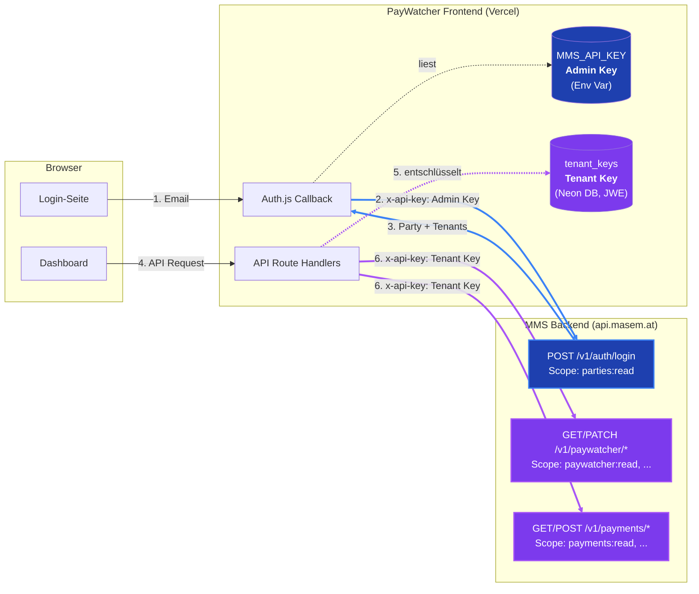
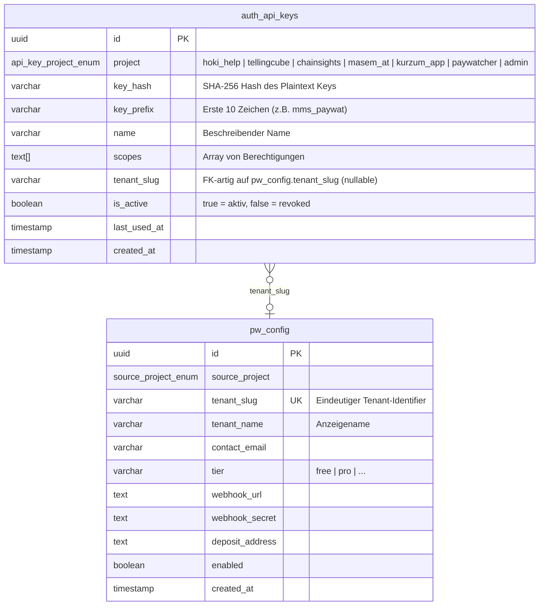
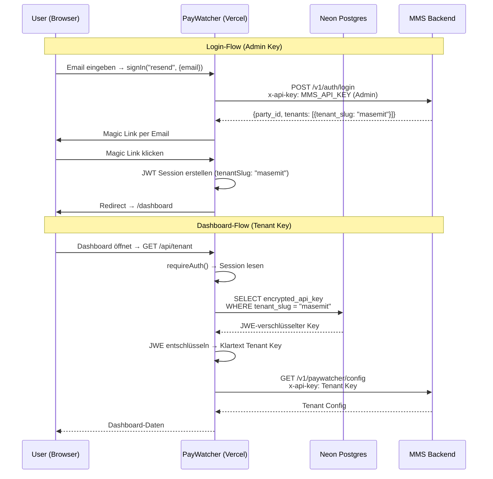

# PayWatcher API Key Architektur

## Übersicht: Zwei Keys, zwei Zwecke

PayWatcher verwendet zwei verschiedene MMS API Keys mit unterschiedlichen Aufgaben:



## Die zwei Keys im Detail

### 1. Admin Key (`MMS_API_KEY`) — blau im Diagramm

| Eigenschaft | Wert |
|---|---|
| **Gespeichert in** | `.env.local` (lokal) / Vercel Environment Variables (Produktion) |
| **Verwendet von** | Auth.js `signIn` + `jwt` Callback (serverseitig) |
| **Aufgabe** | Prüft beim Login ob eine Party mit PayWatcher-Tenant in MMS existiert |
| **MMS Endpoints** | `POST /v1/auth/login`, `/v1/admin/paywatcher/*` |
| **Benötigte Scopes** | `parties:read` (Login), `admin:read` + `admin:write` (Tenant-Verwaltung) |
| **Zuordnung in MMS** | Keiner Party/Tenant zugeordnet — ist ein Server-Level Key |

### 2. Tenant Key (`tenant_keys` DB) — lila im Diagramm

| Eigenschaft | Wert |
|---|---|
| **Gespeichert in** | Neon Postgres `tenant_keys` Tabelle, JWE-verschlüsselt mit `AUTH_SECRET` |
| **Verwendet von** | Alle API Route Handler im Dashboard (via `requireAuth()` → `getTenantApiKey()`) |
| **Aufgabe** | Authentifiziert API-Calls an MMS für den jeweiligen Tenant |
| **MMS Endpoints** | `/v1/paywatcher/*`, `/v1/payments/*`, `/v1/webhooks/*` |
| **Benötigte Scopes** | Zugriff auf alle PayWatcher-relevanten Endpoints |
| **Zuordnung in MMS** | Dem jeweiligen Tenant zugeordnet (z.B. `masemit`) |

## MMS Datenbank-Zusammenhänge

### Tabellen



### Key-Typen in `auth_api_keys`

Es gibt drei logische Key-Typen, die sich durch `project`, `scopes` und `tenant_slug` unterscheiden:

| Key-Typ | `project` | `tenant_slug` | `scopes` | Verwendung |
|---|---|---|---|---|
| **Admin Key** | `paywatcher` | `NULL` | `parties:read`, `admin:read`, `admin:write` | PayWatcher Frontend: Login-Flow (`POST /v1/auth/login` braucht `parties:read`), Tenant-Verwaltung (`/v1/admin/paywatcher/*` braucht `admin:*`) |
| **Tenant Key** | `paywatcher` | z.B. `masemit` | `payments:read`, `payments:write` | PayWatcher Frontend: Dashboard-API-Calls pro Tenant |
| **Andere Projekt-Keys** | z.B. `chainsights` | `NULL` | Projektspezifisch | Andere MMS-Konsumenten (nicht PayWatcher-relevant) |

### Scope-Unterschied: `admin:*` vs. `payments:*`

| Scope | Sichtbarkeit | Endpunkte | Zweck |
|---|---|---|---|
| `admin:read` | **Cross-Tenant** (alle Tenants) | `GET /v1/admin/paywatcher/tenants`, `/payments`, `/health` | Plattform-Verwaltung |
| `admin:write` | **Cross-Tenant** | `POST/PATCH /v1/admin/paywatcher/tenants` | Tenants anlegen/updaten |
| `payments:read` | **Eigener Tenant** nur | `GET /v1/payments/*`, `GET /v1/paywatcher/config` | Tenant-Dashboard Lesezugriff |
| `payments:write` | **Eigener Tenant** nur | `POST /v1/payments/*`, `PATCH /v1/paywatcher/config` | Payments erstellen, Config updaten |

### Tenant-Zuordnung

Die Verknüpfung `auth_api_keys.tenant_slug` → `pw_config.tenant_slug` ist eine **logische Referenz** (kein DB-Level Foreign Key). Das MMS Auth-Middleware resolvet den Tenant anhand des `tenant_slug` im API Key:

1. Request kommt mit `x-api-key: mms_paywatcher_xxx`
2. Middleware hasht den Key, findet den Eintrag in `auth_api_keys`
3. Wenn `tenant_slug` gesetzt → Scoped auf diesen Tenant (Tenant Key)
4. Wenn `tenant_slug` NULL → Cross-Tenant Zugriff je nach Scopes (Admin Key)

## Einrichtung

### Admin Key setzen

In `.env.local` bzw. Vercel Environment Variables:

```
MMS_API_KEY=mms_admin_xxxxxxxx
```

### Tenant Key setzen

Via CLI-Script (verschlüsselt automatisch mit `AUTH_SECRET`):

```bash
npx tsx scripts/set-tenant-key.ts <tenant_slug> <api_key>

# Beispiel:
npx tsx scripts/set-tenant-key.ts masemit mms_payw_3a4290...
```

> **Wichtig:** Nie den rohen API Key direkt in die `tenant_keys`-Tabelle schreiben.
> Immer über das Script gehen, das den Key als JWE verschlüsselt.

## Request-Flow im Detail


