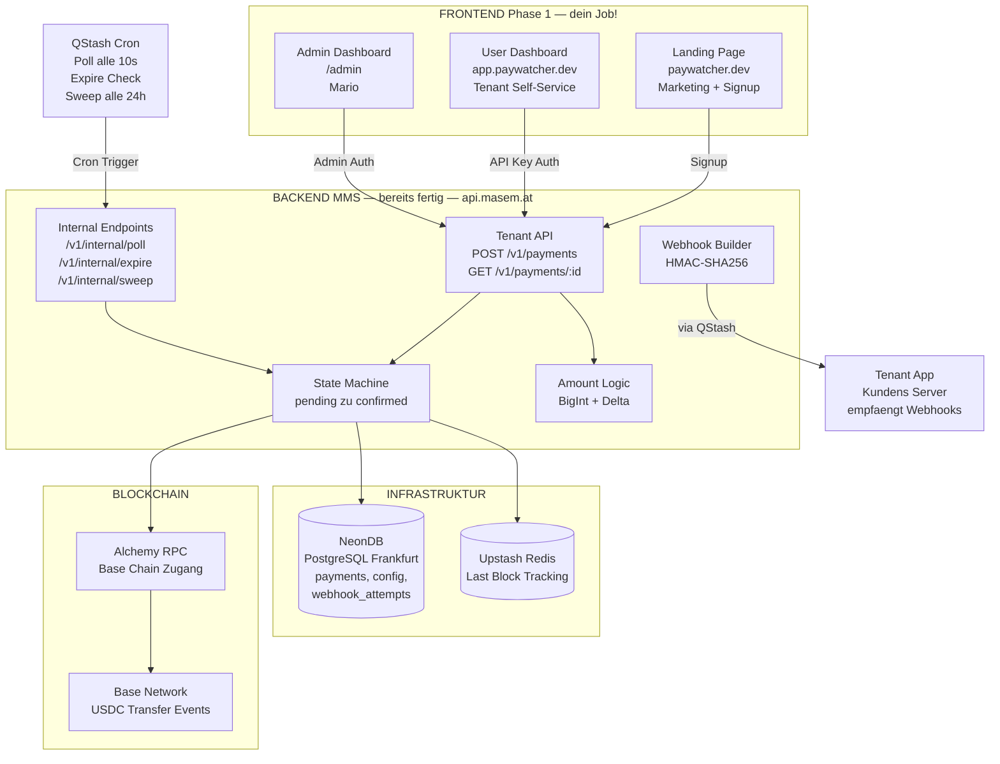
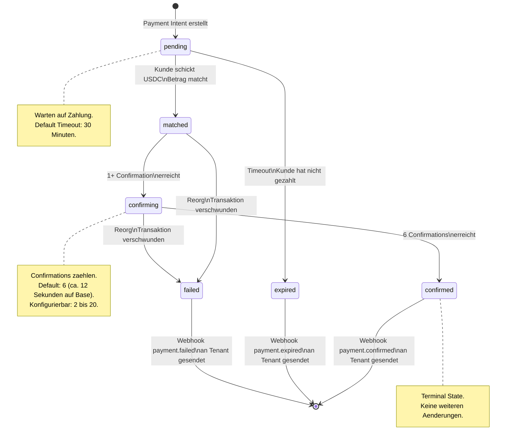

# PayWatcher — Projekt-Handbuch für Entwickler

**Erstellt für:** Neuen Entwickler im masemIT-Team
**Erstellt von:** Mario Semper (PO)
**Datum:** 2026-02-15
**Version:** 1.0

> Dieses Handbuch erklärt dir alles, was du brauchst, um am PayWatcher-Projekt produktiv zu arbeiten — auch wenn du noch nie mit Blockchain, Crypto oder Web3 gearbeitet hast. Es beginnt bei den Grundlagen und baut Schritt für Schritt auf.

---

## Teil 0: Warum es das alles überhaupt gibt

Bevor wir in Technik eintauchen: Warum existieren Blockchain, Krypto und Web3? Woher kommen diese Ideen, und warum zahlen echte Unternehmen echtes Geld dafür? Dieses Kapitel gibt dir das "Big Picture" — mit echten Beispielen, nicht mit Hype.

### 0.1 Das Grundproblem: Vertrauen braucht Mittelsleute

Unser gesamtes Wirtschaftssystem basiert auf Vertrauen — und weil wir einander nicht immer vertrauen können, brauchen wir Mittelsleute:

- Du vertraust deiner Bank, dass sie dein Geld nicht verliert.
- Der Onlineshop vertraut Visa/Mastercard, dass die Zahlung echt ist.
- Der Notar bestätigt, dass der Kaufvertrag gültig ist.
- Das Grundbuchamt beweist, wem das Haus gehört.

Diese Mittelsleute funktionieren — meistens. Aber sie kosten Geld, brauchen Zeit, und manchmal versagen sie. Denk an die Finanzkrise 2008: Die Banken, denen alle vertraut haben, hatten das Vertrauen nicht verdient.

**Die Kernidee von Blockchain:** Was wäre, wenn wir Vertrauen durch Mathematik und Transparenz ersetzen könnten? Kein Mittelmann, der lügen oder versagen kann — stattdessen ein System, das jeder überprüfen kann.

### 0.2 Bitcoin: Der Anfang (2009)

Das erste konkrete Experiment war **Bitcoin**, erfunden 2009 von einer anonymen Person (oder Gruppe) unter dem Pseudonym "Satoshi Nakamoto".

**Das Problem, das Bitcoin löst:** Wie kann Alice digital Geld an Bob schicken, ohne dass eine Bank dazwischen sitzt?

Vor Bitcoin war das unmöglich. Digitale Dinge kann man kopieren (Copy-Paste). Wenn Alice eine digitale Datei "1 Euro" an Bob schickt, was hindert sie daran, die gleiche Datei auch an Charlie zu schicken? Dieses "Double-Spending-Problem" lösten bisher nur Banken — sie führen Buch und sagen "Alice hat nur noch 0 Euro, sie kann nichts mehr schicken."

Bitcoin löst das, indem ALLE Teilnehmer das Kassabuch führen. Wenn Alice 1 Bitcoin an Bob schickt, sehen das alle 10.000+ Computer im Netzwerk. Ein zweites Mal schicken? Geht nicht — alle sehen, dass Alice den Bitcoin schon weg hat.

**Echtes Beispiel:** El Salvador hat Bitcoin 2021 als offizielles Zahlungsmittel eingeführt. Ob man das für klug hält oder nicht — es zeigt, dass Blockchain über Spielgeld hinausgewachsen ist.

### 0.3 Von digitalem Geld zu programmierbarem Geld: Ethereum (2015)

Bitcoin kann eine Sache gut: Wert speichern und überweisen. Aber was, wenn man mehr machen will?

**Vitalik Buterin** (damals 19 Jahre alt) hatte 2013 die Idee: Was wäre, wenn die Blockchain nicht nur ein Kassabuch ist, sondern ein Computer? Ein Computer, auf dem jeder Programme laufen lassen kann — und diese Programme wären genauso unveränderlich und transparent wie Bitcoin-Überweisungen.

So entstand **Ethereum** (2015). Die Programme heißen **Smart Contracts** — "Verträge", die sich selbst ausführen, ohne dass jemand sie überwachen muss.

**Echtes Beispiel — Crowdfunding ohne Kickstarter:**
Stell dir vor, 1.000 Leute wollen gemeinsam ein Projekt finanzieren. Heute nutzen sie Kickstarter. Kickstarter nimmt 5% Gebühr und entscheidet, welche Projekte erlaubt sind.

Mit einem Smart Contract auf Ethereum:
- Jeder schickt Geld an den Contract
- Der Contract sagt: "Wenn bis 31.03. mindestens €50.000 zusammenkommen, geht das Geld an den Projektersteller. Wenn nicht, bekommt jeder automatisch sein Geld zurück."
- Kein Kickstarter nötig. Keine 5% Gebühr. Kein "Kickstarter hat mein Projekt abgelehnt."

### 0.4 Tokens: Mehr als nur Geld

Auf Ethereum kann jeder seinen eigenen "Token" erstellen — einen digitalen Vermögenswert. Das klingt erstmal abstrakt, ist aber extrem vielseitig:

**Tokens als Geld (Stablecoins):**
USDC ist ein Token auf Ethereum, der immer 1 US-Dollar wert ist. Die Firma Circle hält für jeden USDC einen echten Dollar auf der Bank. So kannst du Dollar-Werte auf der Blockchain bewegen — schnell, billig, weltweit, 24/7, ohne Bankarbeitstage.

**Echtes Beispiel:** Ein Freelancer in Nigeria arbeitet für ein Startup in Estland. Banküberweisung: 3–5 Tage, $30+ Gebühren, Empfänger braucht ein Bankkonto (das in Nigeria nicht jeder hat). Per USDC auf Blockchain: 2 Sekunden, $0.01 Gebühr, nur eine Wallet-App am Handy nötig.

**Tokens als Stimmrecht (Governance Tokens):**
Manche Projekte verteilen Tokens, die Stimmrechte repräsentieren. Wer mehr Tokens hat, hat mehr Einfluss auf Entscheidungen. Das ist die Basis von DAOs.

**Echtes Beispiel — Uniswap (UNI Token):**
Uniswap ist eine dezentrale Tauschbörse (kein Unternehmen, kein CEO). Die UNI-Token-Holder stimmen über Änderungen ab: Sollen die Gebühren gesenkt werden? Soll eine neue Blockchain unterstützt werden? Das ist wie eine Aktionärsversammlung — aber jede Woche, online, transparent, und ohne Aufsichtsrat.

**Tokens als Eigentumsnachweis (NFTs):**
Ein NFT (Non-Fungible Token) beweist Eigentum an einem einzigartigen digitalen Objekt. Der Hype um teure Affenbilder hat NFTs einen schlechten Ruf gegeben, aber die Technologie hat seriöse Anwendungen: digitale Konzerttickets, Grundbucheinträge, Zertifikate, Software-Lizenzen.

### 0.5 Web3: Das "neue Internet"?

**Web1** (1990er): Lesen. Statische Webseiten. Du konsumierst Inhalte.
**Web2** (2000er–heute): Lesen + Schreiben. Social Media, Plattformen. Du erstellst Inhalte — aber Facebook, Google, Amazon besitzen die Plattform und deine Daten.
**Web3** (Idee): Lesen + Schreiben + **Besitzen**. Du besitzt deine Daten, dein Geld, deine digitalen Assets direkt — ohne Plattform als Mittelmann.

**Ehrliche Einordnung:** Web3 ist ein großes Versprechen, das noch lange nicht vollständig eingelöst ist. Vieles ist noch experimentell, manches ist Hype, und die User Experience ist oft schlecht. Aber einige Bausteine funktionieren heute schon gut — und Stablecoin-Zahlungen sind einer der praktischsten davon. Genau da setzt PayWatcher an.

### 0.6 DeFi: Finanzwelt ohne Banken

**DeFi** (Decentralized Finance) ist der Versuch, Finanzdienstleistungen auf die Blockchain zu bringen:

**Echtes Beispiel — Aave (Kreditplattform):**
In der traditionellen Welt: Du gehst zur Bank, beantragst einen Kredit, wartest 2 Wochen, brauchst Gehaltsnachweise und Sicherheiten.
Bei Aave: Du hinterlegst Krypto als Sicherheit in einem Smart Contract, und bekommst in 30 Sekunden einen Kredit. Kein Sachbearbeiter, keine Wartezeit, keine Bürozeiten. Der Smart Contract rechnet automatisch Zinsen ab und liquidiert die Sicherheit wenn sie unter den Schwellenwert fällt.

**Aktuell in DeFi gebunden:** Über $100 Milliarden. Das ist kein Spielgeld mehr.

### 0.7 DAOs: Organisationen ohne Chef

Eine **DAO** (Decentralized Autonomous Organization) ist wie ein Verein, bei dem alle Mitglieder über alles abstimmen und die Regeln in Smart Contracts festgeschrieben sind.

**Echtes Beispiel — MakerDAO:**
MakerDAO verwaltet den Stablecoin DAI (ein Dollar-Token, ähnlich wie USDC, aber dezentral). Es gibt keinen CEO. Stattdessen stimmen die MKR-Token-Holder über alles ab: Zinssätze, erlaubte Sicherheiten, Risikoparameter. Das sind Entscheidungen, die bei einer Bank der Vorstand trifft — hier macht es die Community.

**Echtes Beispiel — Arbitrum DAO:**
Arbitrum (ein Layer-2 für Ethereum) wird von einer DAO gesteuert. Anfang 2023 haben sie ARB-Tokens an Early Users verteilt ("Airdrop"). Seitdem stimmen die Token-Holder über die technische Roadmap, Grants für Entwickler und Treasury-Verwendung ab. Marios anderes Produkt **ChainSights** analysiert genau solche DAOs — wie gesund ist die Governance? Stimmen wirklich verschiedene Leute ab, oder kontrolliert eine kleine Gruppe alles?

### 0.8 Stablecoins im Alltag: Warum PayWatcher relevant ist

All das klingt vielleicht noch akademisch. Aber Stablecoins sind der Teil von Crypto, der JETZT praktisch genutzt wird:

**Zahlen, die überzeugen:**
- 2025 wurden über **$27 Billionen** (Trillions) in Stablecoins bewegt — mehr als Visa + Mastercard zusammen
- 76% aller Krypto-Zahlungen laufen über Stablecoins
- Der Markt für Stablecoin-Zahlungsinfrastruktur wächst mit 13–19% pro Jahr

**Wer nutzt Stablecoins wirklich?**

| Wer | Warum |
|-----|-------|
| **Freelancer & Remote Worker** | Internationales Gehalt ohne teure Bankgebühren |
| **E-Commerce** | Globale Zahlungen ohne Chargebacks (einmal gesendet = gesendet, kein "Kreditkarte zurückbuchen") |
| **B2B zwischen Unternehmen** | Große Beträge ($10k+) schnell und günstig überweisen, statt SWIFT-Überweisungen mit 3 Tagen Wartezeit |
| **DApps & Web3 Projekte** | In-App Zahlungen für Services, Subscriptions, NFT-Käufe |
| **Länder mit instabiler Währung** | Argentinier und Türken nutzen USDC als Dollar-Ersatz, weil ihre eigene Währung rapide an Wert verliert |

**Und genau hier kommt PayWatcher ins Spiel:** All diese Unternehmen und Projekte müssen irgendwie verifizieren, dass eine Zahlung angekommen ist. PayWatcher macht genau das — einfach, günstig, ohne Custody.

### 0.9 Die Schattenseiten — ehrlich sein

Blockchain und Crypto haben auch ernste Probleme, und du solltest sie kennen:

- **Betrug & Scams:** Viele "Projekte" sind reine Abzocke. Rug Pulls, Ponzi Schemes, gefälschte Tokens. Der Bereich ist weniger reguliert als traditionelle Finanzmärkte.
- **Energieverbrauch:** Bitcoin verbraucht enorm viel Strom (Proof of Work). Ethereum hat 2022 auf Proof of Stake umgestellt und damit 99.95% Energie gespart. Base (wo PayWatcher läuft) nutzt ebenfalls Proof of Stake.
- **Volatilität:** Bitcoin und die meisten Tokens schwanken extrem im Wert. Stablecoins (wie USDC) sind davon explizit ausgenommen — darum arbeitet PayWatcher nur mit Stablecoins.
- **User Experience:** Wallets, Private Keys, Gas Fees — das ist für normale Menschen noch viel zu kompliziert. Ein großer Teil der Web3-Industrie arbeitet daran, das zu verbessern.
- **Regulierung:** Die rechtliche Lage ist weltweit uneinheitlich und ändert sich ständig. PayWatcher positioniert sich bewusst als non-custodial Verification-Service, um regulatorische Komplexität zu minimieren.

**Warum trotzdem mitmachen?** Weil die Grundtechnologie (dezentrale, transparente, programmierbare Wertübertragung) reale Probleme löst. Man muss nicht an "Crypto wird alles ersetzen" glauben, um zu sehen, dass Stablecoin-Zahlungen schneller, billiger und zugänglicher sind als traditionelle Banküberweisungen. PayWatcher baut auf dem praktischen Teil auf, nicht auf dem Hype.

---

## Teil 1: Die Welt in der PayWatcher lebt

### 1.1 Was ist eine Blockchain?

Stell dir eine Blockchain wie ein öffentliches Kassabuch vor, das auf tausenden Computern gleichzeitig gespeichert wird. Jeder kann reinschauen, aber niemand kann nachträglich etwas ändern.

**Wichtige Eigenschaften:**
- **Dezentral:** Kein einzelnes Unternehmen kontrolliert die Daten. Tausende Computer (Nodes) haben eine Kopie.
- **Unveränderlich:** Einmal geschrieben, kann ein Eintrag nicht mehr geändert werden.
- **Transparent:** Jede Transaktion ist öffentlich einsehbar (z.B. auf einem Block Explorer wie Basescan).
- **Blöcke:** Transaktionen werden in "Blöcke" zusammengefasst, wie Seiten in einem Buch. Jeder Block verweist auf den vorherigen — daher "Block-Chain" (Kette aus Blöcken).

**Analogie:** Eine Blockchain ist wie ein Google Sheet, das jeder lesen kann, niemand löschen kann, und das auf 10.000 Computern gleichzeitig existiert.

### 1.2 Was ist Ethereum und was sind EVM-Chains?

**Ethereum** ist die bekannteste Blockchain nach Bitcoin. Der große Unterschied: auf Ethereum kann man Programme laufen lassen — sogenannte Smart Contracts.

**EVM** steht für "Ethereum Virtual Machine" — das ist die Laufzeitumgebung, in der Smart Contracts ausgeführt werden. Denk an die EVM wie an die Java Virtual Machine (JVM): ein Standard, auf dem verschiedene Plattformen aufbauen können.

**EVM-Chains** sind Blockchains, die die gleiche Technologie wie Ethereum verwenden, aber unabhängig laufen. Die wichtigsten:

| Chain | Besonderheit | Transaktionskosten |
|-------|-------------|-------------------|
| **Ethereum** (Mainnet) | Die "Mutter-Chain", am sichersten, aber am teuersten | $1–50 pro Transaktion |
| **Base** | Von Coinbase betrieben, sehr günstig, wächst am schnellsten | $0.001–0.01 pro Transaktion |
| **Polygon** | Älter, weit verbreitet | $0.001–0.1 pro Transaktion |
| **Arbitrum** | Auch günstig, starke DeFi-Community | $0.01–0.1 pro Transaktion |

**PayWatcher arbeitet auf Base** — weil es günstig, schnell und der am stärksten wachsende Layer-2 ist.

### 1.3 Was ist ein Layer-2 (L2)?

Ethereum ist langsam und teuer. Layer-2-Chains wie **Base** lösen das Problem, indem sie Transaktionen "oben drauf" bündeln und dann als Zusammenfassung auf Ethereum speichern.

**Analogie:** Stell dir Ethereum als Autobahn vor. Wenn alle gleichzeitig fahren, gibt es Stau. Layer-2 ist wie eine Schnellstraße neben der Autobahn — du fährst schneller und billiger, aber die Sicherheit kommt immer noch von der Autobahn (Ethereum).

**Base** ist ein Layer-2, das von **Coinbase** (größte US-Kryptobörse) betrieben wird. Es hat einen "Sequencer" — einen zentralen Computer, der die Transaktionen der Reihe nach ordnet. Das macht es schneller, aber weniger dezentral als Ethereum selbst.

### 1.4 Was sind Tokens und Stablecoins?

**Token:** Ein digitaler Vermögenswert auf einer Blockchain. Es gibt tausende verschiedene Tokens — manche sind Währungen, manche Stimmrechte, manche Sammlerstücke (NFTs).

**ERC-20:** Ein technischer Standard, der definiert, wie ein Token auf EVM-Chains funktioniert. Wenn ein Token ERC-20-kompatibel ist, kann jede Wallet und jede App damit umgehen. Denk an USB als Standard — jedes USB-Gerät funktioniert in jedem USB-Anschluss.

**Stablecoin:** Ein Token, dessen Wert an eine echte Währung gekoppelt ist.

| Stablecoin | Gekoppelt an | Herausgeber | Marktkapitalisierung |
|-----------|-------------|-------------|---------------------|
| **USDC** | 1 US Dollar | Circle (reguliertes US-Unternehmen) | ~$50 Mrd. |
| **USDT** | 1 US Dollar | Tether (umstrittener) | ~$100 Mrd. |
| **DAI** | 1 US Dollar | Dezentral (MakerDAO) | ~$5 Mrd. |

**PayWatcher arbeitet mit USDC auf Base** — weil USDC der vertrauenswürdigste Stablecoin ist (regulierter Herausgeber, transparent geprüft) und Base die günstigsten Transaktionskosten hat.

**Wichtig:** 1 USDC = 1 USD. Immer. Das ist kein spekulativer Krypto-Asset. Wenn jemand 49 USDC schickt, hat er $49 geschickt.

### 1.5 Was sind Wallets und Adressen?

**Wallet:** Wie ein digitales Bankkonto. Jede Wallet hat eine Adresse (wie eine IBAN) und einen Private Key (wie ein PIN, nur viel länger).

**Adresse:** Sieht so aus: `0x742d35Cc6634C0532925a3b844Bc9e7595f6E321`. Das ist öffentlich — jeder kann dir Geld an diese Adresse schicken, und jeder kann sehen, was auf dieser Adresse liegt.

**Private Key:** Ein geheimer Schlüssel, den nur der Besitzer kennt. Wer den Private Key hat, kontrolliert die Wallet. Wenn du den Private Key verlierst, sind die Funds weg. Für immer. Es gibt keinen "Passwort vergessen"-Button.

**Im PayWatcher-Kontext:**
- **Hot Wallet:** Eine Wallet, deren Private Key auf dem Server liegt (in einer Environment Variable). Wird aktiv zum Signieren von Transaktionen verwendet (z.B. Sweep von USDC zur Cold Wallet).
- **Cold Wallet:** Eine Wallet, die offline gespeichert wird (z.B. auf einem Hardware Device). Dort liegen die gesammelten Funds sicher. PayWatcher überweist regelmäßig von Hot nach Cold.
- **Deposit Address:** Die Adresse, an die Kunden ihre USDC schicken. Im MVP ist das eine einzige, gemeinsame Adresse für alle Zahlungen (Shared Address).

### 1.6 Was ist ein Smart Contract?

Ein Programm, das auf der Blockchain läuft. Einmal deployed, kann es niemand mehr ändern. Es führt automatisch aus, was im Code steht.

**USDC selbst ist ein Smart Contract** — ein Programm auf der Blockchain, das weiß, wer wie viele USDC besitzt. Wenn Alice 50 USDC an Bob schickt, ruft sie eine Funktion im USDC-Smart-Contract auf (`transfer(bob, 50)`), und der Contract aktualisiert die Salden.

**Für PayWatcher relevant:** Wir rufen den USDC-Contract nicht aktiv auf (außer beim Sweep). Wir **beobachten** ihn — wir schauen, ob jemand USDC an unsere Deposit Address geschickt hat.

### 1.7 Was ist ein Transfer Event?

Wenn jemand USDC schickt, erzeugt der USDC-Smart-Contract ein **Event** (ein Log-Eintrag auf der Blockchain). Dieses Event enthält:
- `from`: Wer hat geschickt (Adresse)
- `to`: Wer hat empfangen (Adresse)
- `value`: Wie viel wurde geschickt (in kleinster Einheit)

**Analogie:** Wie ein Kontoauszug, den die Bank automatisch erstellt. Jede Überweisung erzeugt eine Zeile.

PayWatcher beobachtet diese Events und sucht: "Hat jemand genau X.XXXXXX USDC an unsere Deposit Address geschickt?" Wenn ja → Payment matched!

### 1.8 Was sind Confirmations (Bestätigungen)?

Wenn eine Transaktion in einen Block aufgenommen wird, hat sie 1 Confirmation. Mit jedem weiteren Block, der danach kommt, steigt die Anzahl der Confirmations.

**Warum ist das wichtig?** Es gibt ein Phänomen namens **Reorg** (Reorganisation): In seltenen Fällen kann die Blockchain die letzten paar Blöcke "umschreiben". Dann wäre eine Transaktion, die schon 1 Confirmation hatte, plötzlich wieder weg.

Je mehr Confirmations, desto sicherer:
- 1 Confirmation = "Sieht gut aus"
- 6 Confirmations = "Ziemlich sicher" (PayWatcher Default)
- 20 Confirmations = "Quasi unmöglich rückgängig zu machen"

**Auf Base:** Ein Block kommt alle ~2 Sekunden. 6 Confirmations = ~12 Sekunden. Das ist schnell genug, dass der Kunde nicht lange warten muss, aber sicher genug, dass wir keine Phantom-Zahlungen bestätigen.

### 1.9 Was sind DAOs, DApps und DeFi?

Diese Begriffe tauchen im masemIT-Umfeld häufig auf (ChainSights analysiert DAOs), also gut zu wissen:

**DAO (Decentralized Autonomous Organization):** Eine Organisation, die durch Smart Contracts und Abstimmungen ihrer Token-Holder gesteuert wird. Wie ein Verein, nur ohne Vorstand — die Mitglieder stimmen über alles ab.

**DApp (Decentralized Application):** Eine App, die auf einer Blockchain läuft. Z.B. ein Marktplatz, auf dem man NFTs kaufen kann, oder eine Tauschbörse für Tokens.

**DeFi (Decentralized Finance):** Finanzdienstleistungen auf der Blockchain — Kreditvergabe, Handel, Zinsen — ohne Banken als Mittelsmann.

**Für PayWatcher:** Unsere Kunden sind oft DApp-Entwickler oder Unternehmen, die Stablecoin-Zahlungen in ihre Produkte einbauen wollen. Sie brauchen PayWatcher, weil sie wissen wollen: "Hat mein Kunde bezahlt?" — ohne selbst einen ganzen Payment Processor bauen zu müssen.

### 1.10 Wichtige Tools und Services im Blockchain-Ökosystem

| Tool/Service | Was es macht | PayWatcher-Relevanz |
|-------------|-------------|-------------------|
| **Alchemy** | Stellt RPC-Zugang zur Blockchain bereit (wie ein Internet-Provider für Blockchain-Daten) | PayWatcher nutzt Alchemy, um Transfer Events auf Base abzufragen |
| **Block Explorer (Basescan)** | Website, auf der man Transaktionen und Adressen nachschauen kann | Debugging: "Wurde die Transaktion wirklich gesendet?" |
| **viem** | JavaScript/TypeScript-Library für Blockchain-Interaktion | PayWatcher nutzt viem im Backend zum Lesen der Chain und Signieren von Sweeps |
| **RPC (Remote Procedure Call)** | API-Protokoll, über das man mit einer Blockchain kommuniziert | Alchemy bietet RPC-Endpoints, PayWatcher ruft sie auf |
| **Webhook** | HTTP-Callback: "Ruf mich an, wenn etwas passiert" | PayWatcher schickt Webhooks an Kunden wenn eine Zahlung bestätigt wird |

---

## Teil 2: Was PayWatcher macht und warum

### 2.1 Das Problem

Ein Unternehmen will Stablecoin-Zahlungen akzeptieren. Heute hat es genau zwei Optionen:

**Option A: Payment Processor** (Coinbase Commerce, NOWPayments, BitPay)
- Vorteile: Einfach einzubauen, alles wird abgewickelt
- Nachteile: **1% Gebühr pro Transaktion**, der Processor kontrolliert den Checkout-Flow, Custody (der Processor hält dein Geld)
- Bei einer $10.000 Zahlung: **$100 Gebühr** — nur damit jemand bestätigt, dass bezahlt wurde

**Option B: Selbst bauen** (Alchemy Webhooks, Moralis Streams)
- Vorteile: Volle Kontrolle, keine Prozent-Gebühren
- Nachteile: **Wochen an Entwicklungsarbeit**. Man muss selbst bauen: Betragsabgleich, Bestätigungszählung, Timeout-Logik, Idempotenz, Webhook-Delivery, Fehlerbehandlung...

**Es gibt keine Mitte.** Kein Produkt sagt einfach: "Sag mir was du erwartest, ich sage dir wenn es angekommen ist." Ohne Custody, ohne Checkout-Flow, ohne Prozent-Gebühren.

### 2.2 Die Lösung: PayWatcher

PayWatcher ist diese fehlende Mitte. Eine **Verification API** — kein Payment Processor.

**Der Flow in 3 Schritten:**

```
1. Dein Kunde will $49 USDC bezahlen
   → Du rufst PayWatcher API auf: POST /v1/payments { amount: "49.00" }
   → PayWatcher gibt zurück: "Lass deinen Kunden exakt 49.000042 USDC 
      an Adresse 0xABC... schicken"

2. Dein Kunde schickt 49.000042 USDC
   → PayWatcher beobachtet die Blockchain (~alle 10 Sekunden)
   → Findet die Transaktion: "49.000042 USDC an 0xABC... — Match!"
   → Wartet auf 6 Bestätigungen (~12 Sekunden)

3. PayWatcher schickt dir einen Webhook:
   → POST an deine URL: { event: "payment.confirmed", tx_hash: "0x123..." }
   → Du weißt: Zahlung ist da, sicher bestätigt → Produkt ausliefern
```

### 2.3 Der Unique-Amount-Trick

**Problem:** PayWatcher nutzt im MVP eine einzige Deposit Address für alle Zahlungen. Wenn drei Kunden gleichzeitig $49 USDC schicken — woher wissen wir, welche Zahlung zu welchem Kunden gehört?

**Lösung:** Jede Zahlung bekommt einen minimal unterschiedlichen Betrag.

| Kunde | Gewünschter Betrag | Exakter Betrag (was PayWatcher generiert) |
|-------|-------------------|------------------------------------------|
| Kunde A | $49.00 | $49.000042 USDC |
| Kunde B | $49.00 | $49.000187 USDC |
| Kunde C | $49.00 | $49.000523 USDC |

Die Differenz (das "Delta") ist maximal $0.999999 — weniger als ein Dollar. Aber es macht jede Zahlung eindeutig identifizierbar.

**USDC hat 6 Dezimalstellen** — das bedeutet, es gibt 999.999 mögliche Deltas. Bei MVP-Volumen ist die Wahrscheinlichkeit einer Kollision praktisch null.

**Technisch:** Die Beträge werden intern als **BigInt** (Ganzzahlen) gespeichert und berechnet. $49.000042 USDC = `49000042` (Ganzzahl). **Keine Kommazahlen, niemals.** Fließkomma-Arithmetik (float, double) ist bei Geldbeträgen verboten, weil sie Rundungsfehler erzeugt.

### 2.4 Was PayWatcher NICHT ist

Das ist genauso wichtig wie zu wissen, was es ist:

| PayWatcher ist... | PayWatcher ist NICHT... |
|-------------------|------------------------|
| Ein Verification/Monitoring Service | Ein Payment Processor (kein Checkout, keine Währungskonvertierung) |
| Non-custodial (hält keine Kundengelder) | Ein Custody Provider (wir verwahren nichts) |
| Ein Developer-Tool (API + Webhooks) | Eine Consumer-App (keine App für Endkunden) |
| Flat-Fee basiert ($0.05 pro Verification) | Prozent-basiert (nicht 1% pro Transaktion) |
| Auf Base Network fokussiert | Multi-Chain (nur Base im MVP) |

**Analogie:** PayWatcher ist wie ein Bankberater, der ans Fenster schaut und sagt: "Ja, der Geldtransporter ist gerade angekommen." Er trägt das Geld nicht rein, er zählt es nicht, er verwahrt es nicht. Er schaut nur und bestätigt.

### 2.5 Warum das regulatorisch wichtig ist

Weil PayWatcher kein Geld bewegt, hält oder konvertiert, fällt es voraussichtlich NICHT unter die strengen Regulierungen für Payment Processor, Kryptobörsen oder Custody-Provider. Das ist ein bewusster strategischer Vorteil — weniger Compliance-Aufwand, schnellerer Launch, geringere Kosten.

---

## Teil 3: Architektur-Überblick

### 3.1 Das Gesamtbild



### 3.2 Payment Lifecycle (State Machine)

Jede Zahlung durchläuft definierte Status:



### 3.3 Tech Stack

| Komponente | Technologie | Wo |
|-----------|------------|-----|
| **Backend (fertig)** | Express 5, Drizzle ORM, viem | api.masem.at (MMS) |
| **Datenbank** | NeonDB (PostgreSQL, Frankfurt) | Serverless |
| **Cache** | Upstash Redis | Für "last polled block" |
| **Cron Jobs** | QStash (Upstash) | Poll alle 10s, Expire, Sweep alle 24h |
| **Blockchain-Zugang** | Alchemy RPC | Base Chain |
| **Frontend (dein Job)** | Next.js 15, Tailwind, shadcn/ui | Vercel |
| **Deployment** | Vercel Pro | Auto-Deploy via Git |
| **Domain** | paywatcher.dev | Porkbun/Vercel DNS |

---

## Teil 4: Was du bauen wirst (Phase 1)

### 4.1 Landing Page (paywatcher.dev)

**Ziel:** Ein Web3-Developer kommt auf die Seite und versteht in 10 Sekunden: "Das ist ein Verification-API für Stablecoin-Zahlungen, non-custodial, flat-fee, developer-first."

**Design-Richtung:** Dark Mode, Code-fokussiert, minimalistisch. Denk an Stripe, Resend oder Clerk als Referenz. Keine Stock-Fotos, keine generischen "Web3 is the future"-Texte.

**8 Sektionen:** Hero → Problem/Solution → How It Works → Code Examples → Pricing → Comparison → Trust Signals → Footer

**Wichtigste Conversion-Elemente:**
- Code-Snippet im Hero (3 Zeilen: Create → Wait → Webhook)
- Pricing-Vergleich: "$100 bei Coinbase Commerce vs. $0.05 bei PayWatcher für eine $10k Zahlung"
- CTA: "Get API Key" (Free Tier, Self-Service)

### 4.2 User Dashboard (app.paywatcher.dev)

**Ziel:** Tenants (unsere Kunden) können ihre Zahlungen sehen, API Keys verwalten, und Webhook-Konfiguration managen.

**4 Seiten:**
1. **Overview** — Statistiken + Recent Payments
2. **Payments** — Tabelle mit Filtern + Detail-Ansicht mit Status-Timeline
3. **Settings** — API Keys, Webhook Config, Confirmation Override
4. **Docs-Lite** — Quick Start + Endpoint Reference (eingebettet oder als Link zu docs.paywatcher.dev)

### 4.3 Admin Dashboard (/admin)

**Ziel:** Mario kann den gesamten Service überwachen.

**5 Seiten:**
1. **System Overview** — Health, Hot/Cold Wallet Balance, Unmatched Transfers
2. **Tenants** — Liste, Enable/Disable, neuen Tenant anlegen
3. **Payments (Global)** — Alle Payments über alle Tenants
4. **Webhooks (Global)** — Delivery Health, Failed Deliveries
5. **System/Config** — ENV Status, QStash Cron Status, Manual Actions

### 4.4 Auth & Signup

- **Free Tier:** Self-Service. Dev registriert sich → bekommt sofort API Key
- **Paid Tiers:** Nach kurzem Review/Onboarding durch Mario
- **Admin:** Separater Auth-Mechanismus für Mario

---

## Teil 5: Phasenplan (Gesamtbild)

### Phase 1 — Frontend Launch (aktuell)

Was du jetzt baust:
- Landing Page auf paywatcher.dev
- User Dashboard
- Admin Dashboard
- Auth + Signup Flow

**Backend ist fertig:** POST/GET Payments, Blockchain Polling, Webhooks, Sweep — alles da.

### Phase 2 — Wachstum & DX

| Feature | Beschreibung |
|---------|-------------|
| **Vollständige API Docs** | Separate Docs-App auf docs.paywatcher.dev (Mintlify oder Fumadocs) |
| **npm SDK** | `npm install @paywatcher/sdk` — TypeScript SDK für einfachere Integration |
| **Multi-Chain** | Neben Base auch Ethereum, Polygon, Arbitrum unterstützen |
| **HD Wallet** | Statt einer Shared Address bekommt jede Zahlung eine eigene Adresse |
| **WebSocket Real-Time** | Dashboard-Updates in Echtzeit (statt Polling/Refresh) |
| **Interactive API Explorer** | Swagger UI oder ähnlich zum Ausprobieren der API |
| **Stripe Billing** | Automatische Abrechnung der Tiers (ab >10 zahlende Tenants) |

### Phase 3 — Enterprise & Scale

| Feature | Beschreibung |
|---------|-------------|
| **Team/Multi-User** | Mehrere Benutzer pro Tenant mit Rollen |
| **Custom Branding** | White-Label für Enterprise-Kunden |
| **Audit Log** | Vollständige Event-History für Compliance |
| **Vault Integration** | Private Keys in einem Hardware Security Module statt ENV |
| **Public Status Page** | status.paywatcher.dev für Uptime-Transparenz |
| **SLA & Support Tiers** | Garantierte Verfügbarkeit für Enterprise-Kunden |

### Phase 4 — Plattform

| Feature | Beschreibung |
|---------|-------------|
| **Multi-Stablecoin** | Neben USDC auch USDT, DAI, EURC |
| **Fiat On-Ramp Partnership** | Partnerschaften für "USD → USDC → PayWatcher"-Flow |
| **Analytics Dashboard** | Erweiterte Auswertungen für Tenants (Trends, Conversion Rates) |
| **Marketplace/Plugin Ecosystem** | Plugins für Shopify, WooCommerce, etc. |

---

## Teil 6: Glossar

Hier nochmal alle Begriffe zum schnellen Nachschlagen:

| Begriff | Erklärung |
|---------|-----------|
| **Alchemy** | Cloud-Service, der RPC-Zugang zur Blockchain bereitstellt. Wie ein Internet-Provider für Blockchain-Daten. |
| **Base** | Layer-2 Blockchain von Coinbase. Günstig, schnell, EVM-kompatibel. |
| **BigInt** | JavaScript-Datentyp für beliebig große Ganzzahlen. Pflicht bei Geldbeträgen — kein float/double! |
| **Block** | Eine Sammlung von Transaktionen auf der Blockchain. Auf Base kommt ca. alle 2 Sekunden ein neuer Block. |
| **Block Explorer** | Website zum Nachschauen von Blockchain-Transaktionen (z.B. basescan.org). |
| **BMAD** | Build, Measure, Analyze, Deploy — masemIT's Entwicklungs-Methodik. Definiert Rollen, Dokumente, Workflows. |
| **Cold Wallet** | Offline-Wallet für sichere Aufbewahrung. PayWatcher sweept regelmäßig Funds von Hot zu Cold. |
| **Confirmation** | Anzahl der Blöcke nach einer Transaktion. Mehr Confirmations = sicherer. Default bei PayWatcher: 6. |
| **Custody** | Verwahrung von Kundengeldern. PayWatcher macht KEINE Custody — wichtig für Regulierung. |
| **DAO** | Decentralized Autonomous Organization — eine durch Token-Holder gesteuerte Organisation. |
| **DApp** | Decentralized Application — eine App, die auf einer Blockchain läuft. |
| **DeFi** | Decentralized Finance — Finanzdienstleistungen ohne traditionelle Banken. |
| **Delta** | Der kleine Betrag ($0.000001–$0.999999), der zum Basisbetrag addiert wird, um Zahlungen eindeutig zu machen. |
| **Deposit Address** | Die Blockchain-Adresse, an die Kunden USDC schicken. Im MVP eine Shared Address. |
| **Drizzle ORM** | TypeScript ORM für PostgreSQL. Wird im MMS Backend verwendet. |
| **ENV Variable** | Umgebungsvariable auf dem Server. Sensitive Daten (Private Keys, API Keys) werden hier gespeichert. |
| **ERC-20** | Standard-Interface für Tokens auf EVM-Chains. USDC ist ein ERC-20 Token. |
| **Ethereum** | Die bekannteste Smart-Contract-Blockchain. |
| **EVM** | Ethereum Virtual Machine — die Laufzeitumgebung für Smart Contracts. |
| **Express 5** | Node.js Web-Framework. Das MMS Backend läuft darauf. |
| **Gas** | Die Gebühr, die man für eine Blockchain-Transaktion bezahlt. Auf Base bezahlt man Gas in ETH. |
| **HMAC-SHA256** | Kryptographische Signatur für Webhooks. Stellt sicher, dass der Webhook wirklich von PayWatcher kommt. |
| **Hot Wallet** | Online-Wallet, die auf dem Server liegt. Wird für Sweep-Transaktionen benötigt. |
| **Idempotenz** | Eine Operation kann mehrfach ausgeführt werden, ohne das Ergebnis zu ändern. Wichtig beim Blockchain-Polling. |
| **Layer-2 (L2)** | Blockchain, die auf Ethereum aufbaut. Schneller und günstiger, erbt Sicherheit von Ethereum. |
| **MMS** | masemIT Managed Services — das zentrale Backend für alle masemIT-Produkte. api.masem.at. |
| **NeonDB** | Serverless PostgreSQL-Datenbank. Läuft in Frankfurt (DSGVO-konform). |
| **Next.js** | React-Framework für Fullstack-Web-Apps. Standard im masemIT-Stack. |
| **Node** | Ein Computer, der am Blockchain-Netzwerk teilnimmt. |
| **Non-custodial** | PayWatcher hält keine Kundengelder. Wichtig für regulatorische Positionierung. |
| **Payment Intent** | Ein von PayWatcher erzeugter Zahlungswunsch mit eindeutigem Betrag und Timeout. |
| **Private Key** | Geheimer Schlüssel einer Wallet. Wer ihn hat, kontrolliert die Funds. NIEMALS loggen oder exponieren. |
| **QStash** | Upstash-Service für Cron Jobs und Message Queues. Steuert Polling, Expiration und Sweep. |
| **Reorg** | Blockchain-Reorganisation — Blöcke werden rückgängig gemacht. Darum warten wir auf Confirmations. |
| **RPC** | Remote Procedure Call — Protokoll zur Kommunikation mit einer Blockchain (über Alchemy). |
| **Scope** | Berechtigungslevel eines API Keys. z.B. `payments:read` darf lesen, `payments:write` darf erstellen. |
| **Sequencer** | Zentraler Akteur auf Base, der Transaktionen ordnet. Macht Base schnell, aber weniger dezentral. |
| **shadcn/ui** | UI-Komponentenbibliothek für React/Tailwind. Standard im masemIT-Stack. |
| **Smart Contract** | Programm auf der Blockchain, das automatisch ausgeführt wird. |
| **Stablecoin** | Token mit stabilem Wert (z.B. 1 USDC = 1 USD). |
| **State Machine** | Definiertes System von Zuständen und erlaubten Übergängen. PayWatcher: pending → matched → confirming → confirmed. |
| **Sweep** | Automatische Überweisung von USDC von der Hot Wallet zur Cold Wallet (alle 24h, wenn Threshold überschritten). |
| **Tenant** | Ein Kunde von PayWatcher. Hat eigenen API Key, Webhook-Config, und Payments. |
| **Transaktion (TX)** | Eine Aktion auf der Blockchain (z.B. USDC-Überweisung). Hat einen einzigartigen txHash. |
| **Transfer Event** | Blockchain-Log-Eintrag, der bei jeder Token-Überweisung erzeugt wird. |
| **USDC** | USD Coin — Stablecoin von Circle. 1 USDC = 1 USD. 6 Dezimalstellen. |
| **Vercel** | Hosting-Plattform für Next.js Apps. Serverless, auto-deploy via Git. |
| **viem** | TypeScript-Library für EVM-Blockchain-Interaktion. Modern, lightweight, type-safe. |
| **Wallet** | Digitales "Konto" auf der Blockchain mit Adresse (öffentlich) und Private Key (geheim). |
| **Webhook** | HTTP-Callback: PayWatcher ruft eine URL beim Kunden auf, wenn sich ein Payment-Status ändert. |

---

## Teil 7: Wichtige Links

| Was | URL |
|-----|-----|
| **PayWatcher Landing Page** | paywatcher.dev (von dir zu bauen!) |
| **MMS Backend API** | api.masem.at |
| **masemIT Website** | masem.at |
| **Base Block Explorer** | basescan.org |
| **USDC Contract auf Base** | basescan.org/token/0x833589fCD6eDb6E08f4c7C32D4f71b54bdA02913 |
| **Alchemy Dashboard** | dashboard.alchemy.com |
| **Vercel Dashboard** | vercel.com/dashboard |
| **NeonDB Console** | console.neon.tech |
| **QStash Console** | console.upstash.com |
| **shadcn/ui Docs** | ui.shadcn.com |
| **Next.js Docs** | nextjs.org/docs |
| **Tailwind Docs** | tailwindcss.com/docs |

---

## Teil 8: Erste Schritte

1. **Lies das Product Brief** (`product-brief-paywatcher-phase1-frontend-2026-02-15.md`) — das ist deine Aufgabenstellung
2. **Schau dir die API an** — öffne Basescan und schau dir ein paar USDC-Transfers an, damit du ein Gefühl bekommst
3. **Frag Mario** bei allem was unklar ist — lieber einmal zu viel fragen als eine falsche Annahme treffen
4. **BMAD-Workflow:** Requirement → Architecture → Epics → Stories → Code → Test → Deploy
5. **Erstes Deliverable:** Landing Page auf paywatcher.dev

Willkommen im Team! 🚀
