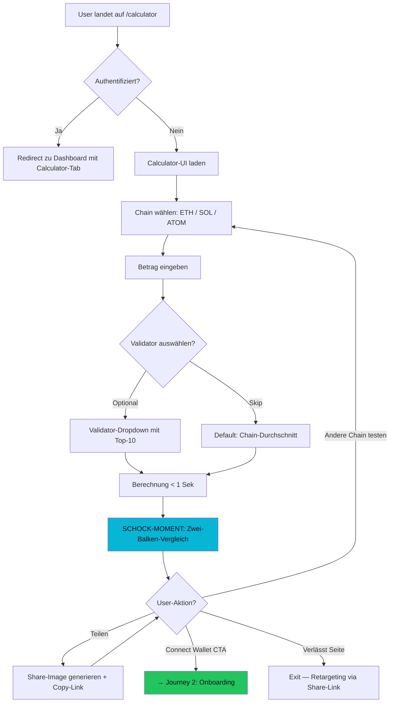
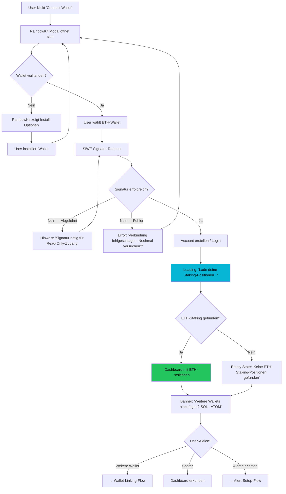
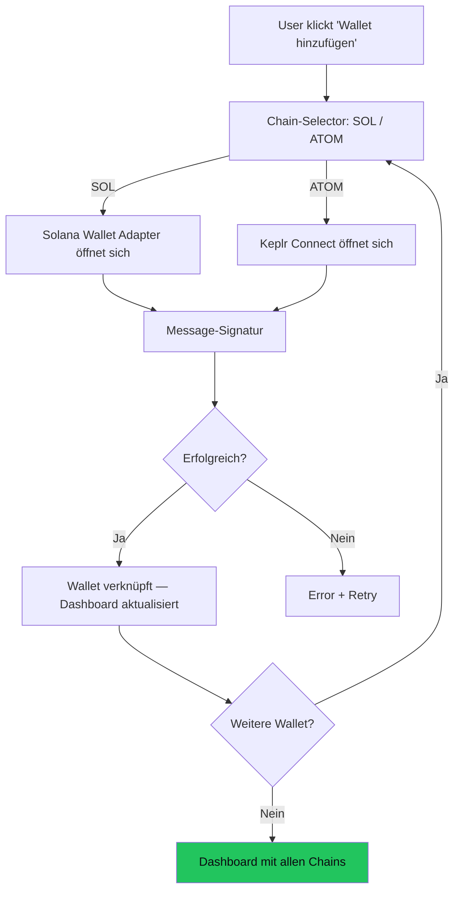
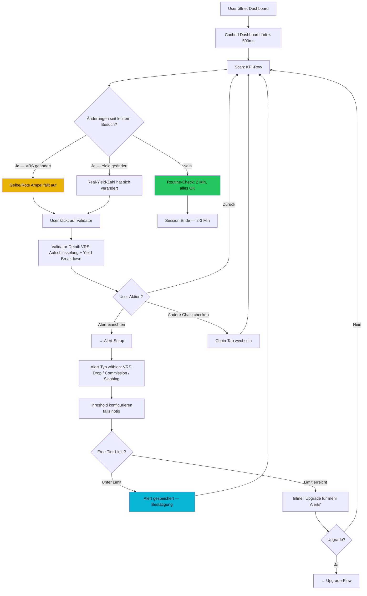
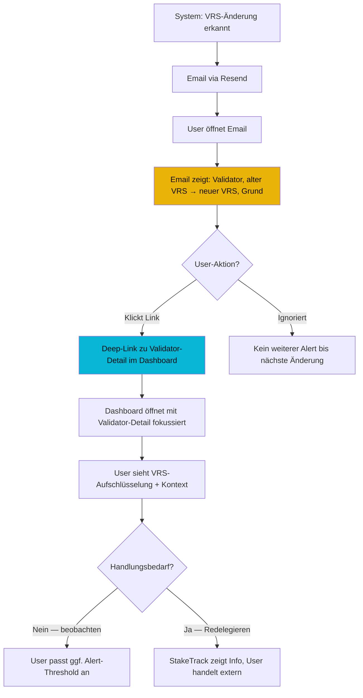

# UX Design Specification StakeTrack AI

**Author:** Sempre
**Date:** 2026-02-19

---

## Executive Summary

### Project Vision

StakeTrack AI ist eine Crypto-native Staking-Intelligence-Plattform, die das "6-Tab-Chaos" durch ein einziges, klares Dashboard ersetzt. Die UX-Strategie basiert auf einem zweistufigen Engagement-Modell: (1) Der Public Real-Yield-Rechner erzeugt einen emotionalen Schock-Moment und fungiert als viraler Einstiegspunkt, (2) das Multi-Chain-Dashboard liefert die anhaltende Klarheit, die Nutzer bindet. Das Design ist Crypto-native (Dark Mode Default, moderne Ästhetik), mobile-gleichwertig zum Desktop, und optimiert auf sofortige Verständlichkeit (VRS-Ampel, Real-Yield-Visualisierung).

### Target Users

**MVP-Primär: Lisa (B2C Multi-Chain-Stakerin)**
- Tech-affine Stakerin, 3 Wallets, 3 Chains, frustriert vom manuellen Tracking
- Nutzt Desktop und Mobile gleichwertig — Dashboard muss auf beiden Formfaktoren vollwertig funktionieren
- Emotional: Frustriert → Schockiert (Real Yield) → Erleichtert (Klarheit)
- Erfolgsmoment: "Ich öffne EIN Dashboard und sehe sofort alles"
- Time-to-Value: < 60 Sekunden nach Wallet-Connect

**MVP-Sekundär: Sempre (Admin)**
- Nutzt existierende Tools (Vercel, NeonDB, QStash) — kein Custom-Admin-UI im MVP
- Monitoring über bestehende Dashboards ausreichend

**Post-MVP:** Thomas (Prosumer/Reports), Sarah (B2B/API), Dev (Integrator)

### Key Design Challenges

1. **Mobile Wallet-Connect:** Drei verschiedene Chain-Wallets (ETH/SOL/ATOM) müssen auf Mobile nahtlos funktionieren — Deeplinks, WalletConnect-Protokoll und Chain-spezifische Adapter erfordern sorgfältiges UX-Design
2. **Daten-Dichte auf Mobile:** Multi-Chain-Portfolio mit VRS-Scores, Real Yield, Validator-Details und Alerts muss auf kleinen Screens priorisiert und nicht überladen dargestellt werden
3. **Graceful Degradation:** Chain-API-Ausfälle müssen transparent und vertrauenserhaltend kommuniziert werden (letzte bekannte Daten + Freshness-Timestamp)
4. **Freemium-Balance:** Free-Tier (1 Chain, 10 Validators) muss genug Value zeigen für Conversion, ohne durch aggressives Gating zu frustrieren
5. **Dark Mode als Default:** Crypto-native Erwartung — gesamtes Design-System muss Dark-Mode-first gedacht werden

### Design Opportunities

1. **Real-Yield-Schock als virales UX-Event:** Die visuelle Enthüllung "Nominal APY vs. Real Yield" kann als dramatischer, teilbarer Moment designed werden — die zentrale virale Mechanik
2. **VRS-Ampel als Glanceable Design:** Grün/Gelb/Rot ist universell verständlich, perfekt für Mobile-Glances und sofortige Orientierung
3. **Public Calculator als Standalone-Tool:** Der `/calculator` als eigenständiges, conversion-optimiertes Mini-Tool mit Share-Funktion — erster Touchpoint im Funnel
4. **Crypto-native Dark-Ästhetik:** Dunkles Theme mit Neon-Akzenten schafft Erwartungskonformität im Crypto-Space und hebt sich von generischen SaaS-Dashboards ab

## Core User Experience

### Defining Experience

**Primäre Nutzungsschleife: Der 2-Minuten Dashboard-Check**
Lisa öffnet StakeTrack AI, scannt ihre Staking-Positionen über alle Chains, checkt die VRS-Ampeln ihrer Validators und sieht ihren aggregierten Real Yield. In 2-3 Minuten hat sie vollständige Klarheit — kein Tab-Wechsel, kein Spreadsheet-Update, kein Block-Explorer nötig. Diese Schleife passiert 2-3x pro Woche und ist der Kern der Retention.

**Zwei gleichwertig kritische Erstinteraktionen:**
1. **Wallet-Connect → First Insight (< 60 Sek):** Der Moment, in dem eine neue Nutzerin ihre Wallet verbindet und sofort ihr komplettes Staking-Portfolio sieht. Wenn das hakt oder zu lange dauert, ist sie weg.
2. **Real-Yield-Schock-Moment:** Die visuelle Enthüllung im Calculator — "Nominal APY vs. was du wirklich bekommst." Wenn dieser Moment nicht emotional trifft, fehlt der virale Motor und der Conversion-Trigger.

Beide Interaktionen sind Make-or-Break und werden mit höchster UX-Priorität behandelt.

### Platform Strategy

| Aspekt | Entscheidung |
|--------|-------------|
| **Plattform** | Responsive Web App (Next.js 15 App Router) |
| **Formfaktoren** | Desktop und Mobile gleichwertig — kein "Mobile-Kompromiss" |
| **Input** | Touch (Mobile) und Mouse/Keyboard (Desktop) gleichberechtigt |
| **Dark Mode** | Default — Crypto-native Erwartung, Light Mode als Option |
| **Offline** | Nicht relevant — Live-Daten sind der Kern des Produkts |
| **PWA** | Nicht im MVP-Scope |
| **Native App** | Nicht im MVP-Scope — Web-first |

**Responsive Breakpoints:**
- Mobile: < 768px (vollwertige Erfahrung, nicht nur "responsive")
- Tablet: 768px - 1024px
- Desktop: > 1024px (primäre Entwicklungsbasis mit Tremor-Komponenten)

### Effortless Interactions

| Interaktion | Muss sich anfühlen wie... |
|-------------|---------------------------|
| **Chain/Wallet-Wechsel** | Ein Tab-Klick — kein Reload, kein Warten. Alles aggregiert sichtbar, Einzelansicht per Filter sofort erreichbar |
| **VRS-Verständnis** | Ein Blick — Grün/Gelb/Rot, sofort verstanden ohne Erklärung. Details on-demand |
| **Real-Yield-Ablesen** | Sofort sichtbar pro Position und als Portfolio-Gesamt. Kein Rechnen, kein Suchen |
| **Alert-Setup** | Maximal 2 Taps/Klicks — Validator auswählen, Alert-Typ wählen, fertig |
| **Calculator-Nutzung** | Chain wählen, Betrag eingeben, Schock sehen. 3 Schritte, kein Login nötig |

**Automatisch ohne User-Intervention:**
- Daten-Aktualisierung (stündlich via Cron)
- VRS-Neuberechnung nach Daten-Update
- Cache-Invalidierung nach frischen Daten
- Alert-Versand bei Threshold-Überschreitung

### Critical Success Moments

| Moment | Beschreibung | Erfolgs-Signal |
|--------|-------------|----------------|
| **"Der Schock"** | User sieht zum ersten Mal Real Yield vs. Nominal APY | Teilt das Ergebnis, klickt "Connect Wallet" |
| **"Endlich Klarheit"** | Dashboard zeigt alle Positionen, alle Chains, ein Blick | User schließt andere Tabs, kommt zurück |
| **"Mein Validator ist safe"** | Grüne VRS-Ampel gibt Sicherheit | User fühlt sich informiert, nicht besorgt |
| **"Das hätte ich wissen müssen"** | Alert informiert über Commission-Erhöhung oder VRS-Drop | User handelt informiert statt überrascht |
| **"Das war einfach"** | Wallet-Connect → Portfolio sichtbar in unter 60 Sek | User bleibt, exploriert weiter |

**Make-or-Break Flows (höchste UX-Priorität):**
1. Public Calculator → Schock → Wallet-Connect CTA (Conversion-Funnel)
2. Wallet-Connect → Dashboard-Load → First Insight (Onboarding)
3. Dashboard → VRS-Scan → Real-Yield-Check (Core Loop)

### Experience Principles

1. **"Klarheit in 2 Minuten"** — Jede Session soll in unter 3 Minuten vollständige Orientierung liefern. Kein Scrollen durch endlose Tabellen, kein Suchen nach dem Wesentlichen.

2. **"Schock vor Komfort"** — Der Real-Yield-Schock-Moment ist ein bewusstes UX-Design-Element, kein Bug. Die emotionale Reaktion treibt Sharing und Conversion. Erst danach kommt die beruhigende Klarheit des Dashboards.

3. **"Ampel schlägt Zahl"** — Wo immer möglich, visuelle Sofort-Verständlichkeit (Farben, Icons, Ampeln) vor numerischer Tiefe. Details sind on-demand verfügbar, aber der erste Blick muss ohne Nachdenken funktionieren.

4. **"Mobile ist kein Kompromiss"** — Kein Feature darf auf Mobile schlechter funktionieren als auf Desktop. Responsive heißt nicht "kleiner", sondern "anders optimiert".

5. **"Transparent, auch wenn's hässlich ist"** — Daten-Freshness, Confidence Levels, Chain-Ausfälle — alles wird ehrlich kommuniziert. Vertrauen entsteht durch Transparenz, nicht durch Verschweigen.

## Desired Emotional Response

### Primary Emotional Goals

**Primär: Empowered — "Ich habe die Kontrolle"**
Lisa soll sich nach jeder Session fühlen, als hätte sie einen unfairen Informationsvorteil. Nicht weil StakeTrack AI geheime Daten hat, sondern weil es Daten so aufbereitet, dass sie zum ersten Mal wirklich versteht, was mit ihrem Geld passiert. Das Gefühl: "Ich sehe klar, ich entscheide informiert."

**Sekundär: Clever-ehrlich — "Endlich sagt mir jemand die Wahrheit"**
StakeTrack AI positioniert sich emotional als das Tool, das dir sagt, was andere verschweigen. Nicht anklagend, nicht alarmistisch — sondern mit der ruhigen Ehrlichkeit eines vertrauenswürdigen Beraters: "Dein APY ist nicht 12%. Hier sind die Fakten."

### Emotional Journey Mapping

| Phase | Emotion | Trigger | Design-Ausdruck |
|-------|---------|---------|-----------------|
| **Discovery** (Calculator/Landing) | Neugier → Schock | "Dein 12% APY ist in Wahrheit 2%" | Dramatischer visueller Kontrast, teilbares Ergebnis |
| **Onboarding** (Wallet-Connect) | Erwartung → Wow | Portfolio erscheint in < 60 Sek | Schneller, sichtbarer Fortschritt, keine Ladebildschirm-Hölle |
| **Core Loop** (Dashboard-Check) | Fokussiert → Empowered | Alles auf einen Blick, VRS-Ampeln grün | Klare Hierarchie, Ampel-System, Portfolio-Gesamt prominent |
| **Alert** (Email/Notification) | Aufmerksamkeit → Handlungsfähig | "Dein Validator hat VRS-Drop" | Klare Info + konkreter Kontext, kein Panik-Design |
| **Fehlerfall** (Chain-API down) | Leicht irritiert → Informiert | "Solana-Daten von vor 2h, Aktualisierung läuft" | Ehrliche Timestamps, kein Verschleiern, kein Crash |
| **Wiederkehr** (2-3x/Woche) | Routine → Bestätigung | Dashboard zeigt: alles stabil | Beruhigende Konsistenz, bekannte Patterns, schneller Scan |

### Micro-Emotions

**Kritische Micro-Emotions für den Erfolg:**

| Erwünscht | Vermeiden | Kontext |
|-----------|-----------|---------|
| **Vertrauen** | Skepsis | VRS-Scores müssen nachvollziehbar sein (Aufschlüsselung on-demand) |
| **Kontrolle** | Hilflosigkeit | User muss immer wissen wo er ist, was er tun kann, wie er zurückkommt |
| **Aha-Erlebnis** | Verwirrung | Real Yield muss sofort verständlich sein — visuelle Erklärung, nicht nur Zahlen |
| **Stolz** | Scham | "Ich verstehe mein Portfolio" statt "Ich hätte das früher wissen sollen" |
| **Ehrliche Sicherheit** | Falsche Sicherheit | Confidence Levels zeigen, wenn Daten unsicher sind — keine falschen Versprechen |

**Bewusst NICHT angestrebt:**
- **Gamification/Dopamin:** Keine Streak-Counter, keine Achievement-Badges. StakeTrack ist ein Werkzeug, kein Spiel.
- **FOMO/Druck:** Keine "Du verpasst X!" oder "Y andere User haben schon..."-Muster. Information, nicht Manipulation.
- **Übertriebener Optimismus:** Keine "Alles super!"-Nachrichten wenn es nicht super ist. Ehrlichkeit ist die Marke.

### Design Implications

| Emotionales Ziel | UX-Designentscheidung |
|-----------------|----------------------|
| **Empowered** | Dashboard zeigt Portfolio-Gesamt prominent oben, User sieht sofort den Gesamtstatus. Alle Aktionen (Filter, Alerts) sind direkt erreichbar, kein Verstecken in Submenüs |
| **Clever-ehrlich** | Real-Yield-Vergleich als zentrales visuelles Element: zwei Balken nebeneinander — "Was dir versprochen wird" vs. "Was du bekommst". Kein Sugarcoating |
| **Vertrauen** | VRS-Aufschlüsselung immer 1 Klick entfernt. Scoring-Methodik verlinkt. Confidence Levels sichtbar. Timestamps auf jedem Datenpunkt |
| **Transparent bei Fehlern** | Stale-Data-Banner mit exaktem Timestamp, nicht versteckt sondern prominent. Farblich neutral (Info-Blau), nicht Alarm-Rot — ehrlich, nicht panisch |
| **Kontrolle auf Mobile** | Bottom-Navigation statt Burger-Menü. Swipe-Gesten für Chain-Wechsel. Thumb-Zone-optimiertes Layout für die wichtigsten Aktionen |
| **Kein FOMO** | Upgrade-CTAs sind sachlich ("Für mehr Chains: Pro-Plan") statt drängend ("Verpasse nicht deine anderen Validators!") |

### Emotional Design Principles

1. **"Ehrlichkeit ist das Feature"** — Jedes UI-Element das Daten zeigt, zeigt auch die Qualität dieser Daten (Freshness, Confidence). Wir verstecken nichts — das IST unser Differenziator gegenüber Tools die immer "alles super" anzeigen.

2. **"Empowerment, nicht Abhängigkeit"** — StakeTrack AI macht Nutzer schlauer, nicht abhängiger. Das Tool erklärt, zeigt Zusammenhänge, gibt Kontext. Es sagt nie "tu dies" — es sagt "hier sind die Fakten, entscheide selbst."

3. **"Schock einmal, Klarheit immer"** — Der Real-Yield-Schock ist ein einmaliges Erlebnis das emotional triggert. Danach wechselt die emotionale Tonalität zu ruhiger, beständiger Kontrolle. Das Dashboard ist nicht aufregend — es ist verlässlich.

4. **"Sachlich upgraden"** — Freemium-Gating kommuniziert Limits sachlich und zeigt den konkreten Mehrwert. Keine Dark Patterns, kein emotionaler Druck. User upgraden weil sie mehr Value wollen, nicht weil sie sich schlecht fühlen.

## UX Pattern Analysis & Inspiration

### Inspiring Products Analysis

**1. Linear (Favorit — SaaS/Productivity)**

| Aspekt | Was Linear auszeichnet | Relevanz für StakeTrack AI |
|--------|----------------------|---------------------------|
| **Speed** | Gefühlt instant — jede Aktion fühlt sich sofort an, optimistische UI-Updates | Dashboard-Load und Chain-Wechsel müssen sich genauso schnell anfühlen |
| **Fokus** | Extrem reduzierte UI, kein visueller Lärm, jedes Element hat eine klare Funktion | Dashboard zeigt nur das Wesentliche, Details on-demand |
| **Dark Mode** | Dunkles Theme mit subtilen Farb-Akzenten, professionell ohne kalt zu wirken | Referenz für StakeTrack AI's Crypto-native Dark-Ästhetik |
| **Keyboard-first** | Power-User können alles per Keyboard, aber Mouse funktioniert genauso gut | Desktop-Experience: CMD+K-Suche, Keyboard-Shortcuts für Chain-Filter |
| **Kein Onboarding-Bloat** | Keine 10-Schritt-Tour, kein Cookie-Banner-Meer — sofort produktiv | Wallet-Connect → Dashboard, keine Zwischenschritte |
| **Typografie** | Saubere, moderne Sans-Serif, hervorragende Hierarchie durch Schriftgröße und Gewicht | Daten-Hierarchie im Dashboard: Portfolio-Gesamt > Chain > Validator |

**2. Zerion (Crypto Portfolio Tracker)**

| Aspekt | Was Zerion auszeichnet | Relevanz für StakeTrack AI |
|--------|----------------------|---------------------------|
| **Wallet-Connect UX** | Ein-Klick Wallet-Connect, sofort Portfolio sichtbar, Multi-Chain aggregiert | Direkte Referenz für F1 (Multi-Chain Dashboard) — so muss sich das anfühlen |
| **Mobile-Erlebnis** | Native-App-Qualität im Web, Touch-optimiert, Bottom-Navigation | Referenz für Mobile-Layout und Navigation-Pattern |
| **Portfolio-Übersicht** | Gesamt-Wert prominent, Assets als sortierbare Liste, Chain-Filter als Tabs | Dashboard-Layout-Inspiration: Portfolio-Gesamt oben, Positionen darunter |
| **Dark Mode** | Crypto-native Dark-Ästhetik mit grünen/roten Akzenten für Performance | Farbsystem-Referenz: Grün/Rot für Yield, ergänzt durch VRS-Ampel |

**3. Revolut (Fintech)**

| Aspekt | Was Revolut auszeichnet | Relevanz für StakeTrack AI |
|--------|----------------------|---------------------------|
| **Komplexität verstecken** | Komplexe Finanzdaten (Kurse, Gebühren, Wechselkurse) extrem zugänglich präsentiert | Real-Yield-Formel (APY − Inflation − Fees − Slashing) muss genauso klar werden |
| **Micro-Interactions** | Subtile Animationen die Feedback geben ohne abzulenken | Calculator-Ergebnis-Enthüllung, VRS-Ampel-Transition |
| **Progressive Disclosure** | Hauptinfo sofort, Details per Tap/Klick, nie überfordert | VRS: Ampel sofort sichtbar, 5-Faktoren-Aufschlüsselung per Klick |
| **Mobile-first** | Jede Interaktion für den Daumen optimiert, Bottom-Sheet-Pattern | Referenz für Mobile-Dashboard und Alert-Management |

**4. Zapper (Multi-Chain DeFi Dashboard)**

| Aspekt | Was Zapper auszeichnet | Relevanz für StakeTrack AI |
|--------|----------------------|---------------------------|
| **Multi-Chain-Aggregation** | Alle Chains, ein Dashboard, gute Filterung | Direkte Referenz für Chain-Aggregation und Filter-UX |
| **Daten-Dichte** | Viel Information, aber visuell gut strukturiert | Wie man Dashboard-Density handhabt ohne zu überladen |
| **Was NICHT kopieren** | Teilweise zu viele Features sichtbar, kann überwältigend wirken | StakeTrack AI bleibt fokussierter — nur Staking, nicht ganzes DeFi |

### Transferable UX Patterns

**Navigation Patterns:**

| Pattern | Quelle | Anwendung in StakeTrack AI |
|---------|--------|---------------------------|
| **Bottom-Navigation (Mobile)** | Zerion, Revolut | 4 Tabs: Dashboard, Calculator, Alerts, Settings — immer erreichbar, Thumb-Zone |
| **Tab-basierter Chain-Filter** | Zerion, Zapper | "Alle / ETH / SOL / ATOM" als horizontale Tabs im Dashboard — ein Tap, kein Dropdown |
| **CMD+K Quick-Search (Desktop)** | Linear | Schnellzugriff auf Validators, Chains, Einstellungen — Power-User-Feature |
| **Sidebar-Navigation (Desktop)** | Linear | Minimale Sidebar: Dashboard, Calculator, Alerts — collapsed by default, expandable |

**Interaction Patterns:**

| Pattern | Quelle | Anwendung in StakeTrack AI |
|---------|--------|---------------------------|
| **Optimistic UI** | Linear | Chain-Filter-Wechsel zeigt sofort Ergebnis, Daten laden im Hintergrund nach |
| **Progressive Disclosure** | Revolut | VRS-Ampel → Klick → 5-Faktoren-Detail. Real Yield → Klick → Formel-Breakdown |
| **Bottom Sheet (Mobile)** | Revolut, Zerion | Validator-Details, Alert-Konfiguration als Bottom Sheet statt neuer Seite |
| **Pull-to-Refresh** | Zerion | Dashboard-Daten manuell aktualisieren auf Mobile |

**Visual Patterns:**

| Pattern | Quelle | Anwendung in StakeTrack AI |
|---------|--------|---------------------------|
| **Monochrome Dark + Farb-Akzente** | Linear | Dunkler Hintergrund, Farbe nur für bedeutungstragende Elemente (VRS-Ampel, Yield-Differenz) |
| **Grün/Rot für Performance** | Zerion, Revolut | Real Yield positiv = Grün, negativ/niedrig = Rot. VRS-Ampel: Grün/Gelb/Rot |
| **Große Zahlen, kleine Labels** | Revolut | Portfolio-Gesamt-Real-Yield als prominente Zahl, "Real Yield" als kleines Label darunter |
| **Subtle Borders statt Boxen** | Linear | Sektionen durch feine Linien trennen, nicht durch schwere Cards mit Shadow |

### Anti-Patterns to Avoid

| Anti-Pattern | Warum vermeiden | Stattdessen |
|-------------|-----------------|-------------|
| **Feature-Overload à la Zapper** | Überwältigt neue User, verletzt "Klarheit in 2 Minuten"-Prinzip | Fokus auf Staking-only, kein DeFi-Generalist |
| **Onboarding-Wizard** | Unterbricht Time-to-Value, Linear zeigt: sofort produktiv ist besser | Wallet-Connect → sofort Dashboard, kontextuelle Hints statt Tour |
| **Bunte Dashboard-Cards** | Crypto-Dashboards neigen zu visueller Überladung (jede Card andere Farbe) | Monochrome Dark + nur VRS-Ampel und Yield-Differenz als Farb-Akzente |
| **Aggressive Upgrade-Modals** | Verletzt "Sachlich upgraden"-Prinzip, zerstört Vertrauen | Inline-Hinweis bei Limit-Erreichen, kein Modal das den Flow unterbricht |
| **Infinite Scroll für Validators** | Verliert Übersicht, kein Orientierungspunkt | Paginierte oder gruppierte Liste, "Top 10" sichtbar, Rest on-demand |
| **Tooltip-Hölle** | Zu viele Erklärungen per Hover lenken ab | Selbsterklärende Labels + ein "Wie funktioniert der VRS?"-Link pro Sektion |

### Design Inspiration Strategy

**Adopt (1:1 übernehmen):**
- Linear's Speed-Philosophie: Optimistic UI, instant-feeling Interactions
- Linear's Dark-Mode-Ästhetik: Monochrome + gezielte Farb-Akzente
- Zerion's Wallet-Connect-Flow: Ein Klick, sofort Portfolio
- Revolut's Progressive Disclosure: Hauptinfo sofort, Details per Tap

**Adapt (anpassen für StakeTrack AI):**
- Zerion's Portfolio-Layout → erweitert um VRS-Ampeln und Real-Yield-Spalte
- Linear's Sidebar → minimaler für StakeTrack (weniger Menüpunkte)
- Revolut's Bottom-Sheet → für Validator-Details und Alert-Setup auf Mobile
- Zerion's Chain-Tabs → erweitert um "Alle"-Aggregation als Default

**Avoid (bewusst nicht machen):**
- Zapper's Feature-Dichte → StakeTrack bleibt Staking-fokussiert
- Generische SaaS-Onboarding-Wizards → sofort produktiv wie Linear
- Bunte Card-Layouts → monochrom wie Linear, Farbe nur für Bedeutung
- Modal-basiertes Upgrade-Gating → inline, sachlich, nicht unterbrechend

## Design System Foundation

### Design System Choice

**Tremor + Tailwind CSS** — Themeable Dashboard Component System

| Aspekt | Entscheidung |
|--------|-------------|
| **Component Library** | Tremor (`@tremor/react`) — Dashboard-optimierte React-Komponenten |
| **Styling Foundation** | Tailwind CSS — Utility-first, Dark-Mode-nativ |
| **Custom Components** | Tailwind-basiert für alles außerhalb von Tremor's Scope |
| **Kategorie** | Themeable System — starke Basis + volle Anpassbarkeit |
| **Dark Mode** | Tailwind `dark:` Klassen + Tremor's eingebauter Dark-Mode-Support |

### Rationale for Selection

| Faktor | Bewertung |
|--------|-----------|
| **Dashboard-Fit** | Tremor ist explizit für Dashboards gebaut — KPI-Cards, Charts, Tables, Badges out of the box |
| **Entwicklungsgeschwindigkeit** | Solo-Developer-optimiert: wenig Boilerplate, schnelle Iteration, gute Defaults |
| **Dark Mode** | Native Unterstützung in Tremor + Tailwind — kein Custom-Theming-Aufwand |
| **Tailwind-nativ** | Tremor baut auf Tailwind auf — keine Style-Konflikte, konsistentes Utility-System |
| **Chart-Bibliothek** | Tremor inkludiert Recharts-basierte Charts — Real-Yield-Visualisierungen ohne Extra-Dependency |
| **Bundle Size** | Tremor ist tree-shakeable — nur genutzte Komponenten landen im Bundle |
| **Project Context** | Bereits im Tech-Stack definiert — keine Migrations- oder Evaluierungskosten |

### Implementation Approach

**Tremor-Komponenten für StakeTrack AI:**

| Tremor-Komponente | Einsatz in StakeTrack AI |
|-------------------|--------------------------|
| `Card` + `Metric` | Portfolio-Gesamt-Wert, Real-Yield-KPI, Staking-Summen |
| `BarChart` / `AreaChart` | Real-Yield-Vergleich (Nominal vs. Real), Yield-Trends |
| `Table` | Validator-Liste mit VRS, Commission, Yield pro Position |
| `Badge` | Chain-Labels (ETH, SOL, ATOM), Tier-Badges (Free, Pro) |
| `TabGroup` / `Tab` | Chain-Filter im Dashboard ("Alle / ETH / SOL / ATOM") |
| `Callout` | Stale-Data-Hinweise, Upgrade-CTAs, Disclaimer |
| `NumberInput` / `Select` | Public Calculator Inputs (Chain, Betrag) |
| `Tracker` | VRS-Score-Visualisierung (Segmente für 5 Faktoren) |

**Custom-Komponenten (Tailwind-basiert):**

| Komponente | Grund | Design-Referenz |
|-----------|-------|-----------------|
| **VRS-Ampel** | Tremor hat kein Traffic-Light-Pattern — Custom mit Score-Zahl + Farbring | Revolut's Status-Indikatoren |
| **Real-Yield-Schock-Balken** | Zwei-Balken-Vergleich "Versprochen vs. Echt" — emotionales Kern-Element, muss custom sein | Eigenes Pattern |
| **Wallet-Connect-Button** | RainbowKit liefert eigene UI — muss ins Dark-Theme integriert werden | RainbowKit + Custom Tailwind Overrides |
| **Bottom Sheet (Mobile)** | Für Validator-Details und Alert-Setup auf Mobile — nicht in Tremor | Revolut/Zerion-inspiriert |
| **Freshness-Indicator** | Timestamp-Badge pro Datenpunkt ("Vor 15 Min aktualisiert") | Linear's subtile Metadata |
| **Confidence-Badge** | VRS Confidence Level (High/Medium/Low) als Mini-Badge | ChainSights GVS Pattern |

### Customization Strategy

**Dark-Mode-Farbsystem (Tailwind Custom Config):**

| Token | Verwendung | Referenz |
|-------|-----------|----------|
| `bg-surface` | Haupt-Hintergrund (sehr dunkel) | Linear's Background |
| `bg-surface-raised` | Cards, erhöhte Elemente | Linear's Card Background |
| `border-subtle` | Subtile Trennlinien | Linear's Border Style |
| `text-primary` | Haupt-Text (helles Grau/Weiß) | Linear's Text |
| `text-secondary` | Labels, Metadata (gedämpftes Grau) | Linear's Secondary Text |
| `accent-brand` | Primärer Akzent (masemIT Cyan #009BB1 als Basis) | masemIT Brand Color |
| `status-positive` | Grün — positiver Real Yield, VRS Grün (80+) | Zerion's Green |
| `status-warning` | Gelb/Amber — VRS Gelb (50-79) | Standard Warning |
| `status-negative` | Rot — negativer Real Yield, VRS Rot (<50) | Zerion's Red |
| `info-neutral` | Blau — Stale-Data-Banner, Info-Callouts | Nicht-alarmierend |

**Typografie-Strategie:**
- System-Font-Stack (wie Linear): `-apple-system, BlinkMacSystemFont, 'Segoe UI', ...` — schnell, nativ, kein Font-Loading
- Große Zahlen (`text-3xl`/`text-4xl`) für KPIs (Portfolio-Wert, Real Yield)
- Mittlere Größe (`text-lg`) für Validator-Namen, Positionen
- Klein (`text-sm`) für Labels, Timestamps, Metadata
- Monospace (`font-mono`) für Wallet-Adressen und exakte Zahlen

**Spacing & Layout:**
- Tremor's eingebautes Spacing-System (konsistent mit Tailwind's Scale)
- `gap-4` als Default zwischen Cards
- Mobile: Single-Column, Cards full-width
- Desktop: 2-3 Column Grid für Dashboard-KPIs, Single-Column für Validator-Tabelle

## Defining Core Experience

### Defining Experience

**"Sieh deinen echten Staking-Ertrag — nicht was dir versprochen wird."**

Das ist StakeTrack AI in einem Satz. Wenn Lisa einer Freundin davon erzählt, sagt sie: _"Du glaubst, du bekommst 12% auf dein ETH-Staking? Gib mal hier deine Daten ein — schau, in Wahrheit sind es 2.7%. Das Tool zeigt dir, was nach Inflation, Fees und Slashing-Risiko wirklich übrig bleibt."_

Die Defining Experience ist die **Real-Yield-Enthüllung** — der Moment, in dem die Lücke zwischen Versprechen und Realität sichtbar wird. Dieser Moment ist:
- **Viral:** Emotional genug um geteilt zu werden ("Das musst du sehen!")
- **Conversion-treibend:** Schock motiviert Wallet-Connect für personalisierte Daten
- **Differenzierend:** Kein Wettbewerber zeigt das so systematisch und visuell

**Komplementäre Experience (Retention):** Das Multi-Chain-Dashboard ("Alle Chains, ein Blick") ist die Retention-Experience — das was Lisa nach dem Schock hält. Aber die Defining Experience bleibt der Real-Yield-Moment.

### User Mental Model

**Wie User heute denken:**

| Mentales Modell | Realität | StakeTrack AI's Aufgabe |
|----------------|----------|------------------------|
| "Mein APY ist 12%, also verdiene ich 12%" | Real Yield nach Inflation oft nur 1-3% | Die Lücke sichtbar machen — einmal sehen, nie mehr vergessen |
| "Alle Validators sind gleich" | Massive Unterschiede in Uptime, Commission, Slashing-Risiko | VRS-Ampel: sofort sehen, nie wieder blind delegieren |
| "Ich muss 5 verschiedene Tools checken" | Stimmt — DeFiLlama, StakingRewards, Block-Explorer, Koinly, Excel | Ein Dashboard ersetzt alle — "Endlich Klarheit" |
| "Staking ist passives Einkommen" | Nur wenn man aktiv monitort (Commission-Änderungen, Slashing) | Alerts machen passiv wieder möglich — informiert statt überrascht |

**Workarounds die User heute nutzen:**
- Excel-Tabellen die monatlich manuell gepflegt werden
- 6+ Browser-Tabs gleichzeitig offen
- Manuelle Berechnungen mit Taschenrechner
- "Ich schau einfach nicht hin und hoffe das Beste"

**Erwartung der User:** Sie erwarten NICHT, dass ein Tool ihnen den Real Yield zeigt — das kennen sie nicht. Der Schock-Moment funktioniert gerade WEIL es unerwartet ist. Nach dem ersten Mal erwarten sie es aber bei jedem Besuch.

### Success Criteria

**Wann fühlt sich die Defining Experience "richtig" an:**

| Kriterium | Messung | Target |
|-----------|---------|--------|
| **Sofort verständlich** | User versteht Real-Yield-Ergebnis ohne Erklärung | < 5 Sek bis "Aha" |
| **Emotional wirksam** | User reagiert sichtbar (teilt, klickt CTA, scrollt nach) | > 5% Share-Rate |
| **Korrekt und vertrauenswürdig** | Ergebnis ist nachvollziehbar, Formel einsehbar | 0 "Das stimmt nicht"-Feedbacks |
| **Schnell** | Calculator liefert Ergebnis sofort | < 1 Sek nach Input |
| **Teilbar** | Ergebnis lässt sich als Bild/Link teilen | Share-Button prominent |
| **Conversion-treibend** | Schock motiviert Wallet-Connect | > 10% Calculator → Wallet-Connect |

**Wann fühlt es sich FALSCH an:**
- User versteht nicht, warum Real Yield anders ist als APY → Formel-Breakdown fehlt
- Ergebnis wirkt willkürlich → Confidence Level und Quellen-Angabe fehlen
- User fühlt sich belehrt oder dumm → Tonalität falsch (clever-ehrlich, nicht herablassend)

### Novel UX Patterns

**Pattern-Analyse: Etabliert vs. Innovativ**

| Element | Pattern-Typ | Erklärung |
|---------|------------|-----------|
| **Real-Yield-Enthüllung** | **Innovativ (Framing)** | Die Rohdaten sind öffentlich, aber niemand zeigt sie so. Die Innovation ist das Framing: Zwei Balken nebeneinander — "Was dir versprochen wird" vs. "Was du wirklich bekommst". Kein neues Interaction-Pattern, aber ein neues Informations-Pattern. |
| **VRS-Ampel** | **Etabliert (Adaptation)** | Traffic-Light-Pattern ist universell bekannt. Adaptation: Score 0-100 als Zahl + Farbring. Keine Erklärung nötig. |
| **Dashboard-Aggregation** | **Etabliert** | Multi-Asset-Portfolio-View ist ein bewährtes Pattern (Zerion, Zapper, Revolut). StakeTrack wendet es auf Staking-only an. |
| **Calculator als Conversion-Funnel** | **Etabliert (Kombination)** | Rechner-Tools als Lead-Gen sind bekannt (Hypothekenrechner, Gehaltsrechner). Innovation: Kombination mit emotionalem Schock-Moment + Share-Funktion. |
| **Progressive VRS-Disclosure** | **Etabliert** | Ampel → Klick → Detail ist ein Standard-Pattern (Revolut). Aber die Inhalte (5 Validator-Faktoren) sind domain-spezifisch und brauchen kontextuelle Erklärung. |

**Fazit:** StakeTrack AI erfindet keine neuen Interaction-Patterns — es kombiniert bewährte Patterns mit innovativem Informations-Framing. Das reduziert die Lernkurve (alles fühlt sich vertraut an) bei gleichzeitig hoher Differenzierung (niemand zeigt diese Informationen so).

### Experience Mechanics

**Flow 1: Real-Yield-Schock (Defining Experience — Public Calculator)**

```
1. INITIATION
   User landet auf /calculator (via Farcaster/Bluesky-Link oder Landing Page)
   → Sieht: Headline "Was verdienst du WIRKLICH?" + Chain-Selector + Betrags-Input
   → Keine Registrierung, kein Login, sofort nutzbar

2. INTERACTION
   User wählt Chain (ETH/SOL/ATOM) → Select-Dropdown
   User gibt Staking-Betrag ein → Number-Input
   Optional: Validator auswählen (für präziseres Ergebnis)
   → System berechnet sofort (< 1 Sek)

3. FEEDBACK — DER SCHOCK-MOMENT
   Visueller Zwei-Balken-Vergleich erscheint:
   ┌─────────────────────────────────────┐
   │ Nominal APY    ████████████  12.0%  │
   │ Real Yield     ███          2.7%    │
   └─────────────────────────────────────┘
   Darunter: Formel-Breakdown (Inflation −X%, Fees −Y%, Slashing −Z%)
   Farblich: Nominal = neutrales Grau, Real = Grün (wenn positiv) oder Rot (wenn negativ)

4. COMPLETION + CONVERSION
   → Share-Button: "Teile deinen echten Ertrag" (generiert Bild/Link)
   → CTA: "Verbinde deine Wallet für dein persönliches Portfolio"
   → Kein Druck, sachlicher Mehrwert: "Sieh alle deine Positionen auf einen Blick"
```

**Flow 2: Wallet-Connect → First Insight (Onboarding)**

```
1. INITIATION
   User klickt "Connect Wallet" (von Calculator oder Landing Page)
   → RainbowKit-Modal öffnet sich (ETH) oder Chain-spezifischer Connect

2. INTERACTION
   User wählt Wallet → signiert Read-Only-Zugriff
   → Ladeindikator: "Lade deine Staking-Positionen..." (mit Chain-Icons die aufleuchten)
   → Progressiver Load: Erste Daten erscheinen sofort, Rest lädt nach

3. FEEDBACK — "ENDLICH KLARHEIT"
   Dashboard erscheint mit:
   ┌─────────────────────────────────────┐
   │ Portfolio Real Yield: 2.7%         │
   │ Gesamt gestaked: €85,420           │
   │ Validators: 5 (4 🟢 1 🟡)          │
   └─────────────────────────────────────┘
   Darunter: Positions-Liste nach Chain gruppiert
   VRS-Ampeln sofort sichtbar pro Validator

4. COMPLETION
   → User scannt Dashboard (2-3 Min)
   → Optional: Alert einrichten für gelben/roten Validator
   → Wiederkehr-Trigger: "Komm zurück wenn sich was ändert" (via Alert)
```

**Flow 3: Dashboard-Check (Core Loop — Wiederkehr)**

```
1. INITIATION
   User öffnet StakeTrack AI (Bookmark, Direktzugriff)
   → Dashboard lädt sofort (cached, < 500ms TTFB)

2. INTERACTION
   Scan: Portfolio-Gesamt oben → VRS-Ampeln → Real Yield
   Optional: Chain-Filter per Tab-Klick
   Optional: Validator-Detail per Klick/Tap

3. FEEDBACK
   Alles stabil = beruhigende Routine ("Mein Portfolio ist in Ordnung")
   Änderung sichtbar = informiertes Handeln ("VRS von Validator X ist gefallen")
   Freshness-Timestamps zeigen Aktualität

4. COMPLETION
   → Session-Ende nach 2-3 Minuten
   → User hat vollständige Orientierung
   → Nächste Session in 2-3 Tagen (oder bei Alert)
```

## Visual Design Foundation

### Color System

**Primäre Brand-Farbe: Teal/Cyan (#06B6D4)**
Eigenständig gegenüber masemIT (#009BB1), aber in der gleichen Farbfamilie — signalisiert Zugehörigkeit zum Ökosystem ohne identisch zu sein. Teal auf dunklem Hintergrund wirkt modern, technisch und vertrauenswürdig — perfekt für "Staking Intelligence".

**Dark-Mode-Farbpalette (Primäres Theme):**

| Token | Hex | Verwendung |
|-------|-----|-----------|
| `bg-base` | #0A0A0F | Tiefster Hintergrund (Page Background) |
| `bg-surface` | #12121A | Card-Hintergrund, Content-Bereiche |
| `bg-surface-raised` | #1A1A25 | Hover-States, erhöhte Elemente, aktive Tabs |
| `bg-surface-overlay` | #22222E | Modals, Bottom Sheets, Dropdowns |
| `border-subtle` | #2A2A38 | Trennlinien, Card-Borders |
| `border-default` | #3A3A4A | Aktive Borders, Input-Felder |

**Text-Farben:**

| Token | Hex | Verwendung |
|-------|-----|-----------|
| `text-primary` | #F0F0F5 | Haupt-Text, KPI-Zahlen, Headlines |
| `text-secondary` | #9898A8 | Labels, Descriptions, Timestamps |
| `text-tertiary` | #6A6A7A | Placeholder-Text, deaktivierte Elemente |
| `text-brand` | #06B6D4 | Links, aktive Navigation, Brand-Akzente |

**Brand-Farben:**

| Token | Hex | Verwendung |
|-------|-----|-----------|
| `brand-primary` | #06B6D4 | Primärer Akzent — CTAs, aktive States, Links |
| `brand-primary-hover` | #08D0F0 | Hover-State des Primär-Akzents |
| `brand-primary-muted` | #06B6D4/15% | Subtiler Hintergrund für Brand-Elemente |
| `brand-glow` | #06B6D4/20% | Subtiler Glow-Effekt für Fokus-Elemente |

**Semantische Farben (Status/Bedeutung):**

| Token | Hex | Verwendung |
|-------|-----|-----------|
| `status-positive` | #22C55E | Positiver Real Yield, VRS Grün (80-100) |
| `status-positive-muted` | #22C55E/15% | Hintergrund für positive Badges |
| `status-warning` | #EAB308 | VRS Gelb (50-79), Stale-Data-Hinweis |
| `status-warning-muted` | #EAB308/15% | Hintergrund für Warning-Badges |
| `status-negative` | #EF4444 | Negativer Real Yield, VRS Rot (0-49), Slashing |
| `status-negative-muted` | #EF4444/15% | Hintergrund für negative Badges |
| `status-info` | #3B82F6 | Informations-Banner, Stale-Data-Banner |
| `status-info-muted` | #3B82F6/15% | Hintergrund für Info-Callouts |

**Light-Mode (Optional, sekundär):**
- Invertierte Palette: Weiße/helle Backgrounds, dunkler Text
- Brand-Teal bleibt gleich (#06B6D4)
- Status-Farben leicht angepasst für Kontrast auf hellem Grund
- Niedrigere Priorität — Dark Mode ist Default

### Logo-Konzept

**Typ: Icon + Wordmark**

**Icon-Konzept:**
- Einfache geometrische Form — Favicon-tauglich (16x16 bis 512x512)
- Konzeptrichtung: Ein abstrahierter "Puls" oder "Track" — eine aufsteigende Linie mit einem Punkt/Node, die sowohl "Tracking" als auch "Staking" (Nodes/Validators) symbolisiert
- Monochrom funktionsfähig (Weiß auf Dunkel, Dunkel auf Hell)
- In Brand-Teal (#06B6D4) als Akzent einsetzbar
- Kein überladenes Crypto-Klischee (kein Ethereum-Logo, kein Blockchain-Würfel)

**Wordmark:**
- "**StakeTrack**" als zusammengeschriebenes Wort, CamelCase
- "**AI**" als dezentes Suffix — kleiner, leichterer Font-Weight, oder in `text-secondary` Farbe
- Beispiel-Layout: `[Icon] StakeTrack` ^AI^
- System-Font oder geometrische Sans-Serif (Inter, Geist, oder ähnlich)

**Logo-Varianten (für Implementierung):**

| Variante | Verwendung |
|----------|-----------|
| Icon + Wordmark (horizontal) | Navigation-Header, Desktop-Sidebar |
| Icon only | Favicon, Mobile-Tab-Bar, Loading-Screen |
| Wordmark only | Email-Footer, Social-Media-Profile |
| Icon + Wordmark (stacked) | Landing Page Hero, Marketing |

**Farbvarianten:**

| Kontext | Icon | Wordmark | AI-Suffix |
|---------|------|----------|-----------|
| Dark Background | `brand-primary` (#06B6D4) | `text-primary` (#F0F0F5) | `text-secondary` (#9898A8) |
| Light Background | `brand-primary` (#06B6D4) | #12121A | #6A6A7A |
| Monochrom | Weiß | Weiß | Weiß (50% Opacity) |

### Typography System

**Font-Strategie: System-Font-Stack (wie Linear)**

```css
font-family: -apple-system, BlinkMacSystemFont, 'Segoe UI', Roboto,
             Oxygen, Ubuntu, Cantarell, sans-serif;
```

**Rationale:** Kein Custom-Font-Loading = schnellere Ladezeit, native Optik pro Plattform, konsistent mit Linear-Inspiration. Für ein Dashboard-Tool ist Performance wichtiger als typografische Einzigartigkeit.

**Alternative (falls doch Custom gewünscht):** Inter oder Geist Sans — beides geometrische Sans-Serifs die hervorragend für Zahlen und Dashboards funktionieren.

**Type Scale:**

| Token | Größe | Weight | Verwendung |
|-------|-------|--------|-----------|
| `display` | 36px / 2.25rem | 700 (Bold) | Landing Page Hero-Headline |
| `h1` | 28px / 1.75rem | 600 (Semibold) | Page-Titel ("Dashboard", "Calculator") |
| `h2` | 22px / 1.375rem | 600 | Sektions-Titel ("Staking Positions") |
| `h3` | 18px / 1.125rem | 500 (Medium) | Card-Titel, Validator-Name |
| `kpi-large` | 32px / 2rem | 700 | Portfolio-Gesamt-Real-Yield, Haupt-KPI |
| `kpi-medium` | 24px / 1.5rem | 600 | Sekundäre KPIs (Staking-Summe, Validator-Count) |
| `body` | 15px / 0.9375rem | 400 (Regular) | Standard-Text, Beschreibungen |
| `body-small` | 13px / 0.8125rem | 400 | Labels, Tabellen-Zellen, Badge-Text |
| `caption` | 11px / 0.6875rem | 400 | Timestamps, Freshness-Indicators, Footnotes |
| `mono` | 14px / 0.875rem | 400 (Mono) | Wallet-Adressen, exakte Zahlen, Formeln |

**Monospace-Font (für Zahlen & Adressen):**
```css
font-family: 'SF Mono', 'Cascadia Code', 'Roboto Mono', monospace;
```

**Typografie-Regeln:**
- KPI-Zahlen immer `tabular-nums` (gleiche Breite pro Ziffer, kein Layout-Shift)
- Wallet-Adressen immer `font-mono`, truncated mit `...` (0x1234...5678)
- Prozent-Zahlen: eine Dezimalstelle (2.7%, nicht 2.734%)
- Große Beträge: mit Tausender-Punkt und Währungssymbol (€85.420)

### Spacing & Layout Foundation

**Base Unit: 4px**

| Token | Wert | Verwendung |
|-------|------|-----------|
| `space-1` | 4px | Minimaler Abstand (Icon zu Label) |
| `space-2` | 8px | Enger Abstand (innerhalb von Gruppen) |
| `space-3` | 12px | Standard-Innenabstand (Card-Padding Mobile) |
| `space-4` | 16px | Standard-Abstand (Card-Padding Desktop) |
| `space-6` | 24px | Sektions-Abstand (zwischen Card-Gruppen) |
| `space-8` | 32px | Großer Abstand (zwischen Haupt-Sektionen) |
| `space-12` | 48px | Page-Level-Spacing |

**Layout-Grid:**

| Breakpoint | Columns | Gutter | Margin |
|------------|---------|--------|--------|
| Mobile (< 768px) | 1 | 16px | 16px |
| Tablet (768-1024px) | 2 | 20px | 24px |
| Desktop (> 1024px) | 12 (flexibel) | 24px | 32px |

**Dashboard-Layout (Desktop):**
```
┌──────────────────────────────────────────────────┐
│ [Sidebar]  │  [KPI-Row: 3 Cards]                 │
│  collapsed │  [Real-Yield | Staked | Validators]  │
│            │──────────────────────────────────────│
│  Dashboard │  [Chain-Filter-Tabs]                 │
│  Calculator│  [Validator-Table: full width]       │
│  Alerts    │                                      │
│  Settings  │                                      │
└──────────────────────────────────────────────────┘
```

**Dashboard-Layout (Mobile):**
```
┌────────────────────┐
│ [Header: Logo + ⚙] │
│────────────────────│
│ [KPI: Real Yield]  │
│ [KPI: Staked]      │
│ [KPI: Validators]  │
│────────────────────│
│ [Chain-Tabs]       │
│ [Validator-List]   │
│   - Validator 1 🟢 │
│   - Validator 2 🟡 │
│   - ...            │
│────────────────────│
│ [Bottom Nav]       │
│ 🏠  📊  🔔  ⚙    │
└────────────────────┘
```

**Komponentengrößen:**

| Komponente | Desktop | Mobile |
|-----------|---------|--------|
| KPI-Card | ~300px breit, ~120px hoch | Full-width, ~100px hoch |
| Validator-Row | Full-width, 56px hoch | Full-width, 72px hoch (mehr Touch-Target) |
| Bottom Sheet | n/a | Max 85vh, rounded-top corners |
| Sidebar | 240px expanded, 64px collapsed | Nicht sichtbar (Bottom-Nav stattdessen) |
| Bottom-Navigation | n/a | 64px hoch, fixed bottom |

### Accessibility Considerations

**Kontrast-Anforderungen (WCAG 2.1 AA):**

| Element | Vordergrund | Hintergrund | Ratio (Ziel: ≥ 4.5:1) |
|---------|-------------|-------------|----------------------|
| Primary Text | #F0F0F5 | #0A0A0F | ~18:1 |
| Secondary Text | #9898A8 | #0A0A0F | ~7:1 |
| Brand on Surface | #06B6D4 | #12121A | ~6.5:1 |
| Status Green | #22C55E | #12121A | ~6:1 |
| Status Red | #EF4444 | #12121A | ~4.5:1 |
| Status Yellow | #EAB308 | #12121A | ~7:1 |

**Farbe ist nie der einzige Indikator:**
- VRS-Ampel: Farbe + Score-Zahl + Label (Grün/Gelb/Rot)
- Real Yield: Farbe + Vorzeichen (+2.7% / -1.3%)
- Stale Data: Farbe + Icon + Text ("Daten von vor 2h")

**Touch-Targets:**
- Minimum 44x44px für alle interaktiven Elemente (WCAG 2.5.5)
- Validator-Rows auf Mobile: 72px Höhe (mehr als Desktop)
- Bottom-Navigation Icons: 48x48px Touch-Area

**Weitere Barrierefreiheit:**
- `prefers-reduced-motion`: Animationen respektieren (Calculator-Enthüllung ohne Animation)
- `prefers-color-scheme`: Light-Mode automatisch wenn System-Preference hell ist (aber Dark als expliziter Default)
- Keyboard-Navigation: Alle interaktiven Elemente per Tab erreichbar, sichtbarer Focus-Ring in Brand-Teal
- Screen-Reader: ARIA-Labels für VRS-Ampeln ("Validator Lido-42: Risk Score 85, Bewertung Grün")

## Design Direction Decision

### Design Directions Explored

Die Design-Richtung wurde durch die iterative Arbeit in Steps 3-8 organisch entwickelt, statt durch divergente Mockup-Exploration. Die starke Orientierung an Linear (Favorit-Referenz) in Kombination mit Crypto-native Elementen aus Zerion und Revolut ergab eine klare, konsistente Richtung ohne Entscheidungsbedarf zwischen konkurrierenden Ansätzen.

### Chosen Direction

**"Linear Clean meets Crypto Intelligence"**

Die gewählte Design-Richtung kombiniert:

| Aspekt | Entscheidung | Quelle |
|--------|-------------|--------|
| **Grundästhetik** | Monochrom Dark, extrem reduziert, kein visueller Lärm | Linear |
| **Farb-Philosophie** | Farbe NUR für Bedeutung (VRS-Ampel, Real-Yield-Differenz, Brand-Akzent) — alles andere monochrom | Linear + eigenes Prinzip "Ampel schlägt Zahl" |
| **Layout-Dichte** | Mittlere Dichte — nicht so luftig wie eine Marketing-Page, nicht so dicht wie ein Trading-Terminal | Balance aus Linear (luftig) und Zerion (dicht) |
| **Card-Stil** | Subtle Borders, kein Shadow, kein Gradient — `bg-surface` + `border-subtle` | Linear |
| **Navigation** | Collapsed Sidebar (Desktop), Bottom-Nav (Mobile) | Linear (Desktop) + Zerion/Revolut (Mobile) |
| **Interaktions-Stil** | Optimistic UI, instant-feeling, Progressive Disclosure | Linear |
| **Typografie** | System-Font-Stack, große KPI-Zahlen, kleine Labels | Linear + Revolut |
| **Brand-Akzent** | Teal (#06B6D4) sparsam eingesetzt — aktive Nav, CTAs, Links | Eigenständig |
| **Besonderheit** | Real-Yield-Schock-Balken als einziges "lautes" visuelles Element — bewusster Kontrast zur sonst ruhigen UI | Eigenes Pattern |

### Design Rationale

1. **Konsistenz mit Experience Principles:** "Klarheit in 2 Minuten" und "Ampel schlägt Zahl" erfordern eine reduzierte UI wo nur bedeutungstragende Elemente visuell hervorstechen. Linear's Ansatz erfüllt das perfekt.

2. **Crypto-native ohne Klischee:** Dark Mode und Teal-Akzent sind Crypto-Space-konform, aber die Linear-Reduziertheit vermeidet die typische "Crypto-Dashboard-Überladung" (Neon-Glows, Gradients, zu viele Charts gleichzeitig).

3. **Der Schock-Kontrast:** In einer bewusst ruhigen, monochrom-reduzierten UI fällt der Real-Yield-Schock-Balken (Rot/Grün, zwei Balken, große Zahlen) umso stärker auf. Der Kontrast zwischen ruhiger UI und emotionalem Moment ist gewollt — der Schock wirkt stärker in einer sonst nüchternen Umgebung.

4. **Solo-Developer-Realismus:** Linear-Clean ist schneller zu implementieren als ein visuell aufwändiges Design mit Gradients, Glows und komplexen Animationen. Tremor + Tailwind liefern 80% der Komponenten für diesen Stil out of the box.

### Implementation Approach

**Phase 1 — MVP-Launch:**
- Tremor-Komponenten mit Dark-Mode-Customization (Farbtokens aus Visual Foundation)
- Custom-Komponenten: VRS-Ampel, Real-Yield-Schock-Balken, Freshness-Indicator
- Bottom-Navigation als einfache Tailwind-Komponente
- Collapsed Sidebar mit Tailwind + CSS-Transition
- Kein Gradient, kein Glow, kein komplexes Animation-System

**Phase 2 — Polish (Post-Launch):**
- Subtile Micro-Interactions (Hover-States, Tab-Transitions)
- Calculator-Enthüllungs-Animation (respektiert `prefers-reduced-motion`)
- Loading-Skeletons statt Spinner
- Verfeinerte Bottom-Sheet-Komponente für Mobile

## User Journey Flows

### Journey 1: Calculator → Schock → Conversion (Viral Funnel)

**Trigger:** User klickt Link auf Farcaster/Bluesky/Discord oder findet `/calculator` über Suchmaschine.



**Screen-States:**

| State | Was User sieht |
|-------|---------------|
| **Leer** | Headline "Was verdienst du WIRKLICH?", Chain-Selector, Betrags-Input, dezenter Disclaimer |
| **Berechnet** | Zwei-Balken-Vergleich (Nominal vs. Real), Formel-Breakdown darunter, Share-Button + Wallet-CTA |
| **Geteilt** | Toast-Notification "Link kopiert!", Balken bleibt sichtbar |

**Edge Cases:**
- Chain-API down → Fallback auf letzte bekannte Durchschnittswerte + Info-Banner "Daten von [Timestamp]"
- Betrag = 0 oder negativ → Input-Validation, kein API-Call
- Extrem hoher Betrag → Kein Limit, aber Disclaimer "Große Beträge können abweichen"

---

### Journey 2: Onboarding — ETH-First + Link Later

**Trigger:** User klickt "Connect Wallet" (aus Calculator, Landing Page oder direkter Zugriff).



**Wallet-Linking-Flow (weitere Chains hinzufügen):**



**Screen-States:**

| State | Was User sieht |
|-------|---------------|
| **Wallet-Connect** | RainbowKit-Modal (ETH) — vertrautes UI, Dark-Mode-angepasst |
| **Loading** | Skeleton-Cards für KPIs + Validator-Liste, Chain-Icons leuchten progressiv auf |
| **Dashboard (Daten)** | KPI-Row + Validator-Tabelle + "Weitere Wallets?"-Banner |
| **Dashboard (Leer)** | Freundlicher Empty State, keine Schuldzuweisung, Hinweis auf unterstützte Chains |
| **Multi-Chain** | Banner wird zu Tab-Filter ("Alle / ETH / SOL / ATOM") sobald 2+ Chains verknüpft |

**Edge Cases:**
- User hat kein ETH gestaked aber SOL → Empty State zeigt "Keine ETH-Positionen. Füge deine SOL-Wallet hinzu!"
- Wallet bereits verknüpft → "Diese Wallet ist bereits verbunden" Toast
- RainbowKit-Timeout → "Verbindung dauert zu lange. Wallet entsperrt?" mit Retry-Button
- Free-Tier-Limit (1 Chain) erreicht → Inline-Upgrade-Hinweis beim Versuch 2. Chain zu adden

---

### Journey 3: Dashboard Core Loop + Alert-Setup

**Trigger:** User öffnet StakeTrack AI (Bookmark, Direktzugriff, oder via Alert-Email-Link).



**Validator-Detail (Bottom Sheet Mobile / Panel Desktop):**

```
┌─────────────────────────────────────┐
│ Lido-42                    🟡 VRS 58│
│─────────────────────────────────────│
│ Real Yield        +3.1%            │
│ Nominal APY       5.2%             │
│ Commission        10%              │
│─────────────────────────────────────│
│ VRS-Aufschlüsselung:               │
│ Uptime         ████████░░  82/100  │
│ Slashing       ██████████  95/100  │
│ Commission     ████░░░░░░  42/100  │
│ Performance    ███████░░░  68/100  │
│ Dezentral.     █████░░░░░  51/100  │
│─────────────────────────────────────│
│ Confidence: Medium (7/12 Monate)   │
│ Aktualisiert: vor 23 Min           │
│─────────────────────────────────────│
│ [🔔 Alert einrichten]   [Methodik] │
└─────────────────────────────────────┘
```

---

### Journey 4: Alert-Empfang → Informiertes Handeln

**Trigger:** System sendet Email-Alert wegen VRS-Drop, Commission-Erhöhung oder Slashing.



**Email-Template:**
```
Betreff: ⚠️ VRS-Drop: Lido-42 (ETH) — 72 → 51

Dein Validator "Lido-42" auf Ethereum hat einen VRS-Drop erfahren.

VRS: 72 → 51 (Gelb → Gelb, Tendenz Rot)
Grund: Commission von 5% auf 12% erhöht

→ Details ansehen [Deep-Link zum Dashboard]

---
StakeTrack AI — Keine Finanzberatung.
Alert-Einstellungen ändern [Link]
```

---

### Journey Patterns

**Wiederverwendbare Patterns über alle Journeys:**

| Pattern | Beschreibung | Verwendung |
|---------|-------------|-----------|
| **Progressive Loading** | Skeleton → Teildaten → Vollständig. Nie leere Seite, nie endloser Spinner | Dashboard-Load, Wallet-Connect, Chain-Wechsel |
| **Inline-Upgrade-Nudge** | Bei Feature-Limit: dezenter Inline-Hinweis statt Modal. Sachlich, nicht drängend | Alert-Limit, Chain-Limit, Validator-Limit |
| **Deep-Link-to-Context** | Jeder Alert-Link, jeder Share-Link führt direkt zum relevanten Kontext | Email-Alerts → Validator-Detail, Share → Calculator mit Ergebnis |
| **Error → Retry → Explain** | Fehler → Retry-Button → Erklärung was schiefging → Alternative | Wallet-Connect, Chain-API-Fehler |
| **Bottom Sheet (Mobile)** | Details öffnen als Bottom Sheet (Validator, Alert-Setup, VRS-Detail) — kein Page-Wechsel | Validator-Detail, Alert-Konfiguration, Formel-Breakdown |
| **Freshness-Badge** | Jeder Datenpunkt zeigt "Vor X Min aktualisiert" | Dashboard-KPIs, Validator-Rows, VRS-Scores |

### Flow Optimization Principles

1. **Minimale Schritte bis Value:** Calculator: 2 Inputs → Ergebnis. Onboarding: 1 Wallet-Connect → Dashboard. Core Loop: Öffnen → Scannen → Fertig. Jeder zusätzliche Schritt muss sich rechtfertigen.

2. **Kein Dead-End:** Jeder Screen hat mindestens eine sinnvolle nächste Aktion. Empty States zeigen was zu tun ist. Error States zeigen wie es weitergeht.

3. **Context Preservation:** Chain-Filter-State bleibt erhalten zwischen Sessions. Validator-Detail geöffnet → Back-Button kehrt zur gleichen Scroll-Position zurück. Calculator-Inputs bleiben befüllt nach Share.

4. **Fehler sind kein Drama:** Error-Messaging ist sachlich, nicht alarmistisch. "Verbindung fehlgeschlagen. Nochmal versuchen?" statt "FEHLER! Etwas ist schiefgelaufen!"

5. **Progressive Engagement:** Free → Calculator → Wallet → Dashboard → Alert → Upgrade. Jeder Schritt liefert Mehrwert, der nächste Schritt ergibt sich natürlich.

## Component Strategy

### Design System Components

**Tremor-Abdeckung (~60% der UI-Komponenten):**

| Tremor-Komponente | StakeTrack-Einsatz | Journey-Referenz |
|---|---|---|
| `Card` + `Metric` | Portfolio-KPIs (Real Yield, Staked, Validators) | J3: Core Loop |
| `BarChart` | Real-Yield-Trend, Nominal vs. Real (Chart-Variante) | J1: Calculator |
| `AreaChart` | Yield-Verlauf über Zeit | J3: Dashboard |
| `Table` | Validator-Liste (VRS, Commission, Yield) | J3: Core Loop |
| `Badge` | Chain-Labels (ETH/SOL/ATOM), Tier (Free/Pro) | Alle Journeys |
| `TabGroup` / `Tab` | Chain-Filter ("Alle / ETH / SOL / ATOM") | J3: Core Loop |
| `Callout` | Stale-Data-Banner, Upgrade-Hinweise, Disclaimer | Alle Journeys |
| `NumberInput` | Calculator Betrags-Eingabe | J1: Calculator |
| `Select` | Calculator Chain-Wahl, Validator-Dropdown | J1: Calculator |
| `Tracker` | VRS-Faktoren-Visualisierung (5 Segmente) | J3: Validator-Detail |
| `TextInput` | Alert-Threshold-Konfiguration | J3: Alert-Setup |

Tremor deckt den Dashboard-Kern gut ab (Cards, Charts, Tables, Inputs). Alle StakeTrack-spezifischen Elemente (VRS, Real-Yield-Visualisierung, Mobile-Patterns) erfordern Custom-Arbeit.

### Custom Components

#### VRS-Ampel (`VrsScoreBadge`)

**Purpose:** Sofortige visuelle Validator-Risikobewertung — das zentrale "Glanceable"-Element.
**Content:** Score-Zahl (0-100) + Farbring + optionaler Trend-Pfeil

**Anatomy:**
```
  ┌──────┐
  │ ●85  │  ← Farbring (Grün) + Score-Zahl
  │  ↓   │  ← Optional: Trend-Pfeil (↑ besser, ↓ schlechter, — stabil)
  └──────┘
```

**States:**

| State | Visuell |
|---|---|
| Grün (80-100) | `status-positive` Ring, Weiße Zahl |
| Gelb (50-79) | `status-warning` Ring, Weiße Zahl |
| Rot (0-49) | `status-negative` Ring, Weiße Zahl |
| Loading | Grauer Ring + Skeleton-Zahl |
| No Data | Gestrichelter Ring + "–" |

**Variants:**
- `sm` (24px) — Inline in Validator-Tabelle
- `md` (40px) — Validator-Detail-Header
- `lg` (64px) — Dashboard-KPI-Area (prominenteste Variante)

**Accessibility:**
- `aria-label="Validator Risk Score: 85 von 100, Bewertung Grün"`
- Farbe NIE einziger Indikator — Score-Zahl + SR-Text
- Trend-Pfeil mit `aria-label="Tendenz fallend"`

---

#### Real-Yield-Schock-Balken (`RealYieldComparison`)

**Purpose:** DAS emotionale Kern-Element — der visuelle Vergleich "Versprochen vs. Echt". Definiert die Defining Experience.
**Content:** Zwei horizontale Balken + Prozent-Zahlen + Formel-Breakdown

**Anatomy:**
```
┌─────────────────────────────────────────┐
│ Nominal APY    ████████████████  12.0%  │  ← text-secondary, Grauer Balken
│ Real Yield     █████            2.7%    │  ← status-positive ODER status-negative
│                                         │
│ Breakdown:                              │
│  − Inflation    4.2%                    │
│  − Validator    3.8%                    │
│  − Slashing     1.3%                    │
└─────────────────────────────────────────┘
```

**States:**

| State | Visuell |
|---|---|
| Positiver Real Yield | Unterer Balken `status-positive` (Grün) |
| Negativer Real Yield | Unterer Balken `status-negative` (Rot) + "Du verlierst" Hinweis |
| Loading | Skeleton-Balken + Pulse-Animation |
| Error | Callout "Berechnung nicht möglich" + Retry |

**Variants:**
- `calculator` — Groß, zentriert, mit Animation, Breakdown immer sichtbar (Page: /calculator)
- `dashboard` — Kompakt, ohne Animation, Breakdown per Klick (Dashboard-KPI)
- `share` — Statisches Bild-Export-Format (für Social Sharing)

**Accessibility:**
- `aria-label="Nominal APY 12 Prozent, Real Yield 2.7 Prozent"`
- Balken-Farbe + explizites Label ("Real Yield" / "Du verlierst")
- `prefers-reduced-motion`: Keine Enthüllungs-Animation

**Interaction Behavior:**
- Calculator: Balken erscheinen mit kurzer Animation (Nominal zuerst, Real danach — der Schock-Effekt)
- Dashboard: Statisch, keine Animation
- Klick auf Breakdown öffnet Detail (Dashboard-Variante)

---

#### Bottom Sheet (`BottomSheet`)

**Purpose:** Mobile-Äquivalent für Modals/Panels — für Validator-Detail, Alert-Setup, Formel-Breakdown.
**Usage:** Nur auf Mobile (< 768px). Desktop-Fallback: Side-Panel.

**Anatomy:**
```
┌────────────────────┐
│      ━━━━━         │  ← Drag-Handle
│  [Titel]      [✕]  │
│────────────────────│
│                    │
│  [Content Area]    │
│  scrollable        │
│                    │
└────────────────────┘
```

**States:**

| State | Visuell |
|---|---|
| Closed | Nicht sichtbar |
| Peek | 40% Viewport, Content sichtbar |
| Expanded | 85% Viewport (max), voll scrollbar |
| Dragging | Folgt Touch, Snap-Points bei 40% und 85% |

**Variants:**
- `default` — Standard-Sheet (Validator-Detail, VRS-Breakdown)
- `compact` — Kleineres Sheet, kein Expand (Alert-Bestätigung, Toasts)
- `form` — Mit Action-Buttons am Footer (Alert-Setup, Wallet-Linking)

**Accessibility:**
- `role="dialog"`, `aria-modal="true"`
- Focus-Trap innerhalb des Sheets
- Escape-Key schließt
- Backdrop-Click schließt

**Interaction Behavior:**
- Swipe-down zum Schließen
- Snap-Points: Peek (40vh) ↔ Expanded (85vh)
- Desktop-Fallback: Reguläres Side-Panel (kein Bottom Sheet)

---

#### Wallet-Connect-Button (`WalletConnectButton`)

**Purpose:** Einheitlicher Einstiegspunkt für Multi-Chain-Wallet-Verbindung, integriert mit RainbowKit + Chain-spezifischen Adaptern.

**Anatomy:**
```
Nicht verbunden:     Verbunden:
┌──────────────┐    ┌───────────────────┐
│ 🔗 Connect   │    │ 🟢 0x12...5678   │
│    Wallet    │    │    ETH · SOL      │
└──────────────┘    └───────────────────┘
```

**States:**

| State | Visuell |
|---|---|
| Disconnected | Brand-primary Button, "Connect Wallet" |
| Connecting | Loading-Spinner, "Verbinde..." |
| Connected (1 Chain) | Truncated Adresse + Chain-Badge |
| Connected (Multi) | Truncated Adresse + Chain-Count-Badge |
| Error | Roter Border + "Erneut versuchen" |

**Accessibility:**
- `aria-label="Wallet verbinden"` / `"Verbundene Wallet: 0x1234...5678 auf Ethereum und Solana"`
- Keyboard-Enter öffnet RainbowKit-Modal

---

#### Freshness-Indicator (`FreshnessIndicator`)

**Purpose:** Ehrliche Transparenz über Daten-Aktualität. Zentrales Vertrauens-Element ("Transparent, auch wenn's hässlich ist").

**Anatomy:**
```
  ● Vor 15 Min    ○ Vor 2h ⚠️
```

**States:**

| State | Visuell | Threshold |
|---|---|---|
| Fresh | Grüner Dot + "Vor X Min" | < 30 Min |
| Aging | Gelber Dot + "Vor X Min" | 30 Min – 2h |
| Stale | Roter Dot + "Vor X h" + Warning-Icon | > 2h |
| Updating | Pulsierender Dot + "Aktualisiere..." | Während Cron |
| Error | Roter Dot + "Aktualisierung fehlgeschlagen" | API-Fehler |

**Variants:**
- `inline` (12px) — Neben KPI-Zahlen und Validator-Rows
- `banner` (full-width) — Stale-Data-Banner oben im Dashboard

**Accessibility:**
- `aria-label="Daten aktualisiert vor 15 Minuten"`
- Farbe NIE einziger Indikator — immer mit Text

---

#### Confidence-Badge (`ConfidenceBadge`)

**Purpose:** Zeigt Datenqualität des VRS-Scores basierend auf verfügbarer Datenmenge.

**Anatomy:**
```
  [High ●●●]    [Medium ●●○]    [Low ●○○]
```

**States:**

| State | Visuell | Bedeutung |
|---|---|---|
| High | 3 gefüllte Dots + "High" | ≥ 12 Monate Daten |
| Medium | 2 gefüllte + 1 leerer Dot + "Medium" | 6-12 Monate |
| Low | 1 gefüllter + 2 leere Dots + "Low" | < 6 Monate |

**Variants:**
- `inline` — Neben VRS-Score in Tabelle
- `detail` — Mit Erklärungstext ("Basierend auf 7 Monaten Daten")

**Accessibility:**
- `aria-label="Daten-Confidence: Medium, basierend auf 7 Monaten"`

### Component Implementation Strategy

**Foundation Components (Tremor):**
- Cards, Metrics, Tables, Charts, Badges, Tabs, Callouts, Inputs
- Dark-Mode über Tailwind-Tokens customized (Farb-Tokens aus Visual Foundation)
- Tremor-Komponenten als Basis, Custom-Tokens für StakeTrack-Farben

**Custom Components (Tailwind-basiert):**

| Komponente | Komplexität | Rationale |
|---|---|---|
| VRS-Ampel | Mittel | Domain-spezifisch, kein existierendes Pattern in Tremor |
| Real-Yield-Schock-Balken | Hoch | Defining Experience, emotionales Kern-Element, Animation |
| Bottom Sheet | Hoch | Mobile-kritisch, Touch-Gesten, Snap-Points |
| Wallet-Connect-Button | Niedrig | Wrapper um RainbowKit + Chain-Adapter-Status |
| Freshness-Indicator | Niedrig | Simples Pattern, aber überall verwendet |
| Confidence-Badge | Niedrig | Simples Pattern, nur im VRS-Kontext |

**Konsistenz-Regeln:**
- Alle Custom-Komponenten nutzen die gleichen Farb-Tokens wie Tremor (`bg-surface`, `text-primary`, etc.)
- Spacing folgt Tailwind's 4px-Grid
- Alle interaktiven Elemente: 44x44px Minimum-Touch-Target
- Dark-Mode als Default in allen Komponenten

### Implementation Roadmap

**Phase 1 — Core (Sprint 1-2, MVP-kritisch):**

| Komponente | Kritisch für | Priorität |
|---|---|---|
| VRS-Ampel (`sm` + `md`) | Dashboard Core Loop (J3) | P0 |
| Real-Yield-Schock-Balken (`calculator`) | Calculator Conversion (J1) | P0 |
| Freshness-Indicator (`inline`) | Vertrauens-Aufbau, überall | P0 |
| Wallet-Connect-Button | Onboarding (J2) | P0 |

**Phase 2 — Vollständig (Sprint 3-4, MVP-Launch):**

| Komponente | Kritisch für | Priorität |
|---|---|---|
| Bottom Sheet | Mobile-Experience (J3 Mobile) | P1 |
| Real-Yield-Schock-Balken (`dashboard`) | Dashboard-KPI | P1 |
| VRS-Ampel (`lg`) | Dashboard-KPI-Area | P1 |
| Confidence-Badge | VRS-Detail-Ansicht | P1 |
| Freshness-Indicator (`banner`) | Stale-Data-Transparenz | P1 |

**Phase 3 — Polish (Post-MVP):**

| Komponente | Kritisch für | Priorität |
|---|---|---|
| Real-Yield-Schock-Balken (`share`) | Social Sharing | P2 |
| Bottom Sheet (refinement) | Drag-Gesten-Verfeinerung | P2 |
| Calculator-Enthüllungs-Animation | Emotional Polish | P2 |
| Loading-Skeletons (Custom) | Perceived Performance | P2 |

## UX Consistency Patterns

### Button Hierarchy

**Drei Ebenen — klar getrennt:**

| Ebene | Stil | Verwendung | Beispiele |
|---|---|---|---|
| **Primary** | `brand-primary` filled, weiße Schrift | Eine pro Screen — die Hauptaktion | "Connect Wallet", "Alert speichern", "Berechnen" |
| **Secondary** | `border-default` outline, `text-primary` | Ergänzende Aktionen | "Weitere Wallet", "Teilen", "Filter zurücksetzen" |
| **Ghost** | Kein Border, `text-secondary`, Hover: `bg-surface-raised` | Tertiäre/kontextuelle Aktionen | "Methodik", "Alle anzeigen", "Abbrechen" |

**Regeln:**
- Maximal 1 Primary Button pro sichtbarem Bereich
- Destructive Actions (Alert löschen, Wallet trennen): `status-negative` Outline, nie Primary-Stil
- Icon-only-Buttons: Nur für universell verständliche Icons (✕ Schließen, ⚙ Settings, 🔔 Alerts) — immer mit `aria-label`
- Touch-Target: Minimum 44x44px, auch wenn der Button visuell kleiner ist
- Loading-State: Spinner ersetzt Label-Text, Button bleibt gleich breit (kein Layout-Shift)

**Desktop vs. Mobile:**
- Desktop: Buttons können nebeneinander stehen (Flex-Row)
- Mobile: Primary Button immer full-width, Secondary darunter oder als Ghost-Link

### Feedback Patterns

**Vier Feedback-Typen mit konsistentem Verhalten:**

| Typ | Farbe | Icon | Dauer | Verwendung |
|---|---|---|---|---|
| **Success** | `status-positive` | ✓ Checkmark | 3 Sek Auto-Dismiss | Alert gespeichert, Wallet verbunden, Link kopiert |
| **Error** | `status-negative` | ✕ Cross | Persistent bis Dismiss/Retry | Wallet-Verbindung fehlgeschlagen, API-Error |
| **Warning** | `status-warning` | ⚠ Triangle | Persistent bis Dismiss | Stale Data, Free-Tier-Limit erreicht |
| **Info** | `status-info` | ℹ Circle | Persistent bis Dismiss | Disclaimer, Methodik-Hinweis, Feature-Tipp |

**Feedback-Mechanismen:**

| Mechanismus | Wann | Position |
|---|---|---|
| **Toast** | Kurzes Feedback auf User-Aktion | Top-right (Desktop), Top-center (Mobile) |
| **Inline-Message** | Formular-Validation, Input-Fehler | Direkt unter dem betroffenen Feld |
| **Banner** | Systemweite Info (Stale Data, Maintenance) | Top of Content-Area, unter Header |
| **Callout** | Kontextuelle Info innerhalb einer Sektion | Innerhalb der relevanten Card/Sektion |

**Regeln:**
- Toasts: Maximal 1 gleichzeitig sichtbar, neuer Toast ersetzt alten
- Errors: IMMER mit konkreter nächster Aktion ("Erneut versuchen", "Wallet entsperren")
- NIEMALS generische Fehler ("Etwas ist schiefgelaufen") — immer kontextspezifisch
- Fehler-Tonalität: Sachlich, nicht dramatisch ("Verbindung fehlgeschlagen. Nochmal versuchen?" statt "FEHLER!")

### Data Display Patterns

**Zahlen-Formatierung (konsistent überall):**

| Datentyp | Format | Beispiel | Font |
|---|---|---|---|
| **Prozent (Yield/APY)** | 1 Dezimalstelle, mit Vorzeichen bei Real Yield | +2.7%, −1.3%, 12.0% | `tabular-nums` |
| **VRS-Score** | Ganzzahl, kein Dezimal | 85, 42, 100 | `tabular-nums` |
| **Fiat-Beträge** | Tausender-Punkt, 2 Dezimalstellen, € Prefix | €85.420,00 | `tabular-nums` |
| **Crypto-Beträge** | Max 4 Dezimalstellen, Token-Suffix | 32.4518 ETH | `font-mono` |
| **Wallet-Adressen** | Truncated: 6...4 | 0x1234...5678 | `font-mono` |
| **Timestamps** | Relativ wenn < 24h, Datum wenn älter | "Vor 23 Min", "18. Feb 2026" | `text-secondary caption` |
| **Commission** | Prozent, 1 Dezimalstelle | 5.0%, 10.0% | `tabular-nums` |

**Farb-Semantik für Zahlen:**

| Kontext | Positiv | Neutral | Negativ |
|---|---|---|---|
| **Real Yield** | `status-positive` (+2.7%) | — | `status-negative` (−1.3%) |
| **VRS-Score** | `status-positive` (80+) | `status-warning` (50-79) | `status-negative` (<50) |
| **Yield-Änderung** | `status-positive` (↑) | `text-secondary` (—) | `status-negative` (↓) |
| **Nominal APY** | `text-secondary` (immer neutral — es ist der "Versprochene" Wert) | | |

**Regeln:**
- Große Zahlen (KPIs): `kpi-large` oder `kpi-medium` Font-Size
- Tabellen-Zahlen: `body-small`, rechtsbündig, `tabular-nums`
- Kein Layout-Shift: Alle Zahlen-Spalten in Tabellen gleiche Breite (tabular-nums erzwingt das)
- Null-Werte: "–" anzeigen, nicht "0" oder leer
- Unbekannte Werte: "–" mit Tooltip "Keine Daten verfügbar"

### Navigation Patterns

**Desktop-Navigation (Collapsed Sidebar):**

```
┌────────────┐
│ [Logo]     │  ← Collapsed Sidebar (64px default)
│────────────│
│ 📊         │  Dashboard
│ 🧮         │  Calculator
│ 🔔         │  Alerts
│            │
│────────────│
│ ⚙          │  Settings
│ 👤         │  Account
└────────────┘
```

| Aspekt | Entscheidung |
|---|---|
| Default-State | Collapsed (nur Icons, 64px) |
| Expand | Hover oder Pin-Toggle (240px) |
| Active Indicator | `brand-primary` Highlight-Bar links + Icon in Brand-Farbe |
| Hover | `bg-surface-raised` + Tooltip mit Label |
| Keyboard | Tab-Navigation, Enter/Space zum Aktivieren |

**Mobile-Navigation (Bottom Nav):**

```
┌──────────────────────────────────┐
│  📊        🧮        🔔        ⚙  │
│ Dashboard Calculator Alerts  More │
└──────────────────────────────────┘
```

| Aspekt | Entscheidung |
|---|---|
| Items | 4 Tabs: Dashboard, Calculator, Alerts, More (Settings + Account) |
| Active Indicator | `brand-primary` Icon + Label, andere `text-tertiary` |
| Position | Fixed Bottom, 64px Höhe, `bg-surface` + Top-Border |
| Safe Area | iOS Safe-Area-Inset respektieren |

**In-Page-Navigation (Chain-Filter):**

| Aspekt | Entscheidung |
|---|---|
| Pattern | Horizontale Tabs (Tremor `TabGroup`) |
| Default | "Alle" als aktiver Tab |
| Active | `brand-primary` Underline + `text-primary` |
| Inactive | `text-secondary`, kein Underline |
| Verhalten | Optimistic UI — Tab wechselt sofort, Daten laden nach |
| Mobile | Scrollbar wenn nötig, "Alle" immer sichtbar |
| State-Persistence | Aktiver Tab bleibt zwischen Sessions erhalten (localStorage) |

**Back-Navigation:**
- Keine klassischen Breadcrumbs — die App ist zu flach (max 2 Levels)
- Validator-Detail: "← Zurück" Ghost-Button, kehrt zur Scroll-Position zurück
- Mobile Bottom Sheet: Swipe-down oder ✕ zum Schließen

### Form Patterns

**Input-Felder:**

| Aspekt | Entscheidung |
|---|---|
| Style | `bg-surface`, `border-default`, `text-primary` — Tremor-Defaults customized |
| Focus | `border-brand-primary` + subtiler `brand-glow` Shadow |
| Error | `border-status-negative` + Inline-Error-Message darunter |
| Placeholder | `text-tertiary`, verschwindet bei Focus |
| Label | Über dem Input, `text-secondary body-small` |
| Required | Kein Stern (*) — alle sichtbaren Felder sind required. Optionale explizit markiert "(Optional)" |

**Validation:**

| Timing | Verhalten |
|---|---|
| **On-Blur** | Validation nach Verlassen des Feldes (nicht während Tippen) |
| **On-Submit** | Alle Felder validieren, erstes fehlerhaftes Feld fokussieren |
| **Live** | Nur Calculator-Betrag: Live-Update des Ergebnisses (debounced 300ms) |

**Error-Messages:**
- Direkt unter dem Feld, `status-negative`, `caption`-Size
- Konkret: "Betrag muss größer als 0 sein" statt "Ungültige Eingabe"
- Maximal 1 Error-Message pro Feld

**Calculator-spezifisch:**
- Chain-Select + Betrags-Input nebeneinander (Desktop) oder gestackt (Mobile)
- Validator-Select: Optional, mit "Chain-Durchschnitt" als Default
- Kein Submit-Button — Ergebnis berechnet live nach Input (debounced)
- Enter-Key im Betrags-Feld: Nichts tun (kein Form-Submit, kein Page-Reload)

**Alert-Setup-spezifisch:**
- Schritt 1: Alert-Typ wählen (VRS-Drop / Commission-Änderung / Slashing)
- Schritt 2: Threshold (optional, nur bei VRS-Drop — z.B. "Unter Score 60")
- Speichern-Button: Primary, am Footer des Bottom Sheets (Mobile) oder inline (Desktop)
- Erfolg: Toast "Alert gespeichert ✓" + Badge am Alert-Nav-Item aktualisiert

### Loading & Empty States

**Loading-Patterns:**

| Kontext | Pattern | Dauer-Erwartung |
|---|---|---|
| **Dashboard-Load** (cached) | Sofort sichtbar (RSC Cache) | < 500ms |
| **Dashboard-Load** (fresh) | Skeleton-Cards für KPIs + Skeleton-Rows für Tabelle | 1-3 Sek |
| **Chain-Tab-Wechsel** | Optimistic UI — sofort wechseln, Daten nachladen | < 1 Sek |
| **Wallet-Connect** | Progressiver Load: Chain-Icons leuchten auf wenn Daten kommen | 3-10 Sek |
| **Calculator-Berechnung** | Kein sichtbares Loading — Ergebnis < 1 Sek | < 1 Sek |
| **Validator-Detail öffnen** | Skeleton für VRS-Breakdown, Rest aus Cache | < 1 Sek |

**Skeleton-Design:**
- `bg-surface-raised` Rechteck mit subtiler Pulse-Animation
- Skeleton-Form entspricht dem finalen Content (Balken für Text, Kreis für VRS-Ampel, Rechteck für Chart)
- KEIN Spinner außer bei Wallet-Connect (dort als RainbowKit-Standard)

**Empty States:**

| Kontext | Message | Aktion |
|---|---|---|
| **Kein ETH gestaked** | "Keine ETH-Staking-Positionen gefunden." | "Hast du auf einer anderen Chain gestaked? → SOL hinzufügen · ATOM hinzufügen" |
| **Keine Alerts** | "Du hast noch keine Alerts eingerichtet." | "Alert für [Validator-Name] erstellen →" |
| **Keine Validators nach Filter** | "Keine Validators für [Chain] gefunden." | "Alle Chains anzeigen →" |
| **Free-Tier-Limit** | "Du trackst bereits 10 Validators (Free-Limit)." | "Upgrade auf Pro für bis zu 100 Validators →" |
| **Neuer User, keine Wallet** | "Verbinde deine Wallet und sieh dein Staking-Portfolio." | Primary Button: "Connect Wallet" |

**Empty-State-Regeln:**
- Immer eine konkrete nächste Aktion anbieten — kein Dead-End
- Freundlich, nicht schuldzuweisend ("Keine Daten gefunden" statt "Du hast nichts")
- Minimales Line-Icon, monochrom, kein Clipart
- Mobile: Empty State zentriert, Action-Button full-width

### Overlay Patterns

**Drei Overlay-Typen:**

| Typ | Mobile | Desktop | Wann |
|---|---|---|---|
| **Bottom Sheet** | Sheet von unten (40-85vh) | Side Panel (rechts, 400px) | Validator-Detail, Alert-Setup, VRS-Breakdown, Formel-Detail |
| **Modal** | Zentriertes Modal (max 90vw) | Zentriertes Modal (max 480px) | Destructive Confirmations (Wallet trennen, Alert löschen) |
| **Dropdown** | Native Select ODER Bottom Sheet | Custom Dropdown | Chain-Select, Validator-Select |

**Bottom Sheet / Side Panel:**
- Backdrop: `#0A0A0F/60%` Semi-transparent
- Schließen: ✕ Button, Backdrop-Click, Swipe-down (Mobile), Escape-Key
- Kein Nesting: Nie ein Bottom Sheet in einem Bottom Sheet
- Scroll: Content scrollbar, Header bleibt fixed

**Modal (nur Destructive Confirmations):**
- Sparsam einsetzen — NUR wenn eine unwiderrufliche Aktion bestätigt werden muss
- Layout: Titel + 1-2 Sätze Erklärung + Cancel (Ghost) + Confirm (Destructive)
- NICHT für: Upgrade-CTAs (inline), Feature-Erklärungen (Callout), Alerts (Toast)

**Dropdown:**
- Desktop: Custom Dropdown mit `bg-surface-overlay`, max 6 Items sichtbar, dann scrollbar
- Mobile: Für kurze Listen (< 5 Items): Custom Dropdown. Für längere: Bottom Sheet mit Suchfeld
- Calculator Chain-Select: Immer Custom Dropdown (nur 3 Items: ETH/SOL/ATOM)

### Design System Integration Rules

1. **Farbe = Bedeutung:** Außerhalb der semantischen Farben (Status, VRS, Yield) ist alles monochrom. Kein dekorativer Farb-Einsatz.
2. **Ein Pattern pro Kontext:** Jeder Kontext (Detail-View, Confirmation, Selection) hat genau EIN Pattern. Keine Mischung aus Modal und Bottom Sheet für den gleichen Zweck.
3. **Progressive Disclosure überall:** Erst die Essenz, dann das Detail. Gilt für VRS (Ampel → Breakdown), Yield (Zahl → Formel), Feedback (Toast → Detail-Link).
4. **Mobile ≠ kleiner Desktop:** Bottom Sheet statt Side Panel, Bottom Nav statt Sidebar, Stacked statt Side-by-side. Eigenes Layout, nicht geschrumpftes Desktop.

## Responsive Design & Accessibility

### Responsive Strategy

**Philosophie: "Mobile ist kein Kompromiss" (Experience Principle #4)**

StakeTrack AI ist eine responsive Web-App mit drei gleichwertigen Erlebnissen — nicht ein Desktop-Design das auf Mobile geschrumpft wird. Jeder Formfaktor hat sein eigenes optimiertes Layout.

**Desktop (> 1024px) — Primäre Entwicklungsbasis:**

| Aspekt | Strategie |
|---|---|
| Layout | Collapsed Sidebar (64px) + Content-Area mit 12-Column-Grid |
| KPI-Row | 3 Cards nebeneinander (Real Yield, Staked, Validators) |
| Validator-Tabelle | Full-width Table mit allen Spalten sichtbar |
| Detail-View | Side Panel (rechts, 400px) statt neuer Seite |
| Navigation | Sidebar + CMD+K Quick-Search |
| Interaktion | Mouse + Keyboard gleichberechtigt, Hover-States |
| Extra Screen-Space | VRS-Trend-Charts neben Tabelle, Formel-Breakdown immer sichtbar |

**Tablet (768px – 1024px) — Touch-optimierter Hybrid:**

| Aspekt | Strategie |
|---|---|
| Layout | Kein Sidebar — Top-Navigation-Bar + Content |
| KPI-Row | 3 Cards in einer Row (kompakter als Desktop) |
| Validator-Tabelle | Wichtigste Spalten sichtbar, Rest per Horizontal-Scroll oder Detail |
| Detail-View | Side Panel (schmaler, 320px) oder Bottom Sheet |
| Navigation | Top-Bar mit Icons + Labels |
| Interaktion | Touch-optimiert, keine Hover-Abhängigkeit |

**Mobile (< 768px) — Vollwertige Erfahrung:**

| Aspekt | Strategie |
|---|---|
| Layout | Single-Column, Full-width Cards |
| KPI-Row | Cards gestackt (vertikal), prominentester KPI zuerst |
| Validator-Liste | Kompakte Cards statt Tabelle, VRS-Ampel + Name + Real Yield |
| Detail-View | Bottom Sheet (40-85vh) |
| Navigation | Bottom-Nav (4 Tabs), kein Hamburger-Menü |
| Interaktion | Touch-first, Swipe-Gesten, Pull-to-Refresh |
| Thumb-Zone | Wichtigste Aktionen im unteren Drittel des Screens |

### Breakpoint Strategy

**Mobile-first CSS mit Tailwind:**

| Breakpoint | Tailwind-Prefix | Pixel | Beschreibung |
|---|---|---|---|
| Default (Mobile) | — | 0 – 767px | Basis-Styles, Single-Column |
| `md` (Tablet) | `md:` | 768px+ | 2-Column, Top-Nav |
| `lg` (Desktop) | `lg:` | 1024px+ | 12-Column-Grid, Sidebar |
| `xl` (Large Desktop) | `xl:` | 1280px+ | Optionale Erweiterungen (breitere Content-Area) |

**Komponentenanpassungen pro Breakpoint:**

| Komponente | Mobile | Tablet | Desktop |
|---|---|---|---|
| **KPI-Cards** | Full-width, stacked | 3 in Row, kompakt | 3 in Row, groß |
| **Validator-Liste** | Kompakte Cards | Tabelle (reduzierte Spalten) | Tabelle (alle Spalten) |
| **VRS-Detail** | Bottom Sheet | Side Panel (320px) | Side Panel (400px) |
| **Calculator** | Inputs stacked | Inputs nebeneinander | Inputs + Ergebnis side-by-side |
| **Navigation** | Bottom-Nav (64px) | Top-Bar | Collapsed Sidebar (64px) |
| **Real-Yield-Balken** | Full-width, Label unter Balken | Full-width, Label neben Balken | Proportional, Label neben Balken |
| **Alert-Setup** | Bottom Sheet (form) | Modal oder Bottom Sheet | Inline oder Side Panel |

**Spezialfälle:**
- Validator-Tabelle auf Mobile: Keine horizontale Scroll-Tabelle — stattdessen Karten-Layout mit den 3 wichtigsten Infos (Name, VRS-Ampel, Real Yield). Detail per Tap.
- Calculator auf Mobile: Chain-Select oben, Betrag darunter, Ergebnis-Balken full-width darunter. Kein Side-by-Side.
- Bottom-Nav verschwindet NICHT bei Scroll — immer sichtbar (Fixed Bottom).

### Accessibility Strategy

**Compliance-Level: WCAG 2.1 AA**

Ausreichend für gute Accessibility ohne den Overhead von AAA. Crypto-Zielgruppe hat niedrigere Accessibility-Erwartung als z.B. Banking, aber wir wollen trotzdem korrekt bauen.

**Farb-Kontraste (validiert):**

| Element | Ratio | WCAG AA (≥ 4.5:1) |
|---|---|---|
| Primary Text (#F0F0F5) auf Base (#0A0A0F) | ~18:1 | ✅ |
| Secondary Text (#9898A8) auf Base (#0A0A0F) | ~7:1 | ✅ |
| Brand (#06B6D4) auf Surface (#12121A) | ~6.5:1 | ✅ |
| Status Green (#22C55E) auf Surface (#12121A) | ~6:1 | ✅ |
| Status Red (#EF4444) auf Surface (#12121A) | ~4.5:1 | ✅ (Grenzwert) |
| Status Yellow (#EAB308) auf Surface (#12121A) | ~7:1 | ✅ |

**Farbe ist nie der einzige Indikator:**

| Element | Farbe | Zusätzlicher Indikator |
|---|---|---|
| VRS-Ampel | Grün/Gelb/Rot Ring | Score-Zahl (85) + Text-Label |
| Real Yield | Grün/Rot | Vorzeichen (+2.7% / −1.3%) |
| Stale Data | Gelb/Rot Dot | Icon + Zeitangabe ("Vor 2h") |
| Error | Rot Border | Error-Icon + Text-Message |
| Success | Grün | Checkmark-Icon + Text |

**Keyboard-Navigation:**

| Bereich | Verhalten |
|---|---|
| Tab-Reihenfolge | Logisch: Nav → KPIs → Chain-Filter → Tabelle → Detail |
| Focus-Ring | 2px `brand-primary` Outline, gut sichtbar auf `bg-surface` |
| Skip-Link | "Zum Inhalt springen" als erstes Element (visuell hidden bis Focus) |
| Sidebar (Desktop) | Tab zwischen Items, Enter/Space zum Aktivieren |
| Chain-Tabs | Arrow-Keys zum Wechseln, Tab zum Verlassen |
| Validator-Tabelle | Tab durch Rows, Enter öffnet Detail |
| Bottom Sheet | Focus-Trap, Escape schließt |
| Calculator | Tab zwischen Inputs, Live-Ergebnis wird announced |

**Screen-Reader-Support:**

| Element | ARIA-Pattern |
|---|---|
| VRS-Ampel | `aria-label="Validator Risk Score: 85 von 100, Bewertung Grün"` |
| Real-Yield-Balken | `aria-label="Nominal APY 12 Prozent, Real Yield 2.7 Prozent"` |
| Freshness-Indicator | `aria-label="Daten aktualisiert vor 15 Minuten"` |
| Confidence-Badge | `aria-label="Daten-Confidence: Medium, basierend auf 7 Monaten"` |
| Chain-Tabs | `role="tablist"` + `role="tab"` + `aria-selected` |
| Bottom Sheet | `role="dialog"` + `aria-modal="true"` + `aria-labelledby` |
| Validator-Tabelle | `role="table"` mit `scope="col"` Headers |
| Toast-Notifications | `role="alert"` + `aria-live="polite"` |
| Calculator-Ergebnis | `aria-live="polite"` — Ergebnis-Änderung wird announced |

**Weitere Accessibility:**

| Feature | Implementation |
|---|---|
| `prefers-reduced-motion` | Calculator-Animation deaktiviert, Skeleton-Pulse vereinfacht |
| `prefers-color-scheme` | Light-Mode wenn System-Preference hell (Dark bleibt Default) |
| `prefers-contrast` | High-Contrast-Mode: Borders stärker, Shadows entfernt |
| Touch-Targets | Minimum 44x44px für alle interaktiven Elemente |
| Zoom-Support | Layout funktioniert bis 200% Zoom ohne horizontalen Scroll |
| Text-Resize | Alle Text-Größen in `rem`, funktioniert mit Browser-Zoom |

### Testing Strategy

**Responsive Testing:**

| Was | Wie | Priorität |
|---|---|---|
| iPhone Safari (aktuell) | Real Device oder BrowserStack | P0 |
| Android Chrome (aktuell) | Real Device oder BrowserStack | P0 |
| Desktop Chrome | Lokal, DevTools Device-Simulation | P0 |
| Desktop Firefox | Lokal | P1 |
| Desktop Safari | Lokal (Mac) oder BrowserStack | P1 |
| iPad Safari | BrowserStack oder Real Device | P2 |

**Playwright E2E Tests (Responsive):**
- Dashboard-Load auf Mobile Viewport (375x812)
- Calculator-Flow auf Mobile Viewport
- Bottom-Nav-Navigation auf Mobile
- Chain-Tab-Wechsel auf Desktop und Mobile

**Accessibility Testing:**

| Was | Tool | Wann |
|---|---|---|
| Automatisierte A11y-Checks | `axe-core` via Playwright | Jeder PR (CI) |
| Kontrast-Checks | Chrome DevTools / axe | Bei Farbänderungen |
| Keyboard-Navigation | Manuell | Pro Feature |
| Screen-Reader | VoiceOver (Mac) / NVDA (Windows) | Vor Launch + Major Features |
| Farbblindheit-Simulation | Chrome DevTools Rendering | Bei neuen Status-Farben |

**axe-core Integration:**
```typescript
// In Playwright E2E Tests
import AxeBuilder from '@axe-core/playwright'

test('Dashboard has no accessibility violations', async ({ page }) => {
  await page.goto('/dashboard')
  const results = await new AxeBuilder({ page }).analyze()
  expect(results.violations).toEqual([])
})
```

### Implementation Guidelines

**Responsive Development:**
- Mobile-first: Basis-CSS für Mobile, `md:` und `lg:` für größere Screens
- Relative Units: `rem` für Schrift, `%` oder `vw` für Container, `px` nur für fixe Elemente (Sidebar-Breite, Bottom-Nav-Höhe)
- Flexbox + CSS Grid: Tailwind's `flex` und `grid` Utilities — kein Float, kein absolute Positioning für Layout
- Bilder: `next/image` mit responsive Sizes, WebP-Format, Lazy-Loading
- Container-Queries: Für Komponenten die in verschiedenen Kontexten unterschiedlich groß sind (KPI-Card in KPI-Row vs. standalone)

**Accessibility Development:**
- Semantisches HTML: `<nav>`, `<main>`, `<section>`, `<article>`, `<table>` — kein `<div>`-Soup
- Heading-Hierarchie: Ein `<h1>` pro Page, dann `<h2>`, `<h3>` in korrekter Reihenfolge
- ARIA nur wenn nötig: Semantisches HTML bevorzugen, ARIA nur für Custom-Widgets (Bottom Sheet, VRS-Ampel)
- Focus-Management: Bei Modal/Sheet öffnen → Focus ins Modal. Bei Schließen → Focus zurück zum Trigger.
- Announce dynamische Änderungen: `aria-live="polite"` für Calculator-Ergebnis, Toast-Notifications, Daten-Updates

**Performance-Accessibility-Nexus:**
- Schnelle Ladezeit IST Accessibility — Nutzer mit langsamen Geräten oder Verbindungen profitieren
- Skeleton-Loading statt Spinner — gibt sofort visuelle Orientierung
- Progressiver Load — wichtigste Inhalte (KPIs, VRS-Ampeln) zuerst
