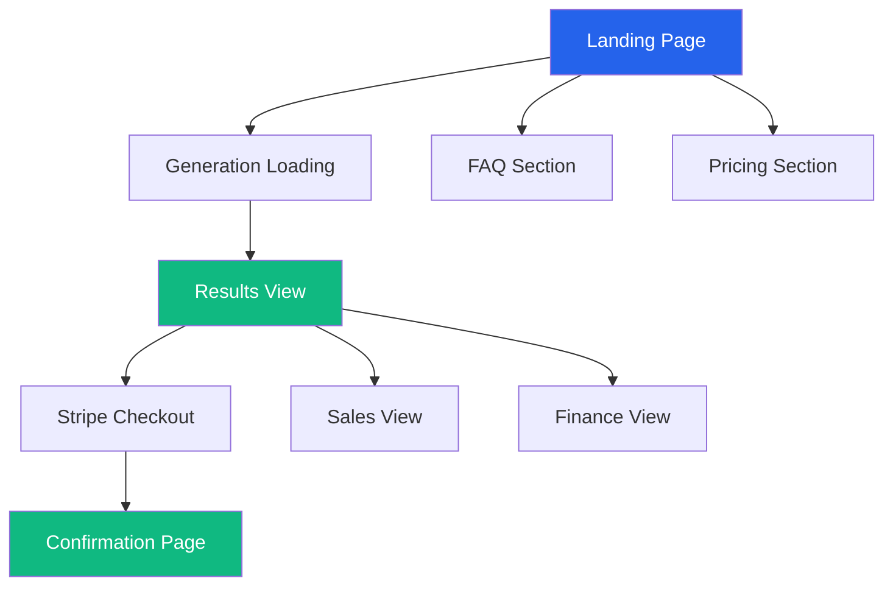
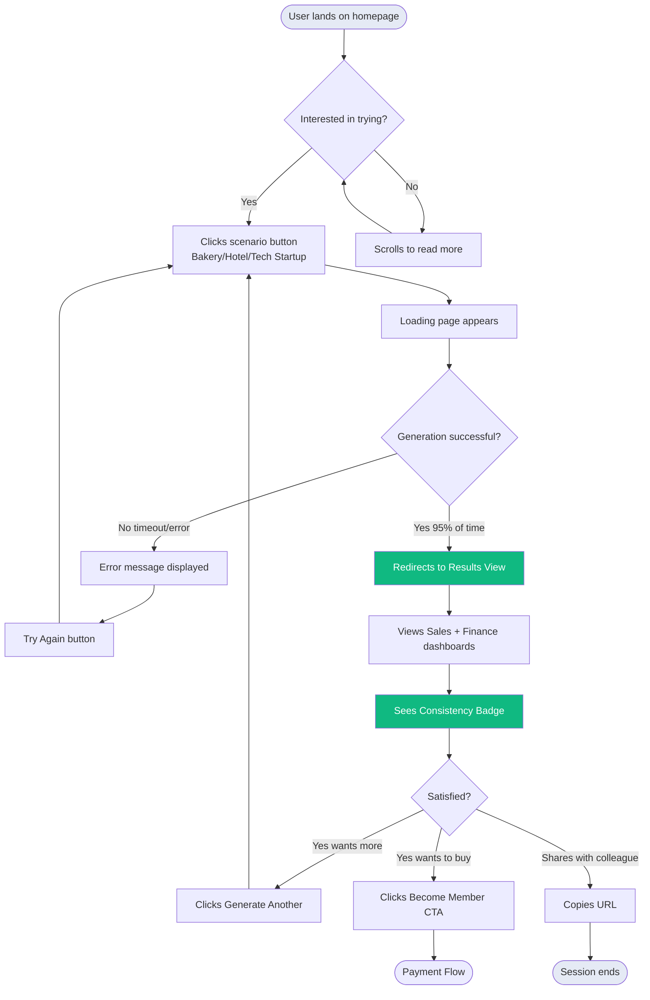
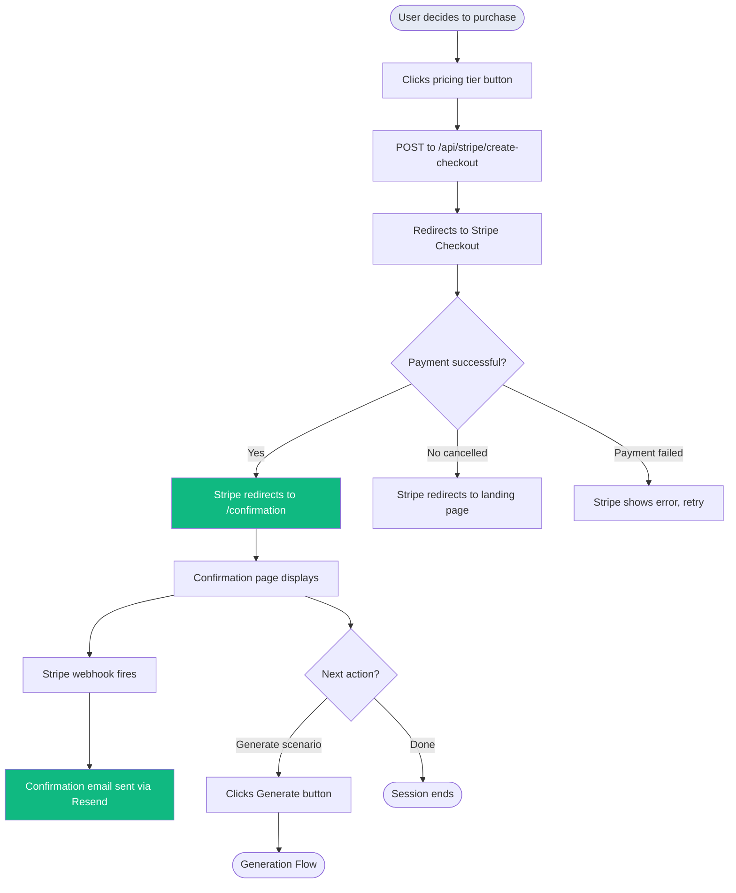
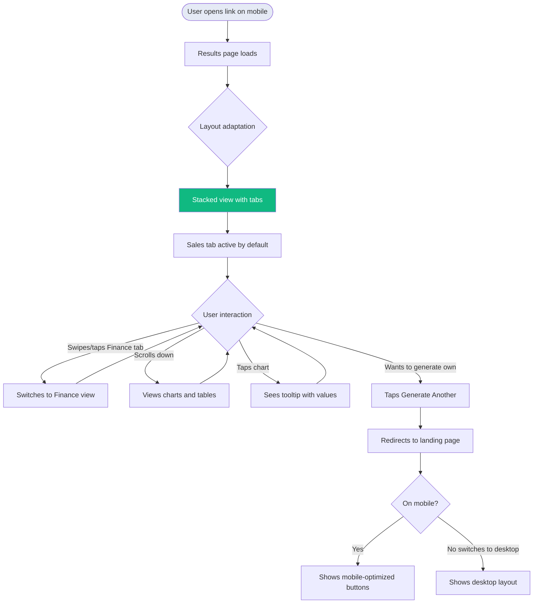

# tellingCube UI/UX Specification

**Document Version:** 1.0
**Created:** 2025-11-14
**Status:** Ready for Frontend Development

---

## Introduction

This document defines the user experience goals, information architecture, user flows, and visual design specifications for tellingCube's user interface. It serves as the foundation for visual design and frontend development, ensuring a cohesive and user-centered experience.

---

## Overall UX Goals & Principles

### Target User Personas

#### 1. Business Reporting Trainer

- **Context:** Runs 10-20 workshops per year teaching IBCS© reporting standards and data visualization
- **Pain Point:** Spends 3-4 hours creating demo datasets per workshop; reusing old data makes workshops stale
- **Goals:** Quickly generate fresh, realistic datasets; focus on teaching not data preparation
- **Tech Savvy:** Moderate; comfortable with web apps and Excel
- **Primary Device:** Laptop during workshop prep; may share scenarios on tablet/mobile during presentations

#### 2. University Professor

- **Context:** Teaches business finance, controlling, or management courses; needs diverse examples for students
- **Pain Point:** Recycling textbook examples from 1995; students disengage with outdated scenarios
- **Goals:** Generate industry-specific scenarios that match lecture topics; data students won't question
- **Tech Savvy:** Variable; some very technical, others prefer simple interfaces
- **Primary Device:** Desktop/laptop; students may view shared scenarios on mobile

#### 3. Strategy Consultant

- **Context:** Creates 2-5 client presentations per month; needs tailored demo data for pitches
- **Pain Point:** Junior staff waste billable hours (€150-300/hour) fabricating datasets
- **Goals:** Rapid scenario generation for client-specific industries; professional-grade quality
- **Tech Savvy:** High; expects polished, efficient interfaces
- **Primary Device:** Laptop primarily; may review on mobile while traveling

### Usability Goals

1. **Speed to value:** New users generate their first scenario within 60 seconds of landing on the page
2. **Zero learning curve:** No tutorial needed; one-click generation with preset scenarios eliminates configuration paralysis
3. **Trust building:** Consistency validation badge and transparent data generation reassure users of quality
4. **Mobile-friendly sharing:** Consultants and trainers can share generated scenarios via mobile devices seamlessly
5. **Professional credibility:** Clean, modern B2B SaaS aesthetic signals this is a serious business tool

### Design Principles

1. **Clarity over cleverness** - Prioritize clear communication and obvious next steps over aesthetic innovation; users shouldn't wonder what to do next
2. **Instant gratification** - Click button → see results; no forms, no account creation, no waiting for emails
3. **Progressive disclosure** - Landing page shows core value immediately; pricing and FAQ below the fold for interested users
4. **Trust through transparency** - Show consistency validation, explain how data is generated, display realistic metrics
5. **One clear action per screen** - Each view has a single primary CTA; avoid decision paralysis

### Change Log

| Date | Version | Description | Author |
|------|---------|-------------|--------|
| 2025-11-14 | 1.0 | Initial UI/UX Specification for tellingCube MVP | Sally (UX Expert) |

---

## Competitive UX Analysis Summary

### Key Differentiators Validated

**tellingCube's Unique Position:**

1. **One-click generation** - No competitor offers preset scenario buttons for instant generation (vs. ChatGPT prompts, Excel blank canvas, simulation complexity)
2. **Multi-view consistency guarantee** - Event-sourced architecture ensures 100% reconciliation (vs. ChatGPT disconnected outputs, Excel manual validation)
3. **Zero configuration** - No forms, no inputs, no setup (vs. simulations requiring days of setup, ChatGPT requiring prompt engineering)
4. **Professional aesthetic** - Premium B2B SaaS polish (vs. ChatGPT rough output, BI tool generic samples)
5. **Speed + quality combo** - 2 minutes to professional results (vs. fast/low-quality or slow/high-quality alternatives)

### UX Positioning vs. Competitors

| Criteria | Excel Manual | ChatGPT | BI Samples | Simulations | **tellingCube** |
|----------|-------------|---------|------------|-------------|-----------------|
| **Time to First Value** | Hours | Minutes | Seconds* | Days | **60 seconds** ✅ |
| **Learning Curve** | Low | Medium | Low | Very High | **None** ✅ |
| **Multi-View Consistency** | Manual | ❌ | ✅ | ✅ | **✅ Guaranteed** |
| **Data Freshness** | ✅ | ✅ | ❌ | ✅ | **✅ Every time** |
| **Professional Quality** | Variable | Low | High | High | **High** ✅ |
| **Visualization Built-in** | Manual | ❌ | Via BI tool | ✅ | **✅ Dashboards** |

*But fixed/dated content

---

## Information Architecture (IA)

### Site Map / Screen Inventory



**Screen Inventory:**

1. **Landing Page** (/) - Hero, problem/solution, scenario buttons, pricing, FAQ
2. **Generation Loading** (/generate/loading) - Progress indicator, status updates
3. **Results View** (/results/[scenarioId]) - Split dashboard with Sales + Finance views
4. **Stripe Checkout** (hosted by Stripe, external)
5. **Confirmation Page** (/confirmation) - Post-payment thank you

### Navigation Structure

**Primary Navigation:** None for MVP

- **Rationale:** Ephemeral experience with no user accounts; no persistent navigation needed
- **Logo behavior:** "tellingCube.com" text in top-left corner links back to landing page (standard web pattern)

**Secondary Navigation:** Contextual CTAs only

- **Landing Page:** Anchor links to Pricing (#pricing) and FAQ (#faq) sections
- **Results View:** "Generate Another Scenario" button returns to landing page; "Become a Founding Member" CTA scrolls to pricing
- **Confirmation Page:** "Generate Your First Scenario" button returns to landing page

**Breadcrumb Strategy:** Not applicable

- **Rationale:** Linear user journey (Landing → Generate → Results → Payment → Confirmation) doesn't require breadcrumbs
- **Back button:** Browser back button is sufficient; each state is a distinct URL

---

## User Flows

### Flow 1: Free Scenario Generation (Primary Happy Path)

**User Goal:** Generate and view a realistic business scenario without payment

**Entry Points:** Landing page scenario buttons (Bakery | Hotel | Tech Startup)

**Success Criteria:** User views complete Sales + Finance dashboards with consistency badge

#### Flow Diagram



#### Edge Cases & Error Handling:

- **Generation timeout (>5 min):** Display error: "Generation took too long. Please try again." with "Try Again" button
- **Claude API failure:** Display error: "Unable to generate scenario. Please try again in a moment." (circuit breaker prevents repeated failures)
- **Database error:** Display error: "Something went wrong. Please refresh and try again."
- **Invalid scenario ID in URL:** Redirect to landing page with message "Scenario not found or expired"
- **24-hour expired scenario:** Redirect to landing page with message "This scenario has expired. Generate a new one!"

**Notes:** This is the core MVP flow—optimize for speed and clarity. Loading state must feel engaging, not frustrating.

---

### Flow 2: Founding Member Purchase

**User Goal:** Purchase lifetime access to unlimited scenario generation

**Entry Points:**
- Landing page pricing section
- Results view CTA banner ("Become a Founding Member")
- Confirmation page after first free generation

**Success Criteria:** User completes payment and receives confirmation email

#### Flow Diagram



#### Edge Cases & Error Handling:

- **Stripe checkout cancelled:** User returns to landing page; no error message (normal behavior)
- **Payment failed at Stripe:** Stripe handles error messaging; user can retry or change payment method
- **Invalid session_id on confirmation page:** Display error: "Payment confirmation not found. Check your email for confirmation."
- **Webhook fails (email not sent):** User still sees confirmation page; manual email can be sent from Stripe dashboard
- **User closes tab during checkout:** Payment may still complete; Stripe handles state; confirmation email will arrive

**Notes:** Stripe handles all payment UI and security; we only handle success/cancel redirects.

---

### Flow 3: Mobile Results Viewing

**User Goal:** Review generated scenario on mobile device (after generating on desktop or via shared link)

**Entry Points:**
- Direct URL share from desktop user
- Mobile browser access to /results/[scenarioId]

**Success Criteria:** User can view all charts and switch between Sales/Finance views seamlessly

#### Flow Diagram



#### Edge Cases & Error Handling:

- **Scenario expired (>24 hours):** Display message: "This scenario has expired. Generate a new one!" with CTA to landing page
- **Slow mobile connection:** Show loading skeleton; charts load progressively
- **Landscape orientation on tablet:** Switch to side-by-side desktop layout (breakpoint: >1024px width)
- **Very small screen (<360px):** Charts scale down but remain readable; tables scroll horizontally
- **No JavaScript enabled:** Display message: "JavaScript required to view scenarios"

**Notes:** Mobile is for viewing/sharing, not generating. Optimize for quick review and easy tab switching.

---

## Branding & Style Guide

### Visual Identity

**Brand Guidelines:** Defined in PRD (docs/prd.md, User Interface Design Goals section)

### Color Palette

**Philosophy:** tellingCube uses vibrant brand colors for UI elements (Landing, Loading, Navigation) and IBCS-compliant grayscale for data visualization (Charts in Results View).

#### UI Brand Colors (Landing Page, Loading State, Buttons, Navigation)

| Color Type | Hex Code | Usage |
|------------|----------|-------|
| Primary | #2563EB | CTA buttons, links, primary brand elements, logo |
| Secondary | #E5EAF5 | Backgrounds, subtle UI elements, secondary buttons |
| Accent | #10B981 | Success states, consistency badge, positive indicators |
| Success | #10B981 | Confirmations, validation passed |
| Warning | #F59E0B | Cautions, important notices |
| Error | #EF4444 | Errors, destructive actions |
| Neutral Text | #1F2937 | Body text, headings |
| Muted Text | #6B7280 | Secondary text, labels, metadata |
| Border/Divider | #E5E7EB | Card borders, separators, dividers |
| White | #FFFFFF | Card backgrounds, main content areas |

#### Chart Colors (IBCS-Compliant - Results View ONLY)

**Applies to:** Charts, graphs, and data tables in the Results View (Sales/Finance dashboards)

**Reference:** See `docs/standards/ibcs-standards.md` Section 6.2 for full IBCS guidelines.

**Base Palette (Grayscale):**

| Color Type | Hex Code | Usage in Charts |
|------------|----------|-----------------|
| **Dark Gray** | #333333 | Primary chart data (Actual/AC), main bars/lines, chart text |
| **Medium Gray** | #666666 | Secondary chart data (Previous Year/PY), axis labels |
| **Light Gray** | #999999 | Tertiary data, alternative comparison values |
| **Grid/Border** | #CCCCCC | Grid lines, chart axes, borders |
| **Chart Background** | #FFFFFF | Chart canvas background |

**Scenario Notation (IBCS UN 3.2):**

| Scenario | Abbreviation | Color | Style | Usage |
|----------|--------------|-------|-------|-------|
| **Actual** | AC | #333333 (dark gray) | Solid fill | Current period actual values |
| **Previous Year** | PY | #999999 (medium gray) | Solid fill | Comparison baseline |
| **Plan** | PL | #333333 (dark gray) | Hatched/striped pattern | Target values |
| **Forecast** | FC | #666666 (gray) | Dashed outline | Projected values |
| **Variance** | Δ | #27AE60 (green) / #E74C3C (red) | Accent only | Positive/negative deltas |

**Chart Type Defaults:**
- **Time series (Line charts):** #333333 (AC), #999999 (PY), dashed #666666 (FC)
- **Comparisons (Bar charts):** Grayscale bars with semantic color accents for highlights only
- **Waterfalls:** #333333 base, #27AE60 (increases), #E74C3C (decreases)

**IMPORTANT:**
- IBCS colors apply **ONLY to chart data visualization** (bars, lines, axes, data points)
- UI elements in Results View (header, tabs, buttons) use **brand colors** (#2563EB, #10B981)
- Color is used **semantically** in charts (same scenario = same color everywhere)

---

### IBCS Layout & Structure Guidelines (Results View)

**Purpose:** The Results View is a showcase-quality IBCS dashboard that demonstrates:
1. Data quality and multi-view consistency
2. Professional IBCS standards compliance
3. Preview of what tellingDash (future product) will create

**Reference:** See `docs/standards/ibcs-standards.md` for complete IBCS principles (SUCCESS formula)

#### Message-Driven Design (IBCS "SAY" Principle)

**Every view should tell a clear story:**

**Sales View - Example Message:**
> "Bakery XYZ generated €500K revenue in 2024, driven by pastry sales (+35% vs PY)"

**Finance View - Example Message:**
> "Operating profit reached €75K (15% margin) despite 12% increase in COGS"

**Implementation:**
- **Page header:** Clear message statement (H2, 24-36px, dark text)
- **Supporting subtitle:** Context or comparison (16px, muted text)
- **Charts below:** Visual evidence supporting the message
- **Commentary (optional):** Brief explanation of key findings

#### Chart Layout Principles (IBCS "EXPRESS" & "SIMPLIFY")

**Chart Types (Section 4.1.2):**
- ✅ **Bar/Column charts:** For comparing magnitudes (revenue by product, costs by category)
- ✅ **Line charts:** For time series (revenue by month, cash flow over time)
- ✅ **Waterfall charts:** For explaining changes (PY → AC with contributing factors)
- ✅ **Tables with embedded charts:** For precise values + visual comparison
- ❌ **Avoid:** Pie charts, gauges, radar charts, funnel charts, 3D effects

**Layout Structure:**

```
┌─────────────────────────────────────────────────────┐
│ [View Header: Sales View / Finance View]           │ ← Brand colors
│ [Message Headline]                                  │ ← Clear statement
│ [Optional: Consistency Badge]                       │ ← Green badge
├─────────────────────────────────────────────────────┤
│                                                     │
│  [KPI Summary Cards - 3-4 key metrics]             │ ← Top metrics
│  Revenue: €500K  |  Units: 12.5K  |  Avg: €40      │
│                                                     │
├─────────────────────────────────────────────────────┤
│                                                     │
│  [Primary Chart: Revenue by Month]                 │ ← Line chart
│  - IBCS grayscale colors                           │   (grayscale)
│  - Clean axis labels                               │
│  - Minimal grid lines                              │
│  - Scenario notation (AC, PY if applicable)        │
│                                                     │
├─────────────────────────────────────────────────────┤
│                                                     │
│  [Secondary Chart: Revenue by Product]             │ ← Bar chart
│  - Horizontal bars (easier to read labels)         │   (grayscale)
│  - Sorted by value (largest first)                 │
│  - Data labels on bars                             │
│                                                     │
├─────────────────────────────────────────────────────┤
│                                                     │
│  [Data Table: Detailed Breakdown]                  │ ← Table
│  - Row headers left-aligned                        │   (clean format)
│  - Numbers right-aligned                           │
│  - No vertical lines (spacing only)                │
│  - Highlight totals (bold)                         │
│                                                     │
└─────────────────────────────────────────────────────┘
```

#### Clean Layout Rules (IBCS "SIMPLIFY" Section 5.1)

**DO:**
- ✅ **White background** for charts (or very light #F5F5F5)
- ✅ **Minimal grid lines** - horizontal only, light gray (#CCCCCC)
- ✅ **Clean axes** - thin lines, no heavy borders
- ✅ **Direct labels** - label data points instead of relying only on legend
- ✅ **Consistent spacing** - use 16px/24px/32px grid for alignment
- ✅ **Small multiples** - multiple small charts instead of one cluttered chart

**DON'T:**
- ❌ **Colored backgrounds** behind charts (no blue/green/gray fills)
- ❌ **Heavy borders** around charts or cards
- ❌ **3D effects**, shadows, gradients on chart elements
- ❌ **Decorative fonts** - stick to Inter (sans-serif)
- ❌ **Vertical grid lines** in most cases
- ❌ **Chart junk** - unnecessary icons, shapes, decorations

#### Table Formatting (IBCS Section 6.5)

**Structure:**
```
┌─────────────────┬──────────┬──────────┬──────────┐
│ Product         │   AC     │   PY     │    Δ%    │
├─────────────────┼──────────┼──────────┼──────────┤ ← Thin line only
│ Pastries        │  250,000 │  185,000 │   +35%   │ ← Right-align numbers
│ Bread           │  150,000 │  160,000 │    -6%   │
│ Cakes           │  100,000 │   90,000 │   +11%   │
├─────────────────┼──────────┼──────────┼──────────┤
│ Total Revenue   │  500,000 │  435,000 │   +15%   │ ← Bold totals
└─────────────────┴──────────┴──────────┴──────────┘
```

**Guidelines:**
- **No vertical lines** - use spacing and alignment
- **Minimal horizontal lines** - header separator and totals only
- **Right-align numbers** - left-align text
- **Consistent decimals** - same precision for same measure
- **Scenario abbreviations** - AC, PY, PL, FC (not "Actual", "Previous Year")
- **Highlight totals** - bold or light background (#F5F5F5)

#### Information Density (IBCS "CONDENSE" Section 5.2)

**Show more relevant information without clutter:**

- ✅ **Add context to charts:** Show AC + PY on same chart (not separate)
- ✅ **Embed mini-charts in tables:** Sparklines or small bars next to numbers
- ✅ **Multi-tier charts:** Combine bar + line (e.g., revenue bars + margin line)
- ✅ **Compact labels:** Use abbreviations (EUR m, k units) to save space
- ✅ **Small multiples:** 3-4 small charts side-by-side instead of 1 large

**Balance:** High density but still readable - not cramming, but efficient use of space

#### Responsive Behavior (Mobile)

**Desktop (>1024px):**
- Side-by-side layout (Sales left, Finance right)
- 2-column chart grids
- Detailed tables visible

**Tablet (768-1024px):**
- Tabbed view (Sales / Finance tabs)
- Single-column charts (full width)
- Tables scrollable horizontally if needed

**Mobile (<768px):**
- Stacked cards
- Simplified charts (fewer data points)
- Tables → summary cards (hide less critical columns)
- Prioritize key metrics over detailed breakdowns

#### Visual Integrity (IBCS "CHECK" Section 5.3)

**Ensure charts don't mislead:**

- ✅ **Y-axis starts at zero** for bar charts (unless variance chart)
- ✅ **Equal scales** for comparable charts (same unit = same scale)
- ✅ **Clear break indicators** if axis must be truncated
- ✅ **Honest proportions** - bar length = actual value
- ❌ **No truncated axes** that exaggerate differences
- ❌ **No logarithmic scales** without clear labeling

#### Accessibility (IBCS-Compatible)

**Beyond IBCS, ensure usability:**

- **Grayscale-friendly:** Charts work in grayscale (IBCS requirement ✅)
- **Screen readers:** ARIA labels for charts ("Revenue by month chart showing...")
- **Keyboard navigation:** Tab through interactive elements
- **Tooltips:** Show exact values on hover/tap
- **Print-friendly:** IBCS grayscale works perfectly for print

---

### Typography

#### Font Families

- **Primary:** Inter (Google Fonts)
- **Fallback:** IBM Plex Sans
- **System Fallback:** -apple-system, BlinkMacSystemFont, "Segoe UI", Roboto, sans-serif

#### Type Scale

| Element | Size | Weight | Line Height |
|---------|------|--------|-------------|
| H1 | 48px | 700 (Bold) | 1.2 (57.6px) |
| H2 | 36px | 600 (Semibold) | 1.3 (46.8px) |
| H3 | 24px | 600 (Semibold) | 1.4 (33.6px) |
| Body | 16px | 400 (Regular) | 1.6 (25.6px) |
| Small | 14px | 400 (Regular) | 1.5 (21px) |

**Font Loading:** Use `font-display: swap` to prevent FOIT (Flash of Invisible Text)

### Iconography

**Icon Library:** Heroicons (MIT license, designed for Tailwind)

**Usage Guidelines:**
- 24px default size for UI icons
- 16px for inline icons (labels, breadcrumbs)
- Stroke width: 2px (outline style)
- Use consistent style throughout (all outline or all solid, not mixed)

### Spacing & Layout

**Grid System:** 12-column grid with 24px gutters on desktop, 16px on mobile

**Spacing Scale (Tailwind-compatible):**
- 4px base unit (use multiples: 8px, 16px, 24px, 32px, 48px, 64px)
- Component padding: 24px (desktop), 16px (mobile)
- Section spacing: 64px (desktop), 48px (mobile)
- Card spacing: 16px internal padding

**Container Max Width:** 1280px (landing page content), Full-width (results dashboards)

---

## Accessibility Requirements

### Compliance Target

**Standard:** MVP Baseline (Semantic HTML + Keyboard Navigation)

**Post-MVP Roadmap:**
- Alpha (Weeks 8-12): Basic WCAG 2.1 Level A compliance
- Beta (Months 3-6): WCAG 2.1 Level AA compliance
- Enterprise (Months 6+): Full WCAG 2.1 Level AA with audit

### Key Requirements

**Visual:**
- Color contrast ratios: Minimum 4.5:1 for body text, 3:1 for large text/UI components (use WebAIM Contrast Checker)
- Focus indicators: 2px solid outline (#2563EB) on all interactive elements
- Text sizing: Minimum 14px; all text scalable via browser zoom

**Interaction:**
- Keyboard navigation: All interactive elements accessible via Tab key; Enter/Space activate buttons
- Screen reader support: Semantic HTML (nav, main, section, article); ARIA labels where needed (e.g., chart descriptions)
- Touch targets: Minimum 44×44px for all buttons and interactive elements (WCAG 2.1 Level AAA recommendation)

**Content:**
- Alternative text: All images/icons have descriptive alt text; decorative images use `alt=""`
- Heading structure: Logical hierarchy (H1 → H2 → H3); no skipped levels
- Form labels: All inputs paired with visible `<label>` elements (future consideration; MVP has no forms)

### Testing Strategy

**MVP Testing:**
- Manual keyboard navigation testing (Tab through all pages)
- Color contrast verification using browser DevTools or WebAIM tool
- Screen reader spot-check with NVDA (Windows) or VoiceOver (Mac)

**Post-MVP Testing:**
- Automated: axe DevTools, Lighthouse accessibility audit
- Manual: Full keyboard-only navigation testing
- User testing: Real users with disabilities (Beta phase)

---

## Responsiveness Strategy

### Breakpoints

| Breakpoint | Min Width | Max Width | Target Devices |
|------------|-----------|-----------|----------------|
| Mobile | 320px | 639px | iPhone SE, Android phones |
| Tablet | 640px | 1023px | iPad, Android tablets |
| Desktop | 1024px | 1919px | Laptops, small desktops |
| Wide | 1920px | - | Large monitors, 4K displays |

**Implementation:** Use Tailwind's responsive prefixes (sm:, md:, lg:, xl:)

### Adaptation Patterns

**Layout Changes:**
- **Mobile (<640px):** Single column; stacked views; full-width cards
- **Tablet (640-1023px):** 2-column grid for pricing cards; stacked views with tabs for results
- **Desktop (>1024px):** Multi-column layouts; side-by-side results view (50/50 split)
- **Wide (>1920px):** Centered content with max-width; wider charts/dashboards

**Navigation Changes:**
- **Mobile:** Hamburger menu not needed (no persistent nav); logo in top-left
- **Desktop:** Logo in top-left; anchor links to #pricing and #faq in top-right (if header added)

**Content Priority:**
- **Mobile:** Hero → Scenario buttons → Problem/solution → FAQ → Pricing (reordered for CTA prominence)
- **Desktop:** Hero → Scenario buttons → Problem/solution → Pricing → FAQ (standard order)

**Interaction Changes:**
- **Mobile:** Sticky tab bar for Sales/Finance view switching; swipe gestures optional (tap tabs primary)
- **Tablet:** Side-by-side in landscape (>1024px width), stacked in portrait
- **Desktop:** Hover tooltips on charts; click to expand (future)

---

## Animation & Micro-interactions

### Motion Principles

1. **Purposeful, not decorative** - Every animation should communicate state or guide attention
2. **Fast but not jarring** - 200-300ms for most transitions; instant feedback (<100ms) for clicks
3. **Respect user preferences** - Honor `prefers-reduced-motion` for accessibility
4. **Consistent easing** - Use `ease-out` for entrances, `ease-in` for exits, `ease-in-out` for state changes

### Key Animations

- **Page transitions:** Fade in content (300ms, ease-out)
- **Button hover:** Scale 1.02 + subtle shadow (150ms, ease-out)
- **Button click:** Scale 0.98 momentarily (100ms, ease-in-out)
- **Loading spinner:** Continuous rotation (1s, linear, infinite)
- **Consistency badge appearance:** Slide down + fade in (400ms, ease-out, delay 200ms after page load)
- **Chart rendering:** Stagger chart animations by 100ms each (bars grow from bottom, lines draw from left)
- **Modal/overlay:** Backdrop fade in (200ms) + content scale from 0.95 to 1.0 (300ms, ease-out)
- **Tab switching (mobile):** Slide transition between Sales/Finance views (250ms, ease-in-out)

**Performance Note:** Use `transform` and `opacity` for animations (GPU-accelerated); avoid animating `width`, `height`, or `margin`.

---

## Performance Considerations

### Performance Goals

- **Page Load:** <2 seconds on desktop (verified with Lighthouse)
- **Interaction Response:** <100ms for button clicks, <300ms for page transitions
- **Animation FPS:** Maintain 60fps for all animations

### Design Strategies

**Optimization Techniques:**
- Use Next.js Image component for all images (lazy loading, optimization)
- Minimize JavaScript bundle (<200KB gzipped)
- Load Inter font with `font-display: swap`
- Defer below-the-fold content (pricing, FAQ) until user scrolls
- Use CSS transforms for animations (GPU-accelerated)
- Implement loading skeletons for charts (perceived performance)

**Chart Performance:**
- Limit data points displayed on mobile (aggregate if >50 points)
- Use canvas-based charts for large datasets (Recharts supports this)
- Lazy-load chart library until needed (code splitting)

---

## Next Steps

### Immediate Actions

1. **Review with stakeholder (Mario)** - Confirm all UX decisions align with vision
2. **Set up design tokens in Tailwind** - Configure colors, typography, spacing in `tailwind.config.js`
3. **Create component inventory** - List all reusable components (Button, Card, Chart, Badge, Table, Tabs, etc.)
4. **Begin Epic 2 development** - Start with Story 2.3 (Chart Library Setup & Base Components)

### Design Handoff Checklist

- [x] All user flows documented
- [x] Component inventory complete (implicit from PRD stories)
- [x] Accessibility requirements defined
- [x] Responsive strategy clear
- [x] Brand guidelines incorporated
- [x] Performance goals established

---

## Summary

**Document Status:** ✅ **Ready for Frontend Development**

**What's Defined:**
- ✅ 3 target user personas with context and goals
- ✅ 5 core design principles guiding all decisions
- ✅ Comprehensive competitive UX analysis validating our approach
- ✅ Complete information architecture (5 screens, linear flow)
- ✅ 3 critical user flows with error handling
- ✅ Full branding & style guide (colors, typography, icons, spacing)
- ✅ Accessibility baseline and post-MVP roadmap
- ✅ Responsive breakpoints and adaptation patterns
- ✅ Animation principles and 8 key micro-interactions
- ✅ Performance goals and optimization strategies

**Key UX Differentiators:**
1. One-click preset scenarios (unique in market)
2. Zero configuration (no forms, no prompts)
3. Multi-view consistency guarantee (killer feature)
4. Professional aesthetic (justifies premium pricing)
5. Mobile-optimized for sharing (unique use case)

**Design Philosophy:**
> "Clarity over cleverness. Instant gratification over customization. Trust through transparency."

**This specification is ready for:**
- Frontend development (Epic 2 & 3 stories in PRD)
- Component library setup (shadcn/ui + Tailwind + Recharts)
- Design tool mockups (optional; can build directly from spec)

---

**Contact:** Sally (UX Expert)
**Related Documents:**
- Product Requirements Document: `docs/prd.md`
- Project Brief: `docs/brief.md`
- Week 1 Checklist: `docs/week-1-checklist.md`
