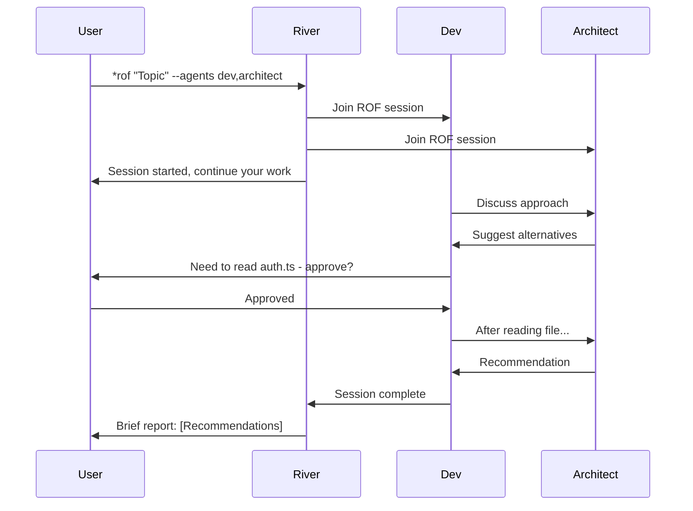

# BMad Method PR #1: Ring of Fire (ROF) Sessions

**Feature Type**: Core workflow enhancement
**Status**: Draft for community review
**Origin**: tellingCube project (masemIT e.U.)
**Author**: Mario Semper (@sempre)
**Date**: 2025-11-23

---

## Summary

**Ring of Fire (ROF) Sessions** enable multi-agent collaborative sessions that run in parallel to the user's main workflow, allowing users to delegate complex multi-perspective analysis while continuing other work.

---

## Problem Statement

Current BMad Method requires **sequential agent interaction**. When users need multiple agents to collaborate on a complex topic, they must:
- Manually orchestrate each agent conversation
- Stay in the loop for every exchange
- Wait for sequential responses before proceeding
- Context-switch constantly between tasks

This creates **bottlenecks** and prevents **parallel work streams**.

---

## Proposed Solution: Ring of Fire Sessions

A new command pattern that enables **scoped multi-agent collaboration sessions** that run while the user continues other work.

### Command Syntax

```bash
*rof "<topic>" --agents <agent-list> [--report brief|detailed|live]
```

### Example Usage

```bash
*rof "API Refactoring Strategy" --agents dev,architect,qa --report brief
```

**What happens**:
1. Dev, Architect, and QA agents enter a collaborative session
2. They analyze the topic together (code review, design discussion, testing concerns)
3. When agents need tool access (read files, run commands), they request user approval
4. User continues working on other tasks in parallel
5. Session ends with consolidated report (brief: just recommendations, detailed: full transcript)

---

## Key Features

### 1. User-Controlled Scope
- **Small**: 2 agents, 5-minute quick discussion
- **Large**: 10 agents, 2-hour deep analysis
- User decides granularity based on complexity

### 2. Approval-Gated Tool Access
- Agents can **discuss** freely within the session
- When agents need **tools** (read files, execute commands, make changes), they:
  - Pause the session
  - Request user approval
  - Resume after user decision

**Why**: Maintains user control, prevents runaway agent actions

### 3. Flexible Reporting

| Mode | Description | Use Case |
|------|-------------|----------|
| `brief` | Final recommendations only | "Just tell me what to do" |
| `detailed` | Full transcript + recommendations | "Show me the reasoning" |
| `live` | Real-time updates as agents discuss | "I want to observe" |

**Default**: `brief` with Q&A available

### 4. Parallel Workflows
- User works on **Task A** while ROF session tackles **Task B**
- No context-switching overhead
- Efficient use of time

---

## Use Cases

### 1. Architecture Reviews
```bash
*rof "Evaluate microservices vs monolith for new feature" --agents architect,dev,qa
```
**Agents collaborate on**: Design trade-offs, implementation complexity, testing implications

### 2. Code Refactoring
```bash
*rof "Refactor authentication module" --agents dev,architect --report detailed
```
**Agents collaborate on**: Current code analysis, refactoring approach, migration strategy

### 3. Feature Planning
```bash
*rof "Plan user notifications feature" --agents pm,ux,dev --report brief
```
**Agents collaborate on**: Requirements, UX flow, technical feasibility, timeline

### 4. Quality Gates
```bash
*rof "Investigate test failures in CI/CD" --agents qa,dev --report live
```
**Agents collaborate on**: Root cause analysis, fix recommendations, regression prevention

### 5. Documentation Sprints
```bash
*rof "Document API endpoints" --agents dev,pm,ux
```
**Agents collaborate on**: Technical accuracy, user-friendly examples, completeness

---

## User Experience Flow



---

## Implementation Considerations

### Technical Requirements
- **Session state management**: Track active ROF sessions, participating agents
- **Agent context sharing**: Agents share knowledge within session scope
- **User approval workflow**: Clear prompt for tool requests
- **Report generation**: Brief/detailed/live output formatting
- **Workflow integration**: Link ROF findings to existing workflow plans/todos

### Open Questions for Community

1. **Integration**: Core BMad feature or plugin/extension?
2. **Concurrency**: How to handle file conflicts if multiple agents want to edit?
3. **Cost Model**: Guidance for LLM call budgeting with multiple agents?
4. **Session Limits**: Recommended max agents/duration?
5. **Agent Communication**: Free-form discussion or structured turn-taking?

---

## Real-World Validation

**Origin Project**: tellingCube (BI dashboard, masemIT e.U.)

**Validation Scenario**:
- **Topic**: "Next steps for tellingCube after validation test"
- **Agents**: River (orchestrator), Mary (analyst), Winston (architect)
- **Report Mode**: Brief
- **Outcome**: Successfully analyzed post-validation roadmap with 3 scenarios (GO/CHANGE/NO-GO), delivered consolidated recommendations in 5 minutes

**User Feedback (Mario Semper)**:
> "This is exactly what I needed - I wanted multiple perspectives without having to orchestrate every conversation. The brief report gave me actionable next steps immediately."

**Documentation**: `docs/_masemIT/readme.md` in tellingCube repository

---

## Proposed Documentation Structure

```
.bmad-core/
  features/
    ring-of-fire.md              # Feature specification

docs/
  guides/
    using-rof-sessions.md        # User guide with examples

  architecture/
    agent-collaboration.md       # Technical design
    rof-session-management.md    # State handling approach
```

---

## Benefits

✅ **Unlocks parallel workflows** - User productivity gains
✅ **Reduces context-switching** - Cognitive load reduction
✅ **Enables complex analysis** - Multi-perspective insights
✅ **Maintains user control** - Approval gates for tools
✅ **Scales flexibly** - From quick checks to deep dives

---

## Comparison to Existing Patterns

| Feature | Standard Agent Use | ROF Session |
|---------|-------------------|-------------|
| Agent collaboration | Sequential (one at a time) | Parallel (multiple simultaneously) |
| User involvement | Required for every exchange | Only for approvals |
| Parallel work | No (user waits) | Yes (user continues tasks) |
| Output | Chat transcript | Consolidated report |
| Use case | Single-perspective tasks | Multi-perspective analysis |

---

## Next Steps

1. **Community feedback** on approach and open questions
2. **Technical design** refinement (state management, agent communication)
3. **Prototype implementation** in BMad core or as extension
4. **Beta testing** with real projects (beyond tellingCube)
5. **Documentation** completion with examples

---

## Alternatives Considered

### Alt 1: "Breakout Session"
- **Pros**: Clear meeting metaphor
- **Cons**: Less evocative, doesn't convey "continuous collaborative space"

### Alt 2: "Agent Huddle"
- **Pros**: Short, casual
- **Cons**: Implies quick/informal only

### Alt 3: "Lagerfeuer" (original German name)
- **Pros**: Warm, campfire metaphor
- **Cons**: Poor i18n, hard to pronounce/remember for non-German speakers

**Chosen**: **Ring of Fire** - evokes continuous collaboration circle, internationally understood, memorable, shortcut "ROF" works well

---

## References

- **Source Project**: tellingCube (https://github.com/masemIT/telling-cube) [if public]
- **Documentation**: `docs/_masemIT/readme.md`
- **Discussion**: [Link to BMad community discussion if applicable]

---

**Contribution ready for review.** Feedback welcome! 🔥
